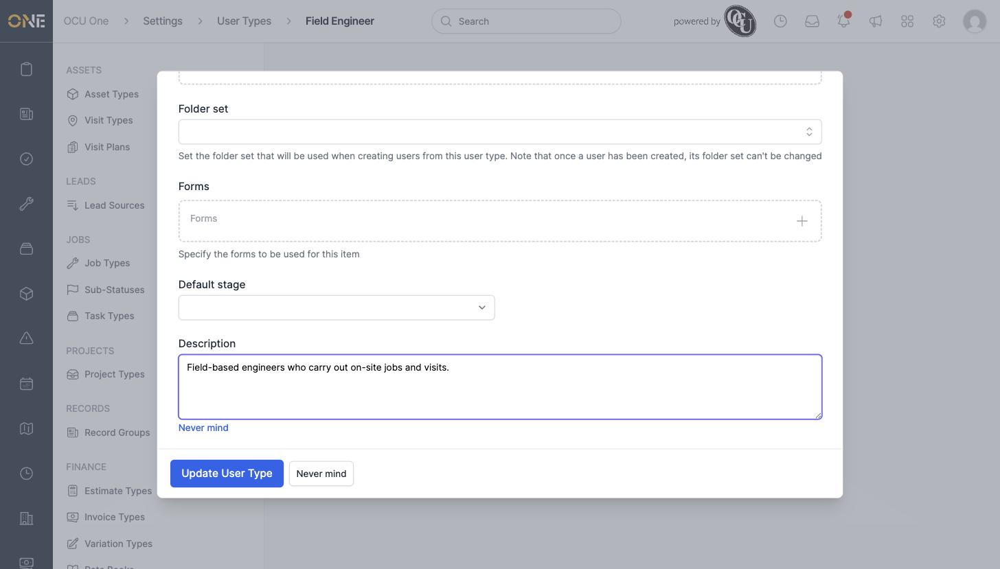
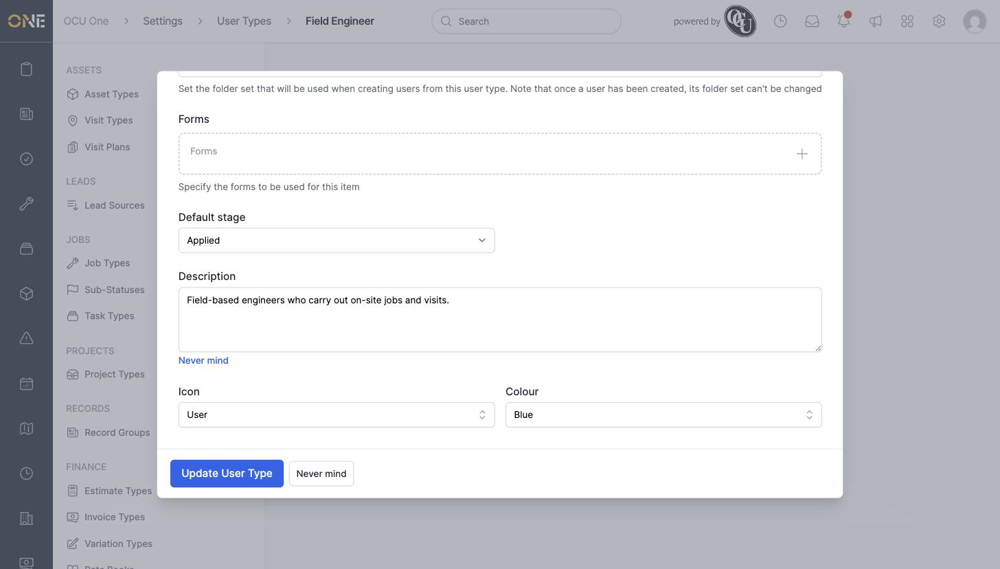
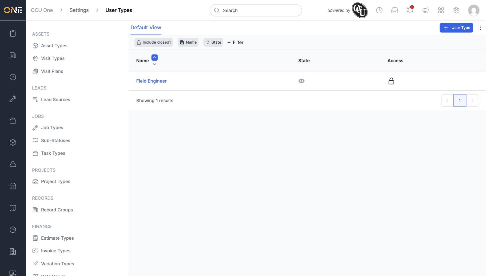

# Managing user types (job roles reference data)

A **User Type** defines a job role in the system — for example Field Engineer or Office Administrator. It's what a new team member is assigned when they're added, and it controls what custom fields, forms, and default settings apply to them.

## Creating a user type

1. Go to **Settings > User Types** and click **+ User Type**.
2. Give it a **Name**, for example **Field Engineer**. A default field set is suggested automatically — change it if needed, or leave it as is.

3. Click **Create User Type**, then open it again to fill in the rest:
   - **Folder set** — the document folder template new users of this type start with
   - **Forms** — any custom forms this type should use
   - **Default stage** — the stage a new user of this type starts at, once a pipeline is attached (see *Attaching a pipeline to user types*)
   - **Description**, **Icon**, and **Colour** — for identifying this type at a glance

   

4. Once a pipeline has been attached to this type, come back and set its **Default stage** from the now-populated dropdown.

   

The new type then appears in the User Types list, and can be selected whenever a new team member is added.

## Things to know

- **Default stage** only offers a choice once at least one pipeline has been attached to the user type — until then, it's empty.
- Field Sets can only be set when a user type is created — they can't be changed afterwards.
- A user type can be deactivated instead of deleted, which keeps existing team members of that type intact while hiding it from the picker when adding someone new.
