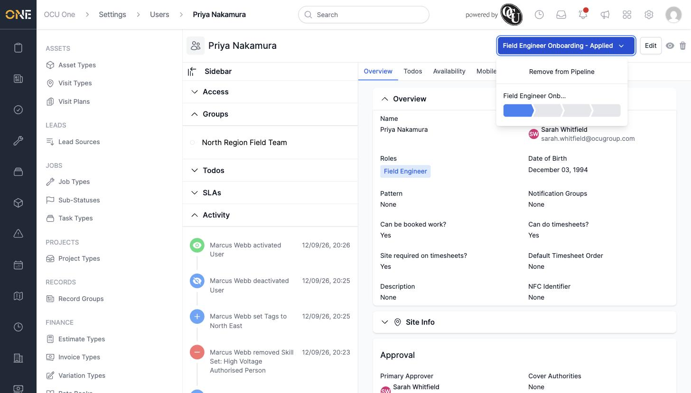
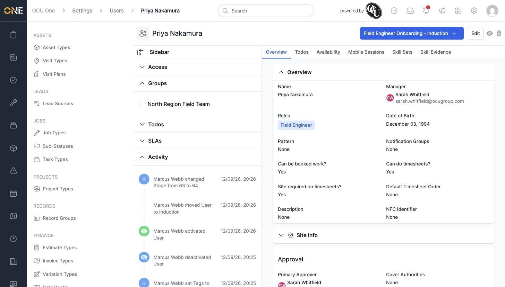

# Moving a user through a stage or pipeline

When a team type has an onboarding (or similar) pipeline attached, every team member of that type moves through its stages — from first joining through to being fully active — right from their own profile page.

## Moving a team member's stage

A badge in the top right of the profile shows the pipeline and current stage, for example **Field Engineer Onboarding - Applied**. Click it to see the pipeline's progress bar and options.

Click further along the progress bar to move the team member to a later stage.

## Things to know

- Clicking a stage moves the team member directly there — you don't have to pass through every stage in between.
- **Remove from Pipeline** in the same dropdown takes the team member off the pipeline entirely, clearing their stage.
- Every stage change is recorded on the profile's **Activity** feed.
