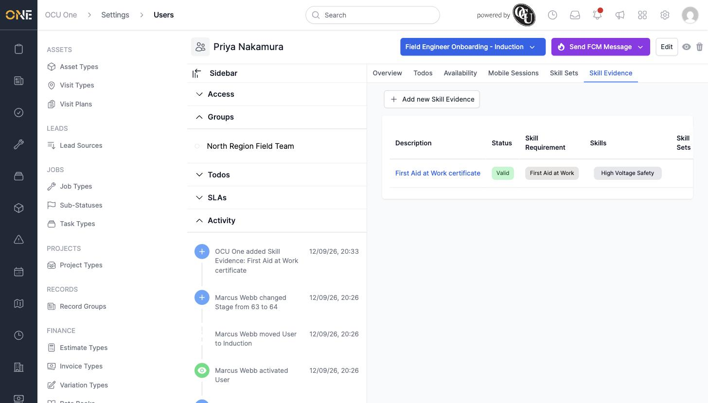
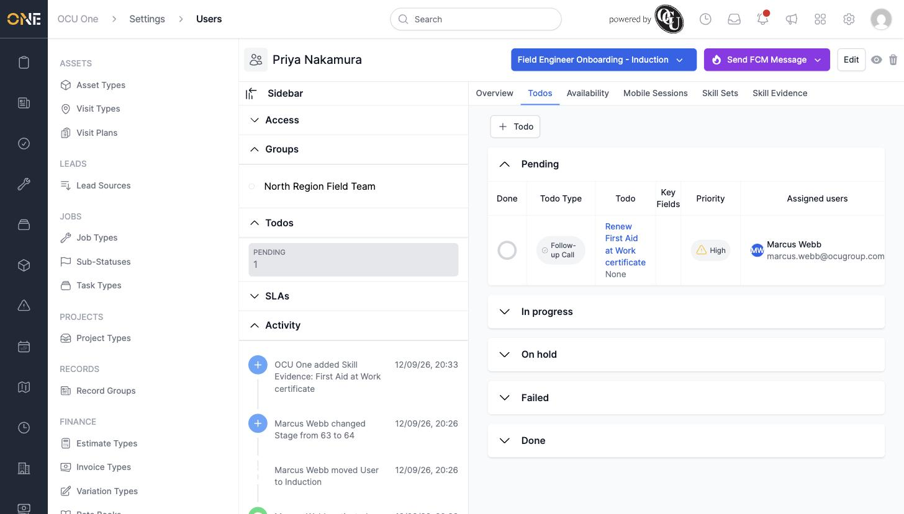

# Reviewing a user's skill evidence and todos

Alongside their skill sets, a team member's profile keeps a record of the actual evidence they've submitted for each requirement, plus any to-dos assigned to them.

## Reviewing skill evidence

Open the team member's profile and go to the **Skill Evidence** tab. Each row shows a piece of evidence, its current status, which requirement it satisfies, and which skill(s) and skill set(s) that requirement belongs to.

Evidence statuses include **Draft**, **Pending**, **Denied**, **Approved**, **Valid**, **Expires Soon**, and **Expired** — the colour of the status badge gives an instant read on whether anything needs chasing.

## Reviewing todos

The **Todos** tab lists to-dos assigned to this team member, grouped by status — **Pending**, **In progress**, **On hold**, **Failed**, and **Done**.

Each row shows the todo's type, its name, any key fields, its priority, and who it's assigned to.

## Things to know

- Skill evidence and todos are two separate things that often relate to each other — for example, a todo reminding someone to renew a certificate before its matching skill evidence expires.
- Click **+ Add new Skill Evidence** or **+ Todo** on their respective tabs to add a new one directly from this profile.
