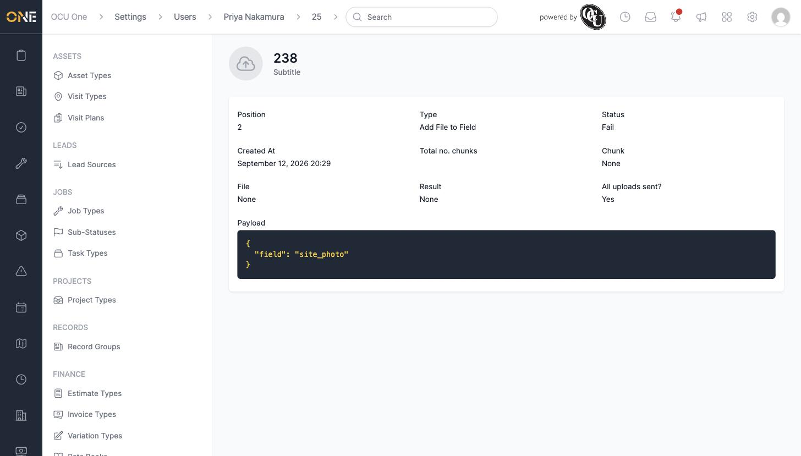
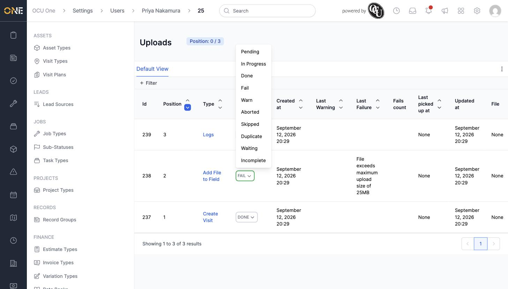
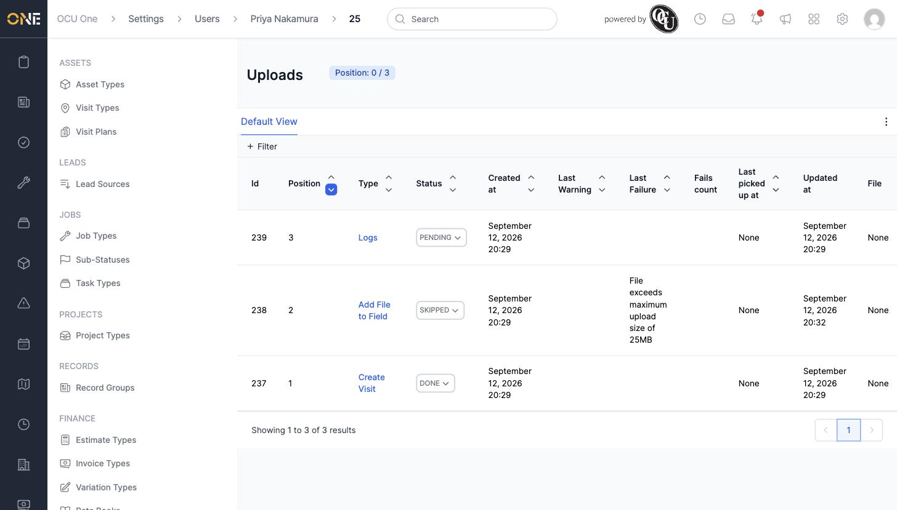

# Reviewing and resolving a mobile session's uploads

When something a field engineer did on their phone hasn't shown up in the office — a job status, a photo, a form — the answer is usually sitting in that device's **Uploads** list, waiting to be processed or stuck with a failure.

## Reviewing an upload

Open the team member's profile, go to **Mobile Sessions**, and click into a session to see its uploads. Each row shows the upload's **Type** (what it was — e.g. Create Visit, Add File to Field, Logs), its **Status**, and, if it failed, the reason under **Last Failure**.

Click an upload's type to see its full detail — its position in the queue, its payload, and whether all of the device's uploads for that action have been sent.

## Overriding an upload's status

If an upload is stuck — for example it failed because a file was too large — you can manually change its status from the list view. Click the status chip and choose a new one.

Choosing, for example, **Skipped** marks the upload resolved without it ever completing — useful when the underlying issue (like an oversized file) can't be fixed by retrying.

## Things to know

- **Last Failure** shows the exact error the device reported — for example "File exceeds maximum upload size of 25MB" — which is usually enough to tell you whether the fix is on the device side or needs an override here.
- Overriding a status is a manual, one-off fix — it doesn't change what actually happened on the device, only how the office record treats that upload from now on.
