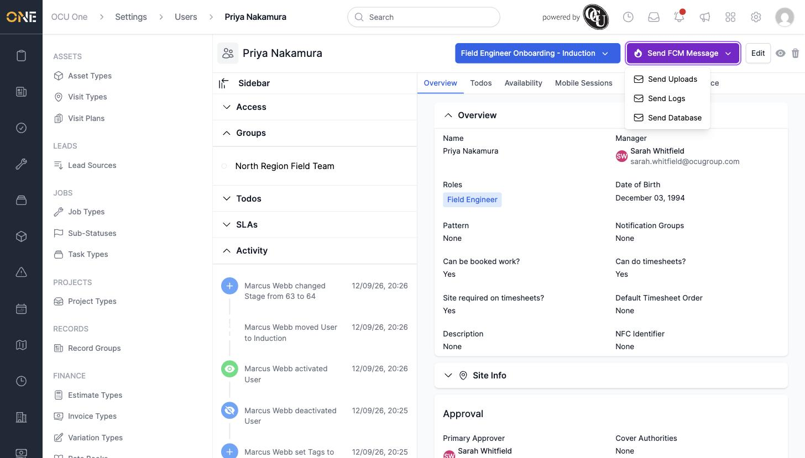

# Sending a push message to a user's mobile device

If a field engineer's app has gone quiet — not syncing, not showing recent changes — an admin can send it a direct instruction, without needing to speak to the person or touch their phone.

## Sending a message

Once a team member has signed into the mobile app, a **Send FCM Message** button appears on their profile. Click it to see the available message types.

Choose one:

- **Send Uploads** — asks the device to push up any data it's holding that hasn't reached the office yet
- **Send Logs** — asks the device to upload its diagnostic logs, useful when troubleshooting a fault
- **Send Database** — asks the device to send up its full local database, for a deeper investigation

## Things to know

- This button only appears once a team member has logged into the mobile app at least once — there's no device to message before that.
- The message is delivered instantly if the device is online; if it isn't, the device picks it up the next time it connects.
