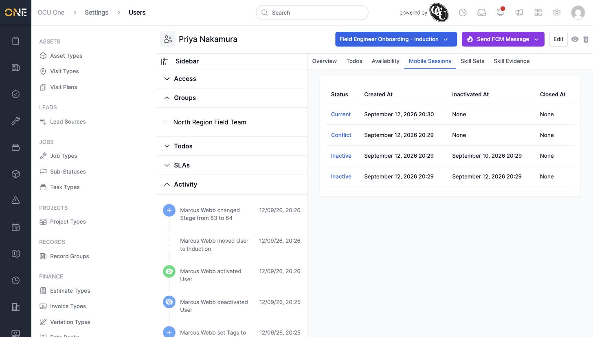
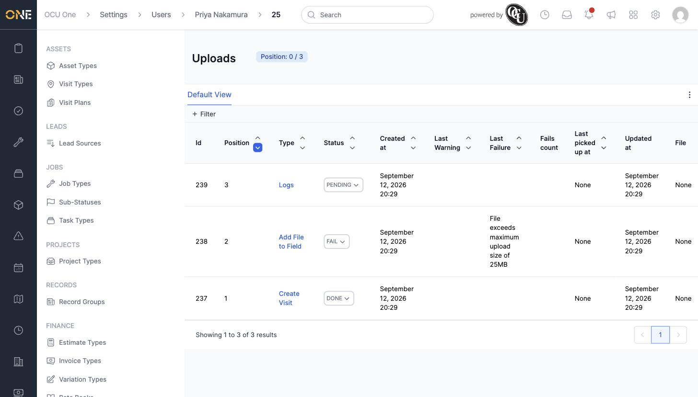

# Tracking a user's mobile device sessions

Every time a field-based team member signs in on the mobile app, it creates a **Mobile Session**. The **Mobile Sessions** tab on their profile lists these, which is the first place to look when someone reports the app "not syncing" or "stuck".

## Viewing a team member's sessions

Open their profile and go to the **Mobile Sessions** tab. Each row shows a session's status, when it was created, when it was deactivated, and when it was closed.

The statuses you'll see are:

- **Current** — the live session on the device right now
- **Inactive** — the device signed out normally
- **Conflict** — two or more inactive sessions still have data to upload, and processing either one first could create conflicting data
- **Closed** — a session that's been fully processed and can no longer send or receive anything

## Viewing a session's uploads

Click a session's status to open its list of **Uploads** — the individual pieces of data (visits created, files added, logs, and so on) that the device has sent up.

## Things to know

- Only one session per team member can ever be **Current** — signing in again on a device automatically deactivates whatever was current before.
- A **Conflict** session needs manual attention (see *Reviewing and resolving a mobile session's uploads*) before its uploads can be safely processed.
