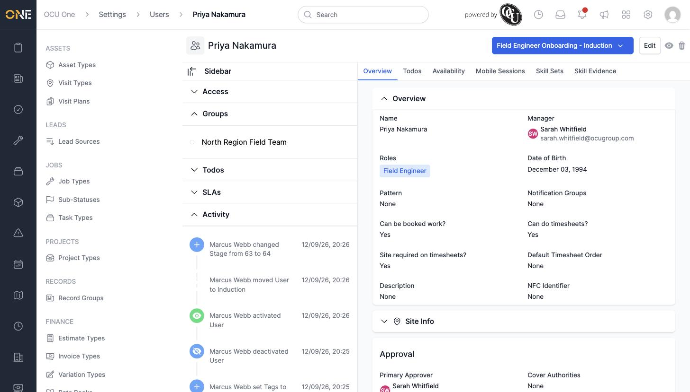
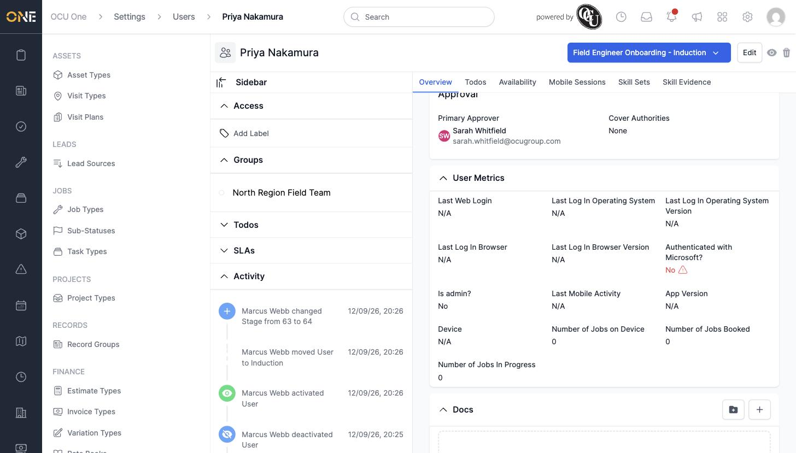

# Viewing a team member's overview

A team member's profile page is a single place to check everything about them — their role and manager, the group and pipeline stage they're in, and a running history of every change made to their record.

## What's on the Overview tab

- **Name, Manager, Roles, Date of Birth** — the person's core details
- **Pattern** and **Notification Groups** — their shift pattern (if any) and where notifications go
- **Can be booked work?**, **Can do timesheets?**, **Site required on timesheets?** — the booking and timesheet toggles set on their profile
- **Approval** — their Primary Approver and any Cover Authorities
- **User Metrics** — read-only device and login information such as Last Web Login, Device, and Number of Jobs Booked

  

## What's in the sidebar

- **Access** — where labels are added to the profile
- **Groups** — the teams this person belongs to
- **Todos** and **SLAs** — any outstanding to-dos or SLAs tracked against them
- **Activity** — a timeline of every change made to the profile, oldest at the bottom

Scrolling further down the main panel also shows **User Metrics** and a **Docs** section for any files attached to the profile.

## Things to know

- The coloured badge in the top right of the page (e.g. **Field Engineer Onboarding - Induction**) shows which pipeline stage this team member is currently at — click it to move them to a different stage.
- The **Activity** feed is the fastest way to answer "who changed this and when" for any field on the profile.
