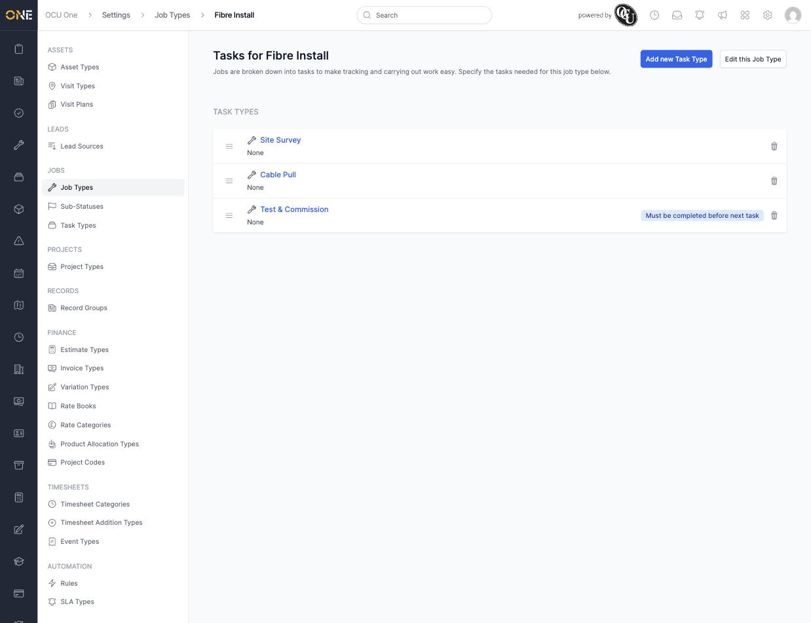
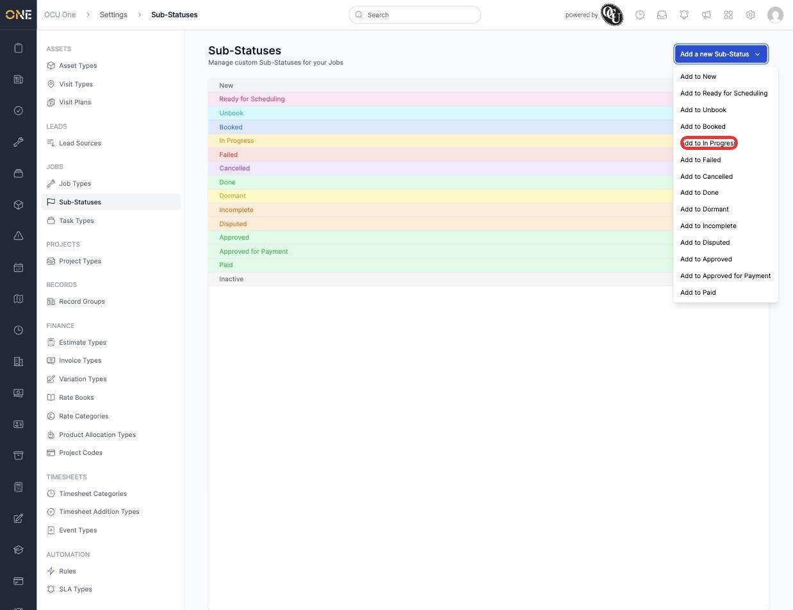
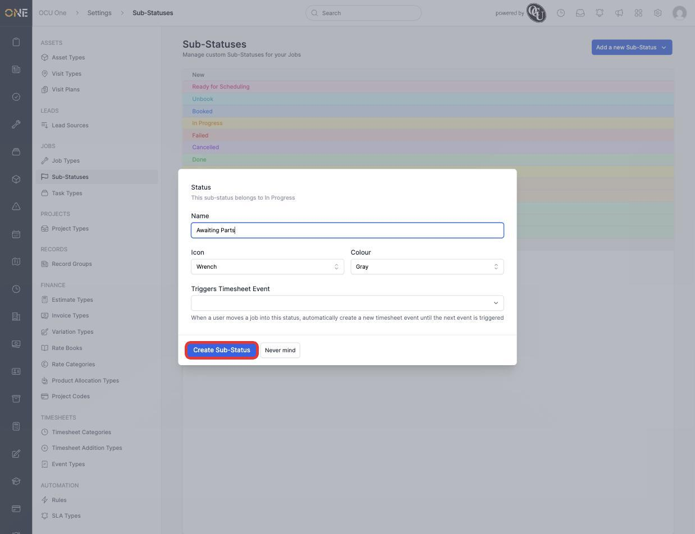
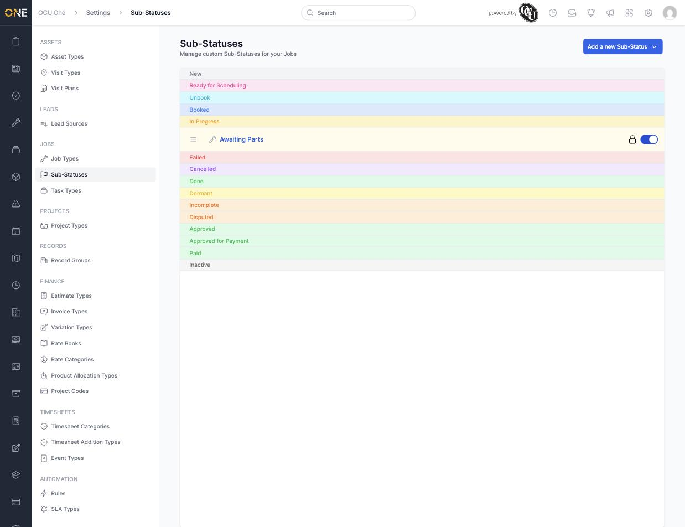

# Building job task pipelines and sub-statuses

Once a Job Type has task types attached, they form an ordered "task pipeline" — the sequence a job's tasks are expected to move through. Separately, any job **status** (New, Booked, In Progress, and so on) can have its own custom **sub-statuses**, for finer detail than the main status alone gives.

## Building a job's task pipeline

The order task types appear in on a Job Type (see [Managing job types and task types](Managing%20job%20types%20and%20task%20types.md)) is the pipeline itself — each is added in sequence and can be dragged to reorder.

**Must be completed before next task?** (set per task type when attaching it) is what actually enforces the sequence — without it, tasks can be completed in any order even though they're listed one after another.

## Adding a sub-status

1. From **Settings > Sub-Statuses**, every real job status is listed (New, Ready for Scheduling, Unbook, Booked, In Progress, Failed, Cancelled, Done, Dormant, Incomplete, Disputed, Approved, Approved for Payment, Paid, Inactive). Click **Add a new Sub-Status** to see the full list as a dropdown of "Add to <status>" options.

   

2. Pick which status the new sub-status belongs to — for example **In Progress** — then give it a **Name** (for example **Awaiting Parts**), an **Icon**, and a **Colour**. **Triggers Timesheet Event** can optionally start a timesheet event automatically whenever a job moves into this sub-status.

   

3. Click **Create Sub-Status**. It appears nested directly under its parent status in the list, with its own active toggle and lock icon.

   

## Things to know

- Sub-statuses are scoped to jobs generally, not to a specific Job Type — once created, "Awaiting Parts" is available on any job in the "In Progress" status, regardless of its Job Type.
- Each real status can have multiple sub-statuses attached, each independently reorderable and toggleable active/inactive without deleting it.
- Switching off a sub-status's toggle removes it from anywhere new it could be picked, without affecting jobs already set to it.
