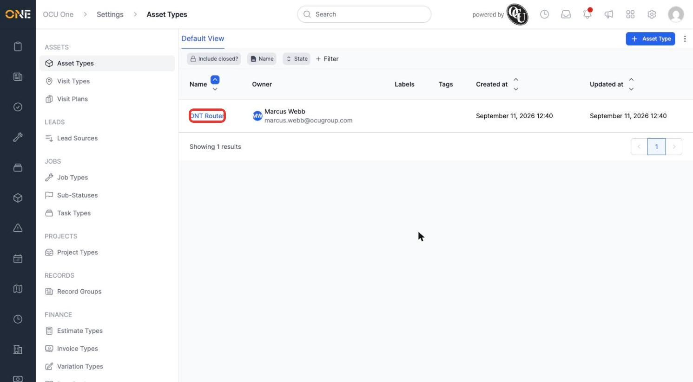
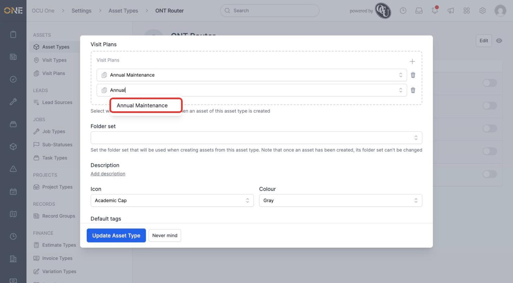
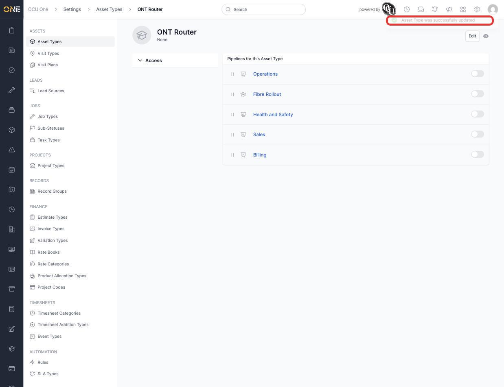
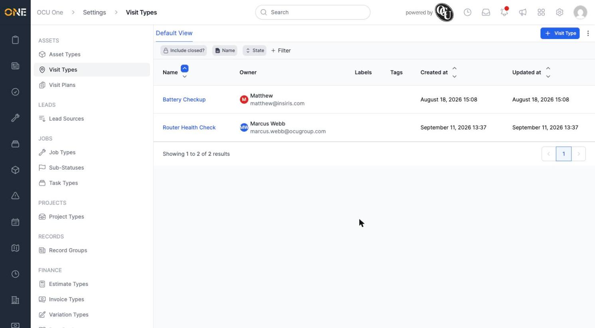
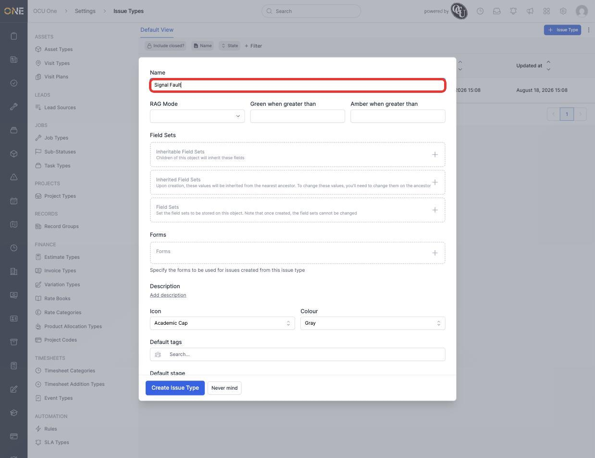
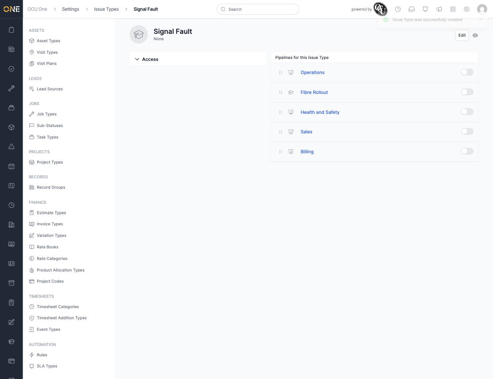

# Configuring asset, visit, and issue types

**Asset Types**, **Visit Types**, and **Issue Types** each define a category of thing your organisation tracks — physical equipment, scheduled site visits, and problems that need resolving. All three share the same basic shape: a name, optional RAG scoring, field sets, forms, and pipelines.

## Attaching a visit plan to an asset type

1. From **Settings > Asset Types**, open an existing type (for example **ONT Router**).

   

2. Click **Edit**, scroll to **Visit Plans**, and click **+** to add one. This is the same field sets/forms shape as any other type, but with an extra section: **Select which visit plans will be created when an asset of this asset type is created**.

   

3. Pick a visit plan (for example **Annual Maintenance**, a shared plan — see [Creating a shared visit plan and its recurring visit schedules](../Visit%20Scheduling/Creating%20a%20shared%20visit%20plan%20and%20its%20recurring%20visit%20schedules.md)) and click **Update Asset Type**. Every new asset created from this type will automatically get that visit plan attached.

   

## Creating a visit type

1. From **Settings > Visit Types**, click **+ Visit Type** and give it a **Name** (for example **Router Health Check**). Like a Job Type, **RAG Mode** can be set to **Automatic** with **Green when greater than** / **Amber when greater than** thresholds to colour-code visits by how overdue they are.
2. Click **Create Visit Type**. It appears in the Visit Types list, ready to be used on a visit plan's recurring schedule.

   

## Creating an issue type

1. From **Settings > Issue Types**, click **+ Issue Type** and give it a **Name** (for example **Signal Fault**). The same RAG Mode, Field Sets, Forms, and Default tags options are available here too.

   

2. Click **Create Issue Type**. Opening the new type shows its own **Pipelines** tab, listing every pipeline in the tenant with a toggle to attach it — the same pattern used across every other type (see [Attaching a pipeline to a type](../Pipelines%20%26%20Stages/Attaching%20a%20pipeline%20to%20a%20type.md)).

   

## Things to know

- Attaching a visit plan to an asset type only affects assets created **after** the change — existing assets of that type keep whatever visit plans they already had.
- An Issue Type is its own separate category from a Record Type — a check-type field's negative-outcome auto-creation (see [Configuring a check-type field's pass/fail (RAG) scoring](../Workspace%20Builder/Configuring%20a%20check-type%20field%27s%20pass-fail%20%28RAG%29%20scoring.md)) creates a Record of a chosen Record Type, not an Issue.
- RAG thresholds on a Visit Type only take effect once RAG Mode is set to Automatic; left unset, a visit's RAG status has to be set manually.
