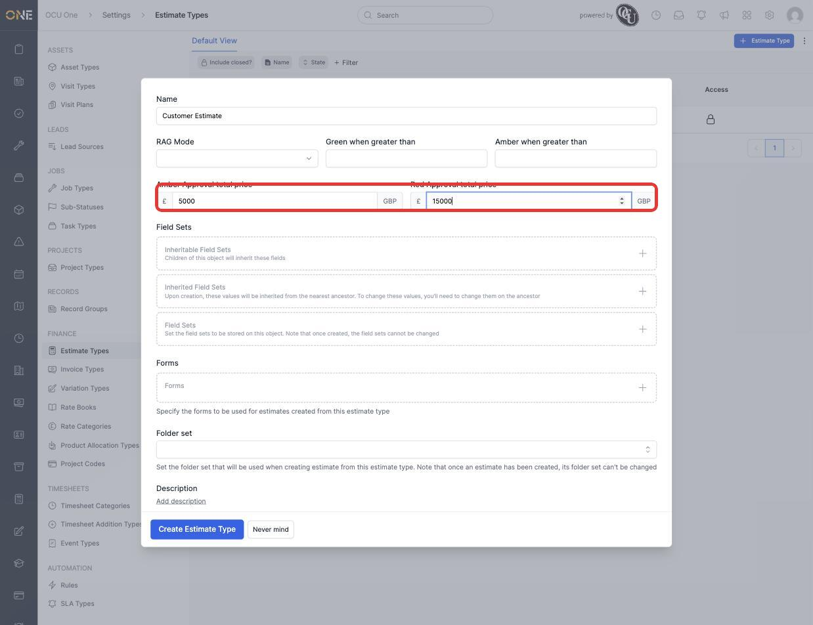
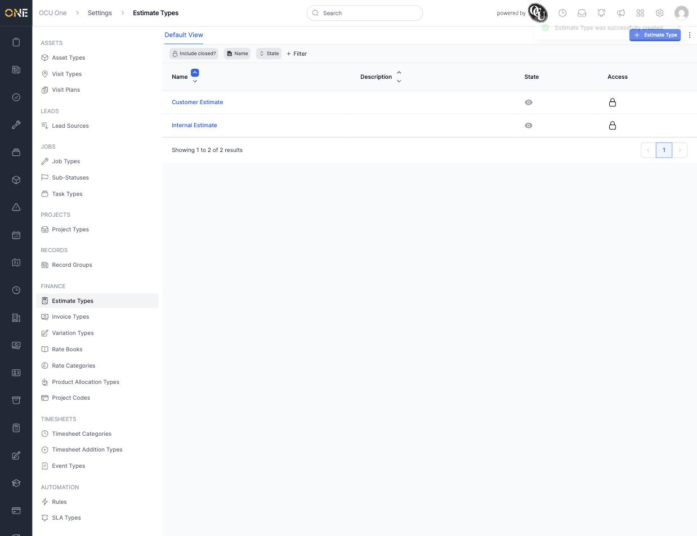
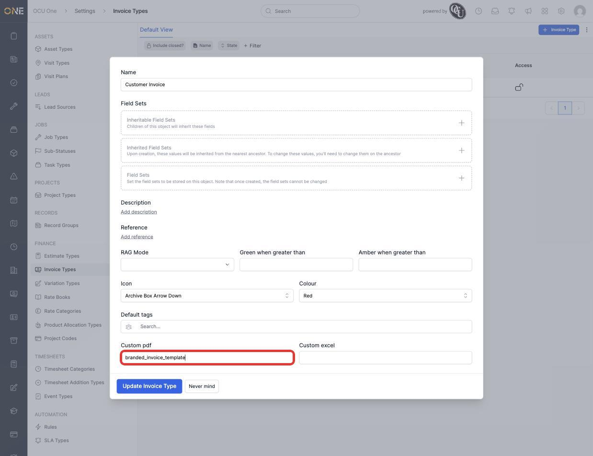
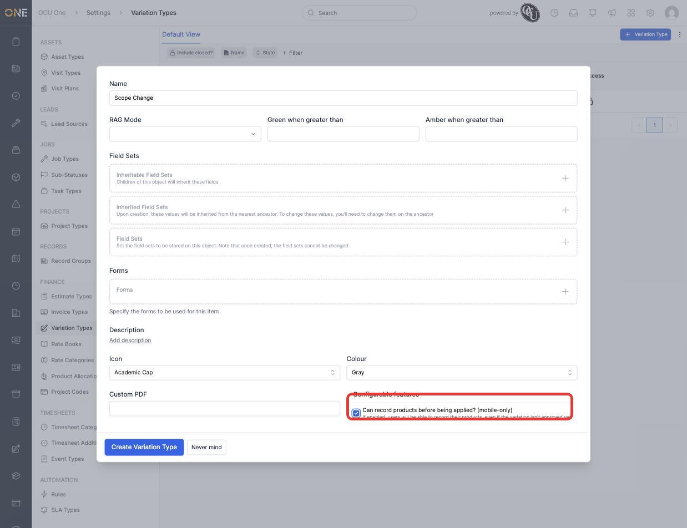
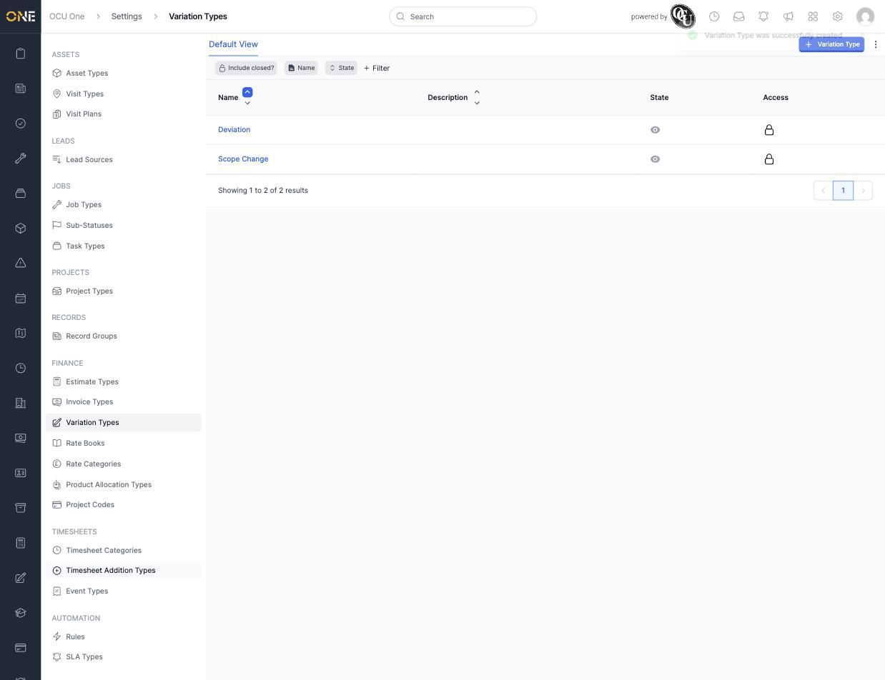

# Configuring estimate, invoice, and variation types

**Estimate Types**, **Invoice Types**, and **Variation Types** categorise the financial documents raised against a job or project — each with its own field sets, forms, and optional customisation.

## Setting approval thresholds on an estimate type

1. From **Settings > Estimate Types**, click **+ Estimate Type** and give it a **Name** (for example **Customer Estimate**).
2. Set **Amber Approval total price** and **Red Approval total price** — estimates above these totals are flagged for closer review before they can be approved, colour-coded amber or red.

   

3. Click **Create Estimate Type**. It appears alongside any existing types.

   

## Setting a custom PDF template on an invoice type

1. Open an Invoice Type (**Settings > Invoice Types**) and find **Custom pdf** (and its neighbour, **Custom excel**) near the bottom of the form.
2. Enter the template's reference to use it for invoices of this type instead of the default layout.

   

3. Click **Update Invoice Type** to save. Estimate Types and Variation Types have the same Custom PDF option available.

## Creating a variation type

1. From **Settings > Variation Types**, click **+ Variation Type** and give it a **Name** (for example **Scope Change**).
2. Under **Configurable features**, **Can record products before being applied? (mobile-only)** lets field users record product usage against a variation of this type before it's been approved.

   

3. Click **Create Variation Type**. It appears in the Variation Types list.

   

## Things to know

- Amber/Red approval totals on an Estimate Type only affect estimates created after the thresholds are set — existing estimates keep whatever approval state they already had.
- "Can record products before being applied?" on a Variation Type only affects the mobile app — desktop users are unaffected either way.
- Field Sets, Forms, RAG Mode, and Default tags work the same way across Estimate Types, Invoice Types, and Variation Types as they do on every other type in Settings.
