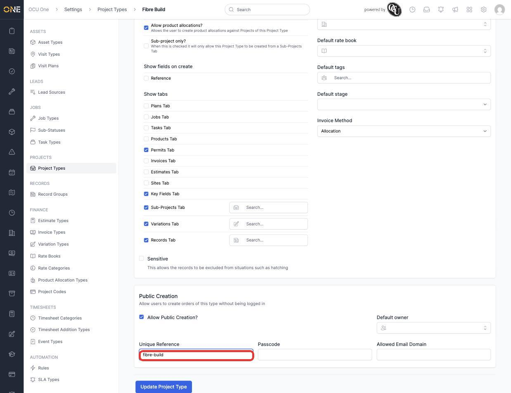
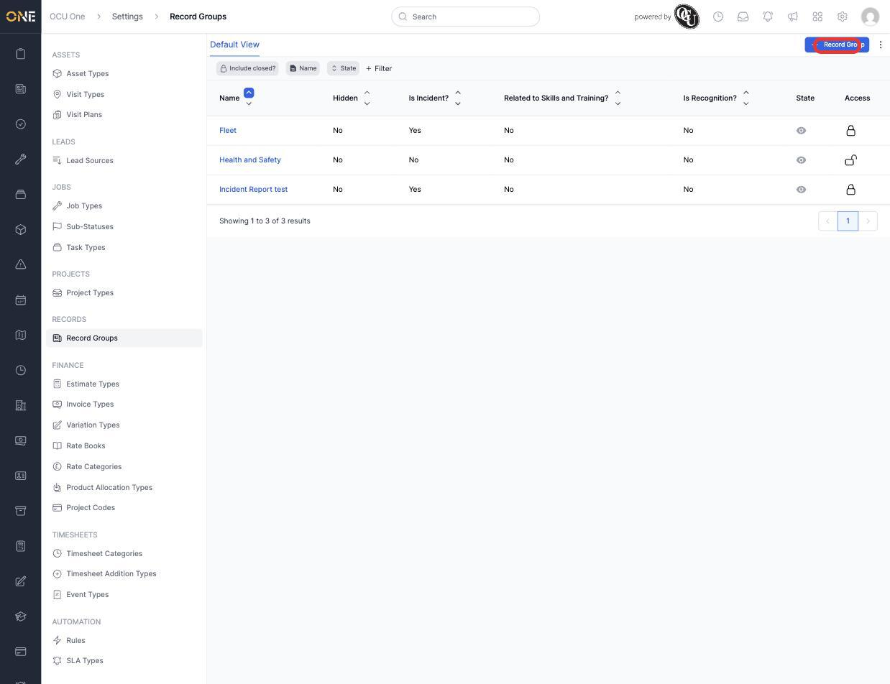
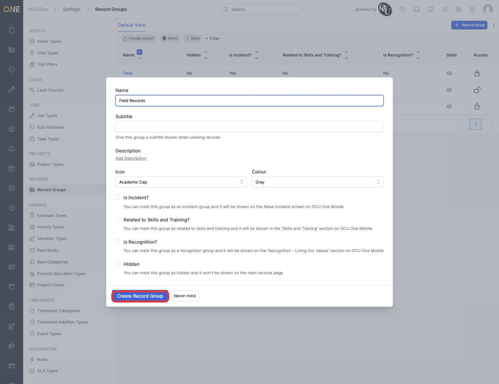
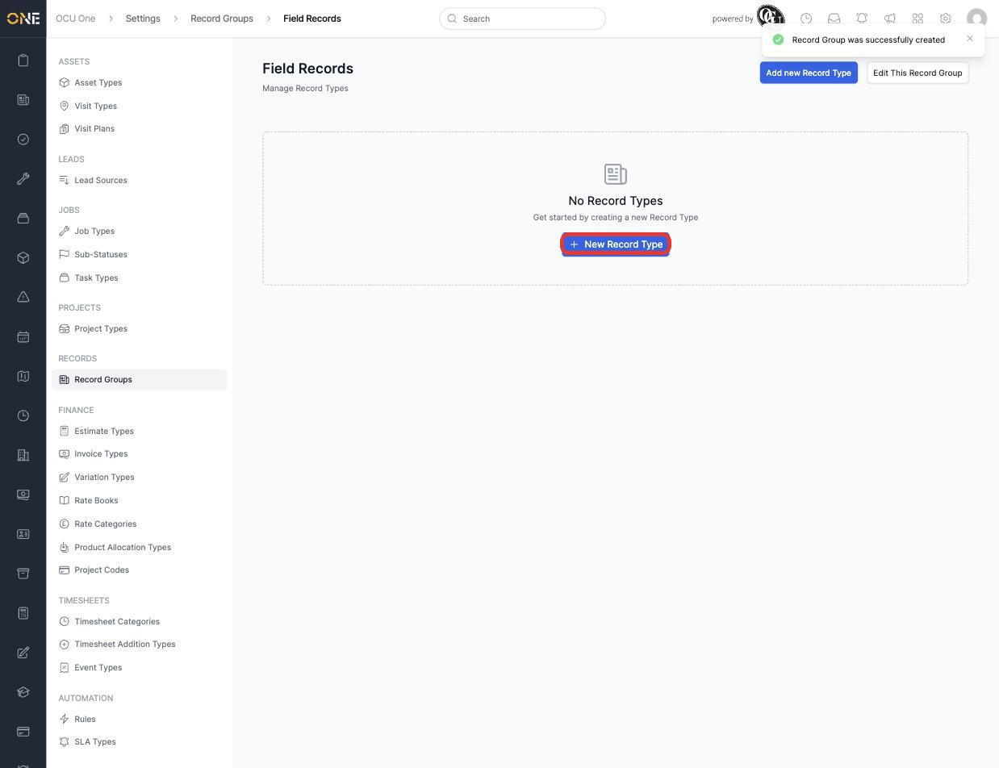
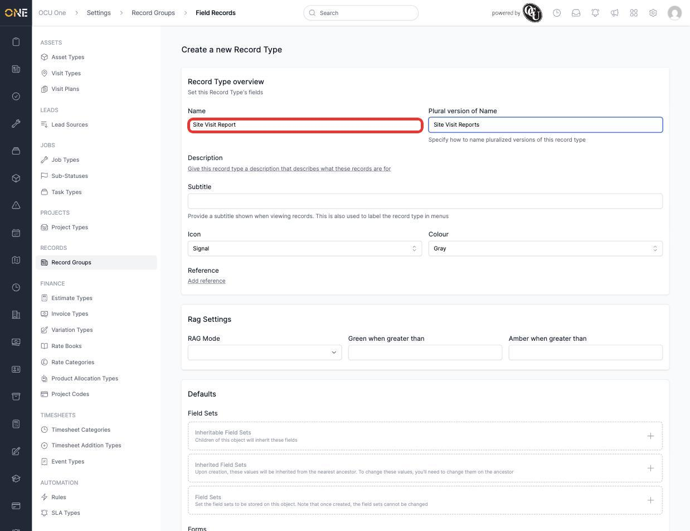
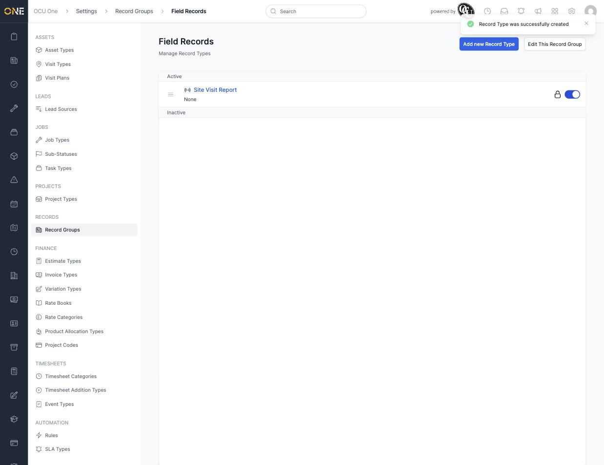

# Configuring project types, record types, and record groups

Project Types, Record Groups, and Record Types are configured from three separate screens under Settings, but share a lot of the same shape — a name and defaults, then a **Public Creation** section for accepting submissions from people who aren't logged in.

## Enabling public creation on a project type

1. Open a Project Type (**Settings > Project Types**) and scroll to **Public Creation**.
2. Tick **Allow Public Creation?**, then set a **Unique Reference** — this becomes the slug in the public intake link's URL — plus an optional **Passcode** and **Allowed Email Domain** to restrict who can submit.

   

3. Click **Update Project Type** to save. See [Enabling a public intake link for a project type or record type](../../Public%20Share%20Links/Enabling%20a%20public%20intake%20link%20for%20a%20project%20type%20or%20record%20type.md) for how this slug turns into a real shareable link.

## Creating a record group

1. From **Settings > Record Groups**, click **+ Record Group**.

   

2. Give it a **Name** (for example **Field Records**) and decide whether it's **Is Incident?**, **Related to Skills and Training?**, **Is Recognition?**, or **Hidden** — these flags control which special screens on OCU One Mobile the group surfaces in.

   

3. Click **Create Record Group**. You land on the group's own page, ready to add record types to it.

   

## Creating a record type within a group

1. Click **New Record Type**, then give it a **Name** (for example **Site Visit Report**) and a **Plural version of Name** for lists.

   

2. Further down, **Show tabs** controls which related-object tabs appear on a real record of this type (Assets, Issues, Projects, Jobs, Clients, and more), and the same **Public Creation** section as project types lets this record type accept public submissions too.
3. Click **Create Record Type**. It appears in the group's list, active by default.

   

## Things to know

- A record type only belongs to one group — to move it, it has to be recreated under the new group (there's no direct "move group" action).
- The **Show tabs** list on a record type is what actually makes related-record navigation (Assets, Jobs, Issues, etc.) appear on real records of that type — leaving them all unchecked keeps the record's page minimal.
- Public Creation settings are identical in shape across Project Types and Record Types, so once the pattern is familiar on one, it applies to the other directly.
