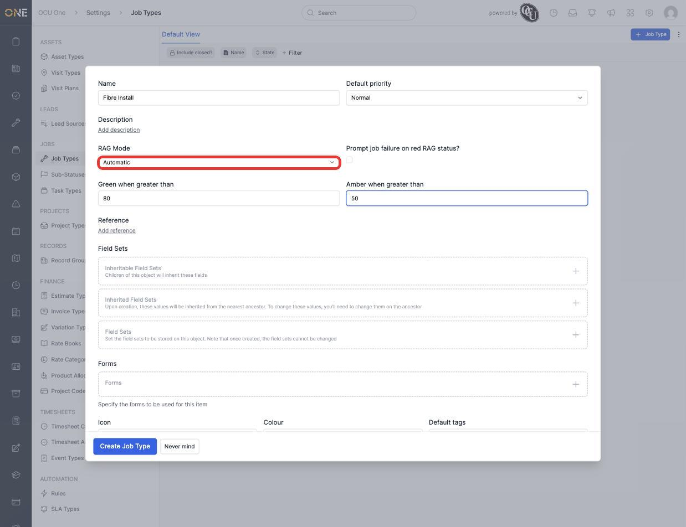
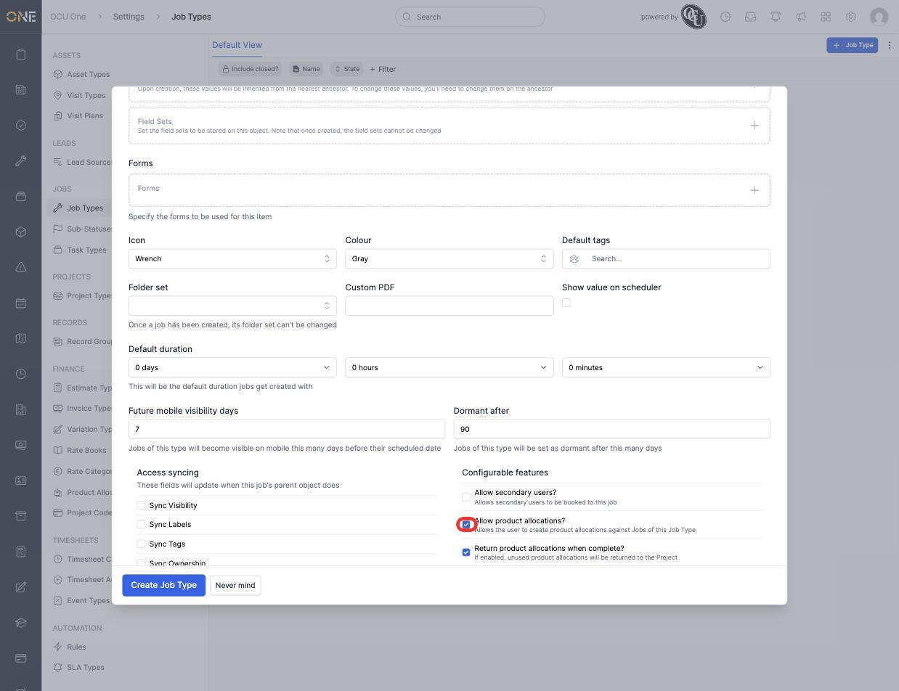
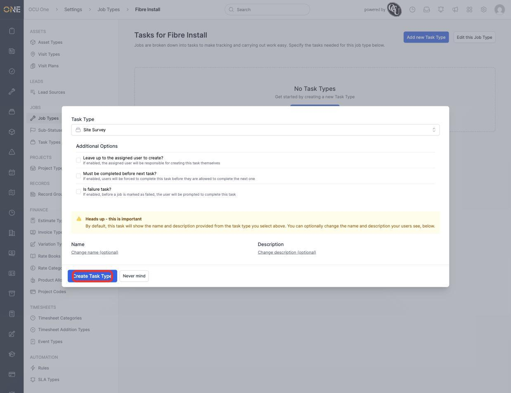
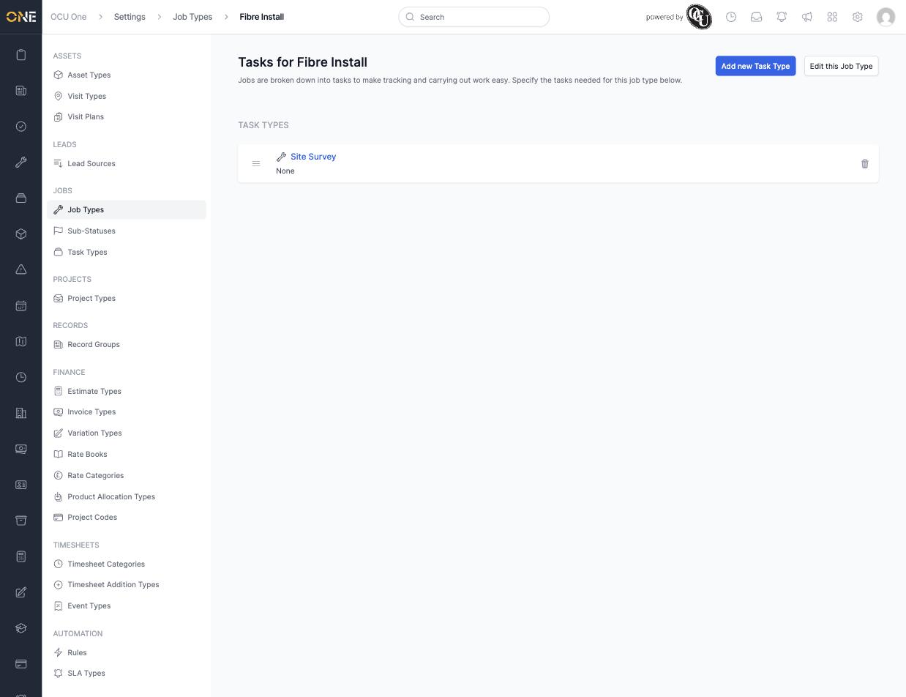

# Managing job types and task types

A **Job Type** defines the defaults and behaviour for a category of job — its RAG scoring, whether it allows product allocations, its default duration, and more. Each Job Type is broken down into **Task Types**, drawn from a shared, reusable list managed separately under **Settings > Task Types**.

## Creating a job type

1. From **Settings > Job Types**, click **+ Job Type**.

   

2. Give it a **Name** (for example **Fibre Install**), a **Default priority**, and set its **RAG Mode** to **Automatic** if it should colour-code based on thresholds — **Green when greater than** / **Amber when greater than** then define those cutoffs.

   

3. Further down, **Allow product allocations?** and **Return product allocations when complete?** are checked by default — leave them on if jobs of this type should be able to have products/materials allocated against them.

   

4. Click **Create Job Type**. You land straight on the type's **Tasks** page, ready to attach task types.

   

## Attaching task types

1. Click **New Task Type**, then pick an existing Task Type from the dropdown — for example **Site Survey**. Task Types themselves are managed separately under **Settings > Task Types**, so this list is shared across every Job Type.
2. Set any **Additional Options** — **Leave up to the assigned user to create?**, **Must be completed before next task?**, or **Is failure task?** — and optionally override the **Name**/**Description** shown to users on this job type specifically.

   

3. Click **Create Task Type**. It now appears in the job type's task list, in the order it'll show up on real jobs (drag to reorder).

   

## Things to know

- The same Task Type (for example "Site Survey") can be attached to multiple Job Types, each with its own display name/description override and ordering — see [Building job task pipelines and sub-statuses](Building%20job%20task%20pipelines%20and%20sub-statuses.md) for how each attached task type gets its own status pipeline.
- **Must be completed before next task?** enforces a strict sequence — the next task can't be marked complete until this one is.
- A Job Type's RAG thresholds only take effect when RAG Mode is set to Automatic; leaving it unset means the job's RAG status must be set manually.
