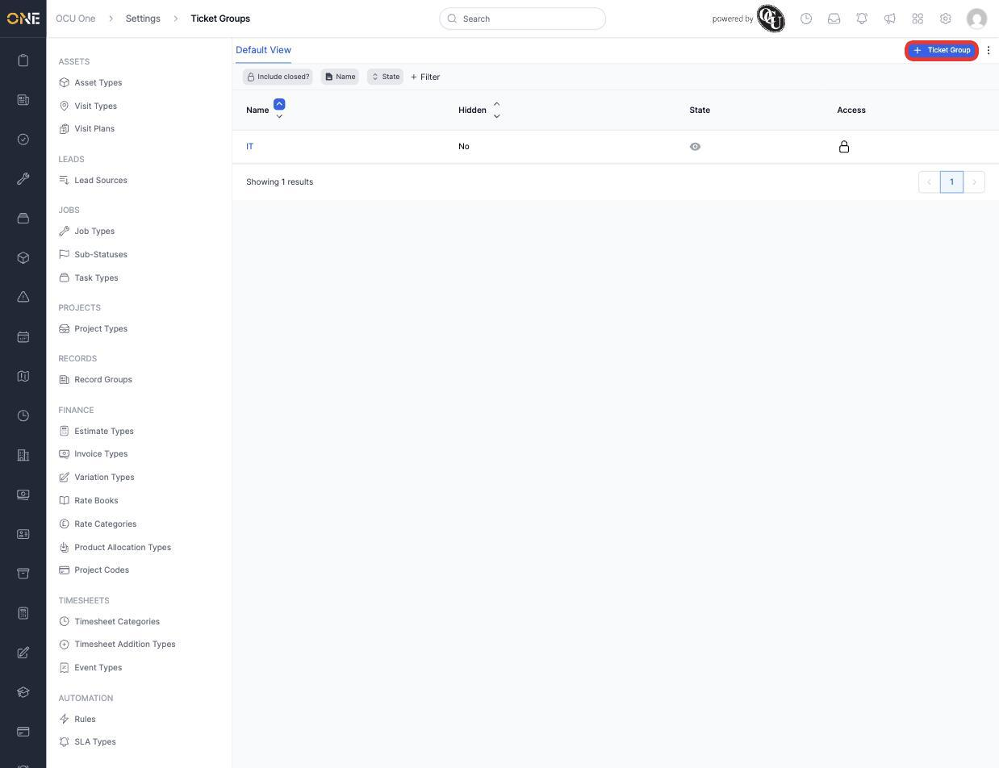
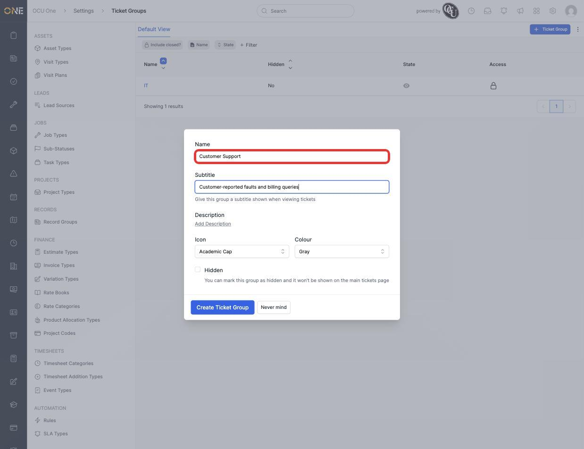
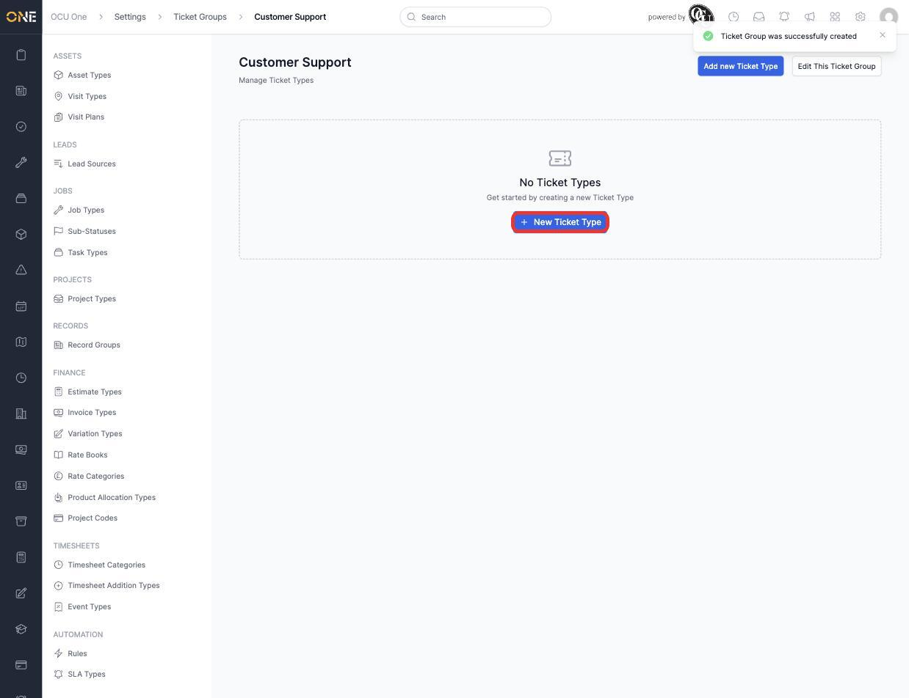
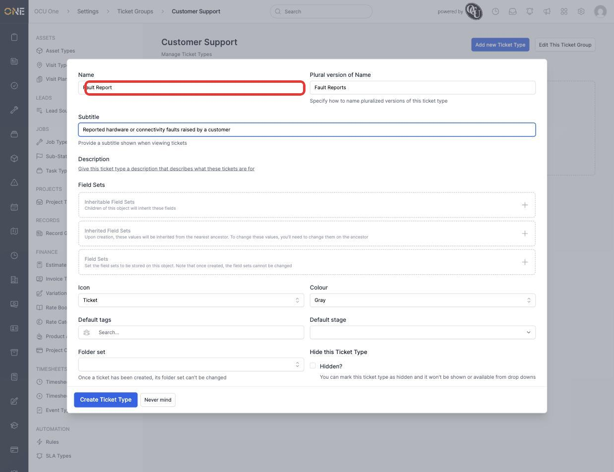
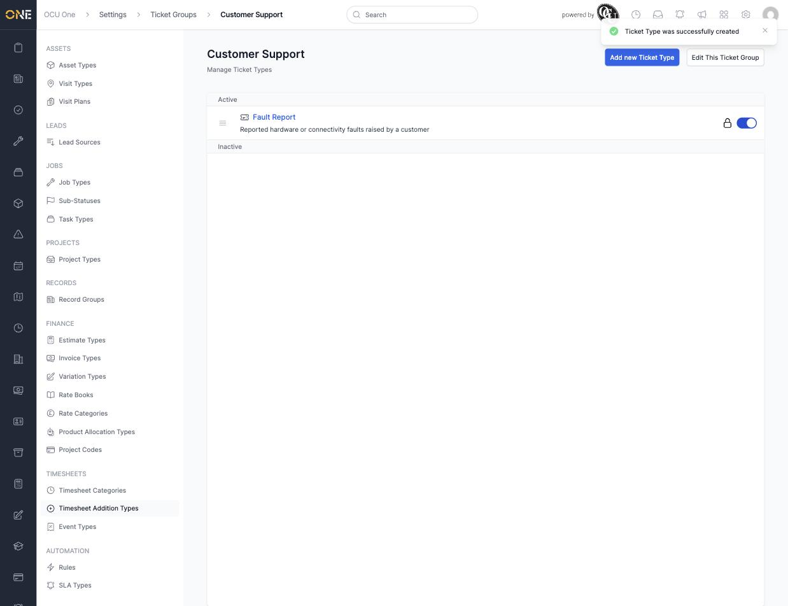
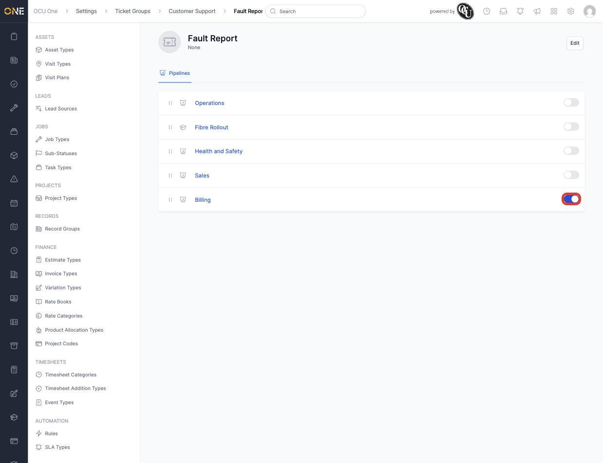

# Managing ticket types and ticket groups

**Ticket Groups** organise related **Ticket Types** together — for example, everything to do with customer support in one group, IT requests in another. Each ticket type can have its own field sets, forms, default tags, and pipelines.

## Creating a ticket group

1. From **Settings > Ticket Groups**, click **+ Ticket Group**.

   

2. Give it a **Name** (for example **Customer Support**) and an optional **Subtitle** shown when viewing tickets, plus a **Description**, **Icon**, and **Colour**. **Hidden** keeps a group off the main tickets page without deleting it.

   

3. Click **Create Ticket Group**. You land straight on the group's own ticket types page, ready to add types.

   

## Adding a ticket type

1. Click **New Ticket Type**, then give it a **Name** (for example **Fault Report**) and a **Plural version of Name**, plus a **Subtitle** and **Description**.

   

2. **Field Sets** lets you attach reusable custom fields the same way as any other type (see [Attaching a field set to a type](../Workspace%20Builder/Attaching%20a%20field%20set%20to%20a%20type.md)), and **Default tags**, **Default stage**, and **Folder set** set what a new ticket of this type starts with. **Hidden** keeps the type out of drop-downs without deleting it.
3. Click **Create Ticket Type**. It appears in the group's Active list.

   

## Attaching pipelines to a ticket type

Opening a ticket type shows its own **Pipelines** tab, listing every pipeline in the tenant with a toggle — the same attach pattern used for Assets, Issues, Projects, Records, and Users (see [Attaching a pipeline to a type](../Pipelines%20%26%20Stages/Attaching%20a%20pipeline%20to%20a%20type.md)). Switching one on makes it available to real tickets of this type.

## Things to know

- A ticket type only belongs to one ticket group — there's no direct way to move it to another group once created.
- Once a ticket has been created from a type, that type's **Folder set** can no longer be changed.
- Hiding a ticket group or ticket type only affects where it can be picked from going forward — existing tickets of that type or group are unaffected.
