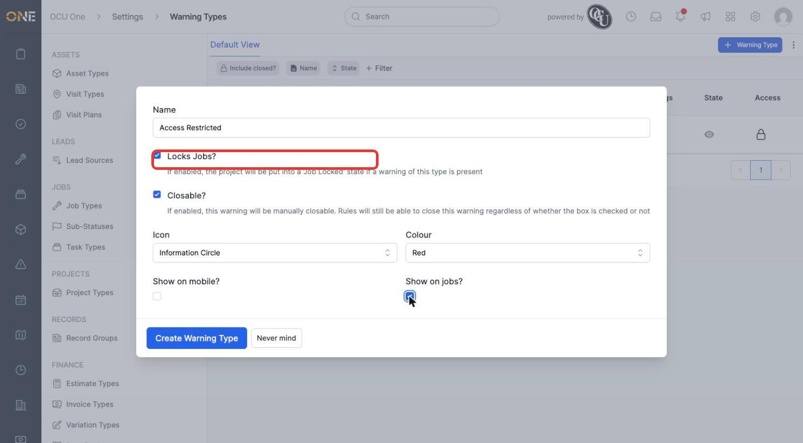
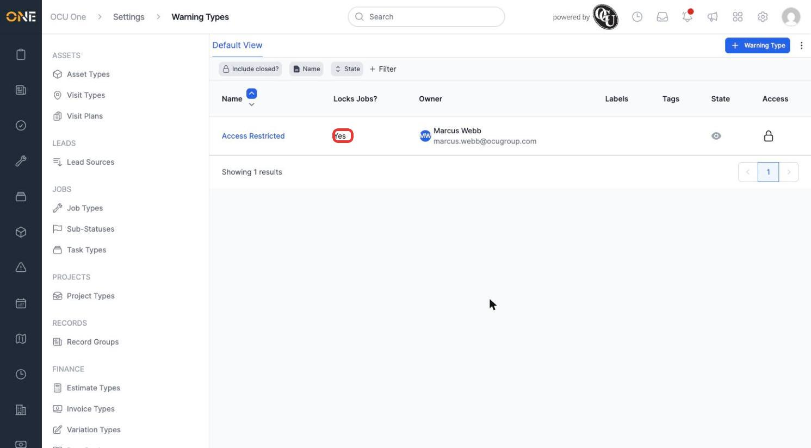
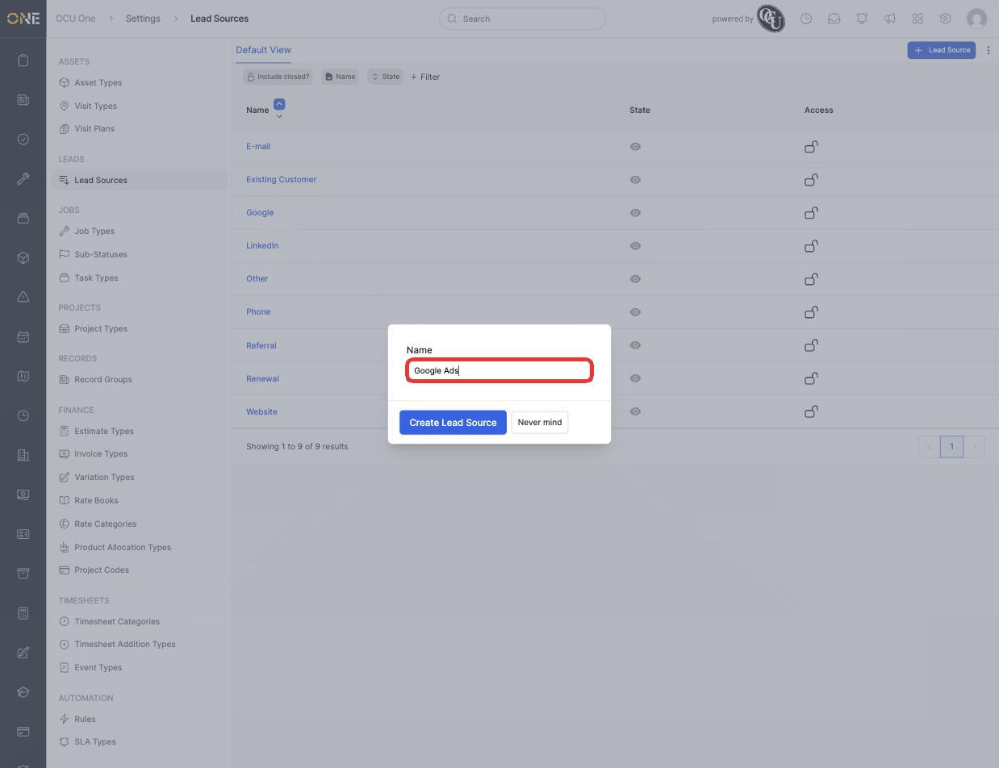
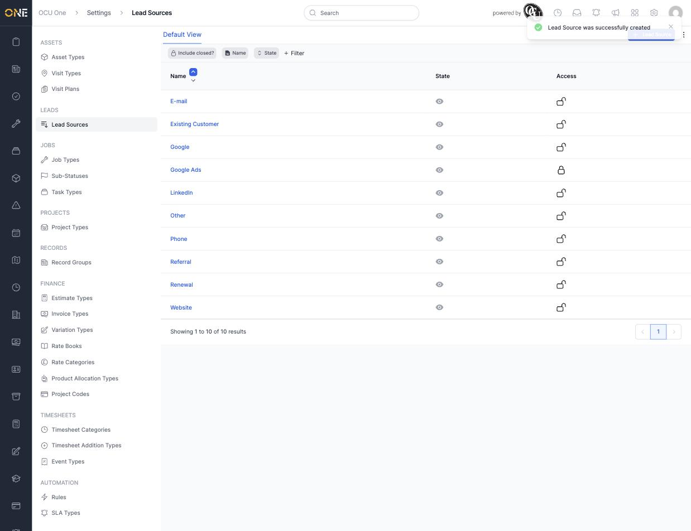
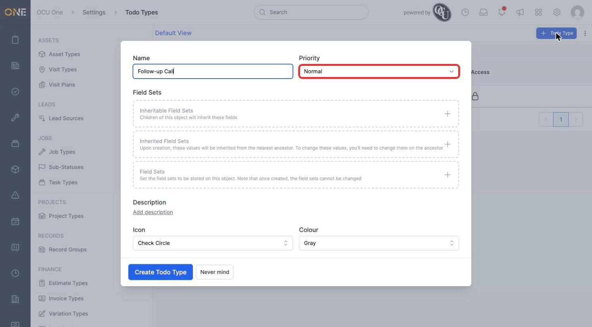
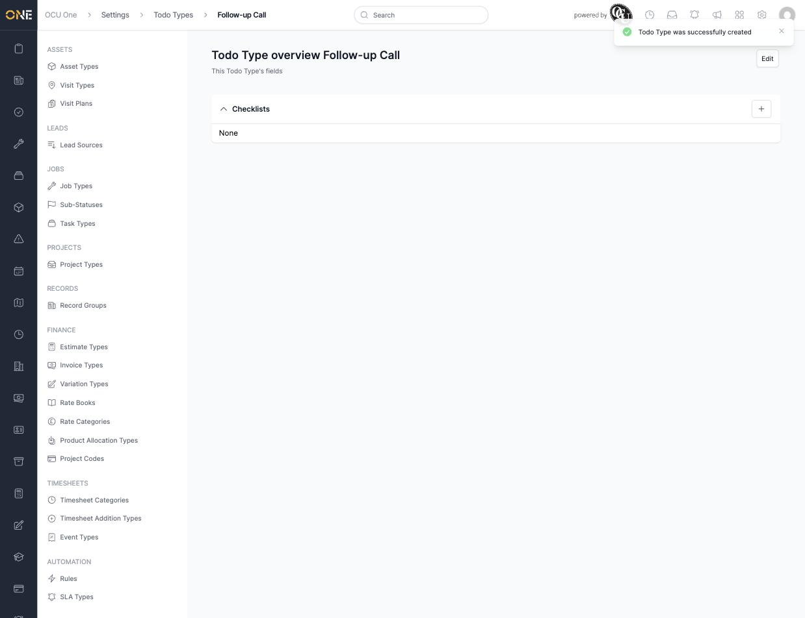
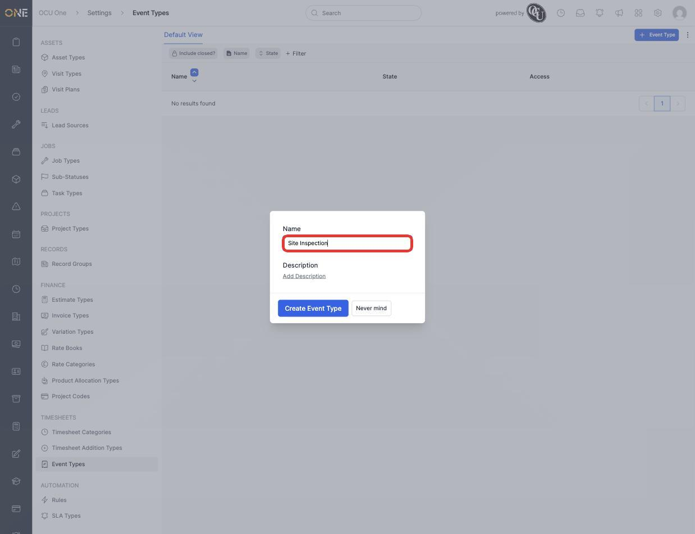
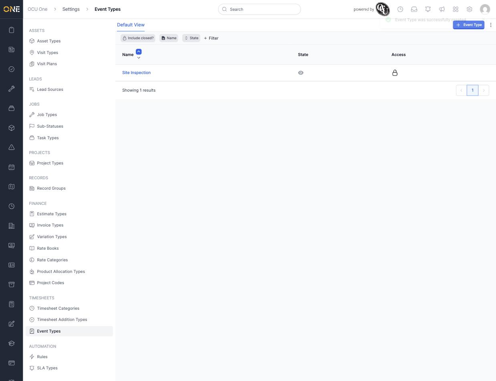

# Managing todo types, event types, warning types, and lead sources

These four smaller type screens round out the categories used across jobs, leads, and general activity tracking: **Warning Types** flag problems on a job, **Lead Sources** track where a lead came from, **Todo Types** categorise to-dos, and **Event Types** categorise calendar events.

## Creating a warning type

1. From **Settings > Warning Types**, click **+ Warning Type** and give it a **Name** (for example **Access Restricted**).
2. Tick **Locks Jobs?** to put a job into a "Job Locked" state whenever a warning of this type is present on it. **Closable?** controls whether a person can manually close the warning, and **Show on mobile?** / **Show on jobs?** control where it's visible.

   

3. Click **Create Warning Type**. Its **Locks Jobs?** value shows directly in the list.

   

## Adding a lead source

1. From **Settings > Lead Sources**, click **+ Lead Source** and give it a **Name** (for example **Google Ads**, alongside the existing **Google** entry to track paid traffic separately from organic).

   

2. Click **Create Lead Source**. It's now available to pick when logging a new lead.

   

## Creating a todo type

1. From **Settings > Todo Types**, click **+ Todo Type**, give it a **Name** (for example **Follow-up Call**), and set its **Priority**.

   

2. Click **Create Todo Type**. Opening the new type shows a **Checklists** section, where reusable checklist templates can be attached so every to-do of this type starts with the same steps.

   

## Creating an event type

1. From **Settings > Event Types**, click **+ Event Type**. This is the simplest type in Settings — just a **Name** and optional **Description**.

   

2. Click **Create Event Type**. It's now available when scheduling a calendar event.

   

## Things to know

- A warning with **Locks Jobs?** enabled affects every job it's added to immediately — there's no way to attach it without triggering the lock.
- Lead Sources and Event Types are deliberately minimal — neither supports field sets, forms, or RAG scoring the way most other types in Settings do.
- A Todo Type's Checklists are templates only — editing one after to-dos already exist doesn't retroactively change checklists already created on those to-dos.
