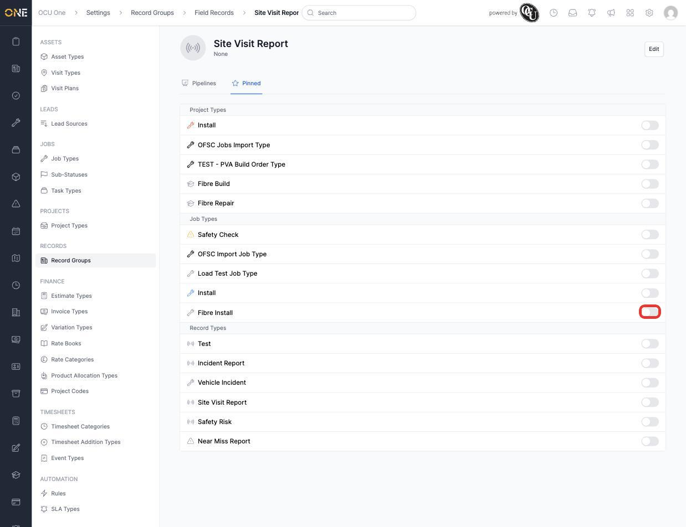
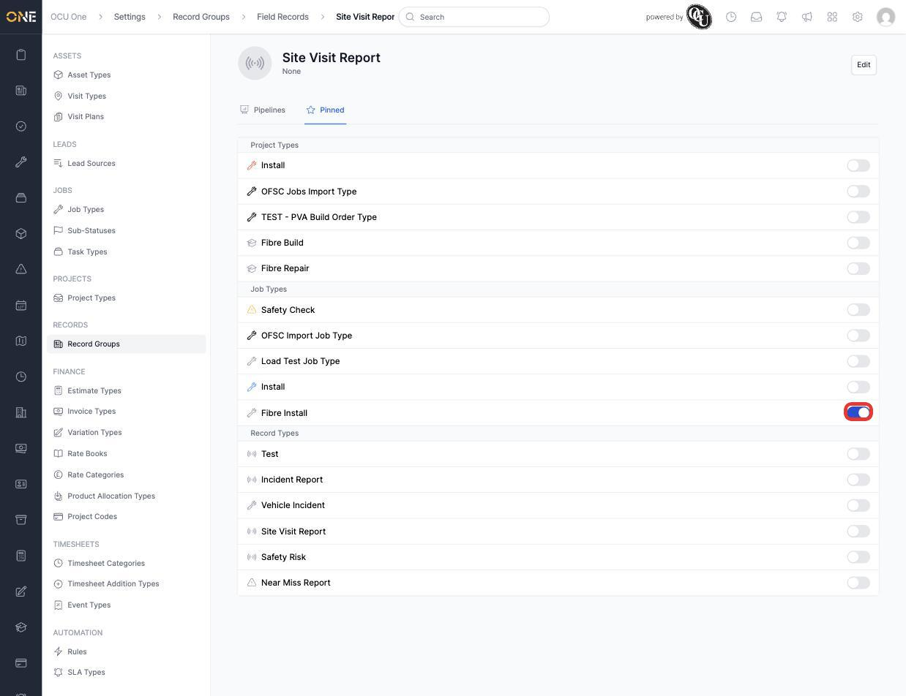
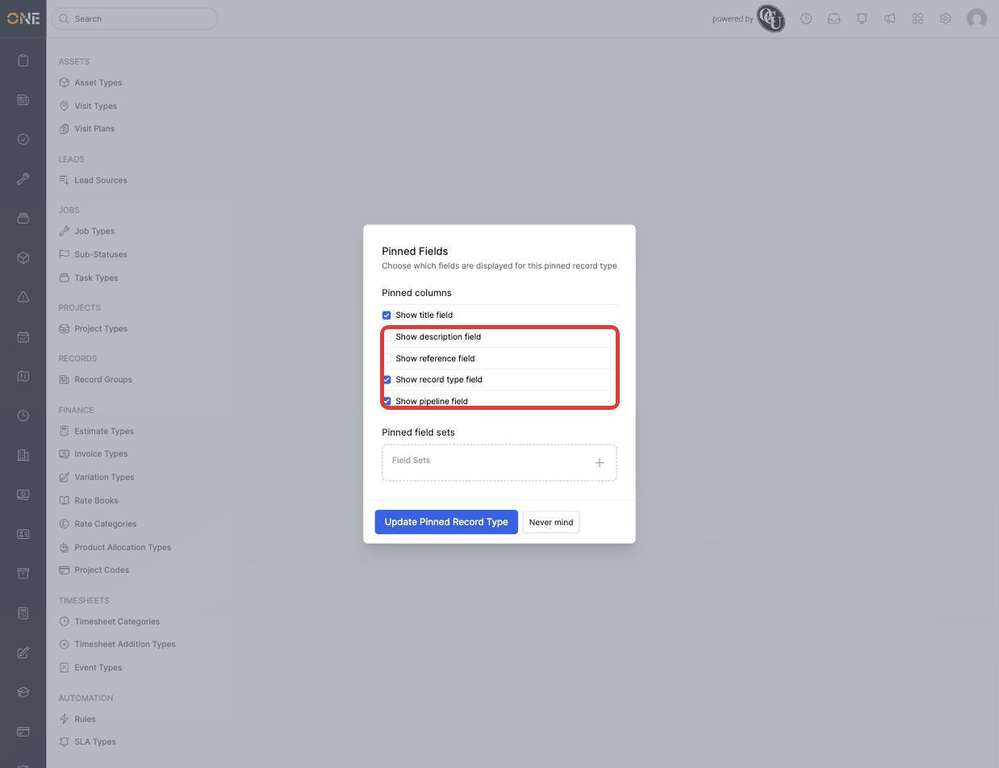

# Pinning related record types to a record type

A record type's **Pinned** tab lets you flag other types — Project Types, Job Types, or other Record Types — as related to it, so a quick-reference list of them shows up on real records of this type.

## Viewing and toggling pinned types

1. Open a Record Type and click its **Pinned** tab. Every active Project Type, Job Type, and Record Type in the tenant is listed, grouped under those three headings, each with its own on/off toggle.

   

2. Switch on the toggle next to any type to pin it — for example **Fibre Install** under Job Types.

   

Switching a toggle off again unpins that type immediately — there's no separate save step for the list itself.

## Choosing which fields show

1. Once a type is pinned, edit it directly (via its own management screen or by re-visiting the pinned relationship) to open **Pinned Fields**. Tick which columns should appear wherever this pinned relationship is shown — **Show title field**, **Show description field**, **Show reference field**, **Show record type field**, **Show pipeline field** — and optionally add **Pinned field sets** to surface specific custom fields too.

   

2. Click **Update Pinned Record Type** to save.

## Things to know

- Pinning is one-directional per pair — pinning "Fibre Install" onto "Site Visit Report" doesn't automatically pin "Site Visit Report" onto "Fibre Install" the other way round.
- The Pinned Fields choices only control which columns display for that specific pinned relationship — they don't change the underlying type's own fields anywhere else.
- Only active types appear in the Pinned tab's list — an archived Project Type, Job Type, or Record Type won't show up as something new to pin.
