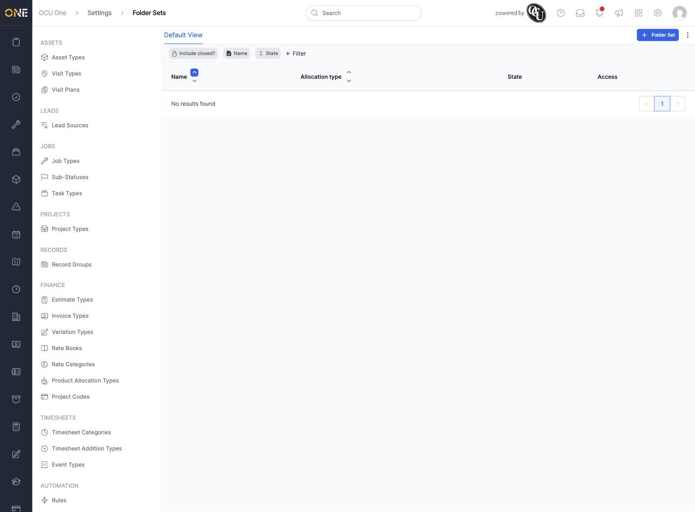
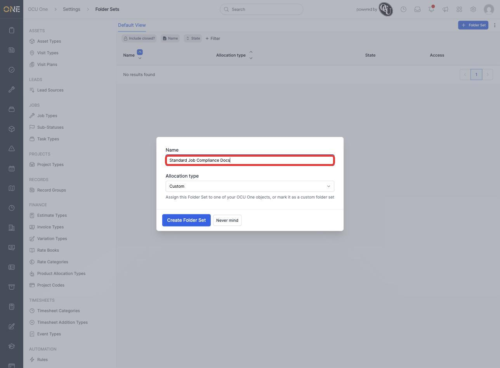
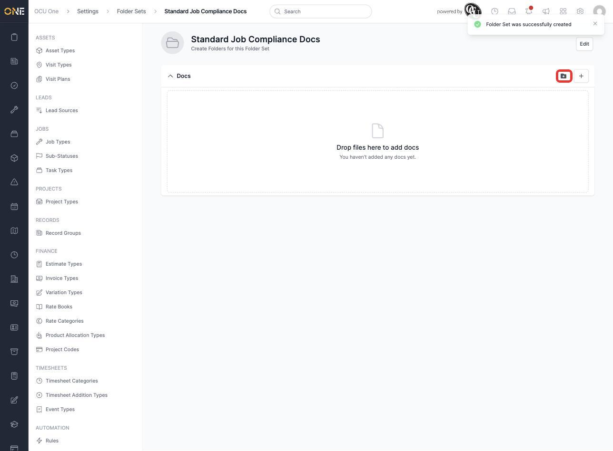
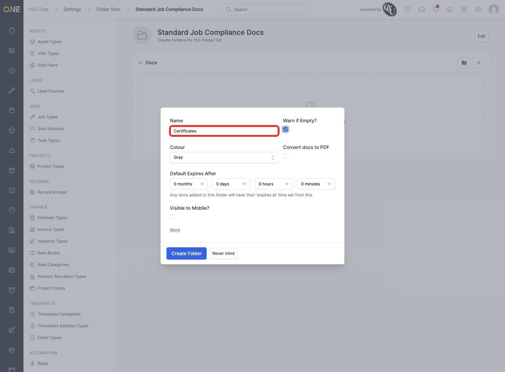
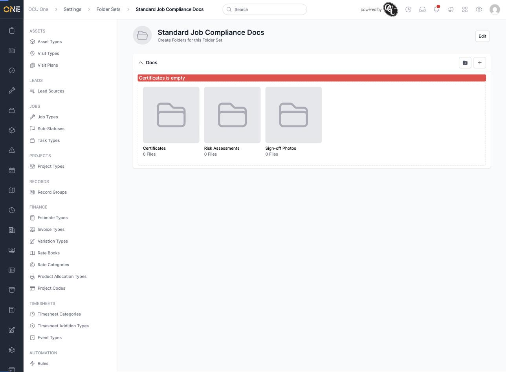

# Managing folder sets (document folder templates)

A folder set is a reusable template of document folders — set it up once as an admin, and every record it's assigned to gets the same folder structure for storing certificates, assessments, photos, and other files. This screen lives under **Settings > Views & Organization**.

## Creating a folder set

1. From the Folder Sets list, click **+ Folder Set**.

   

2. Give it a **Name** — for example **Standard Job Compliance Docs** — and choose an **Allocation type**: assign it to one of your record types, or leave it as **Custom** for a general-purpose template. Click **Create Folder Set**.

   

## Adding folders to the set

You land on the folder set's detail page, with a **Docs** area ready for its child folders.

1. Click the folder icon in the top-right of the Docs area to add a new folder (the icon next to it adds a doc placeholder directly, rather than a folder).

   

2. Give the folder a **Name** — for example **Certificates** — and set any options that apply: **Warn if Empty** flags the folder if nothing's been added to it yet, **Convert docs to PDF** normalises uploads, **Default Expires After** sets an automatic expiry countdown for anything added, and **Visible to Mobile** controls whether field engineers see it in the mobile app.

   

3. Click **Create Folder**, then repeat for as many folders as the template needs. A completed set with three folders — **Certificates**, **Risk Assessments**, and **Sign-off Photos**:

   

## Things to know

- A folder marked **Warn if Empty** shows a red banner on any record using this folder set until at least one file is added to it — as seen above for the still-empty **Certificates** folder.
- Assigning a folder set to a record type means every new record of that type automatically gets this same folder structure, rather than someone building it from scratch each time.
- Folder sets are separate from ordinary docs uploaded directly to a record — they exist specifically to give a consistent, repeatable structure across many records of the same type.
