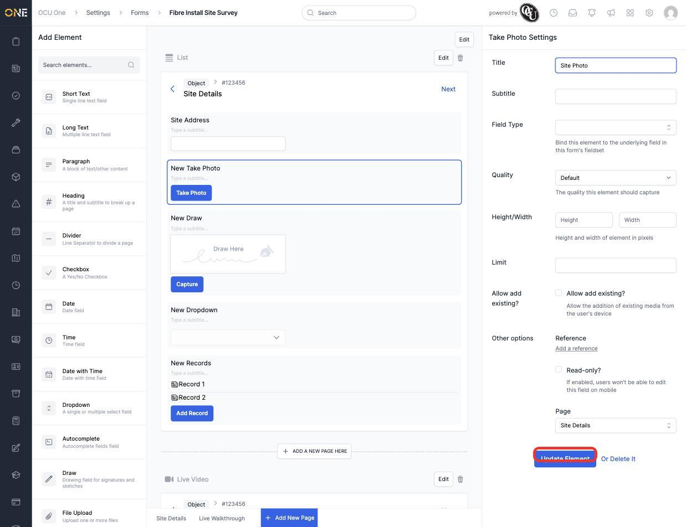
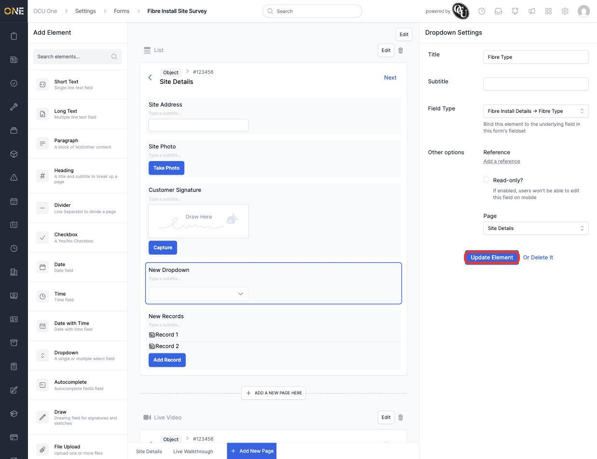
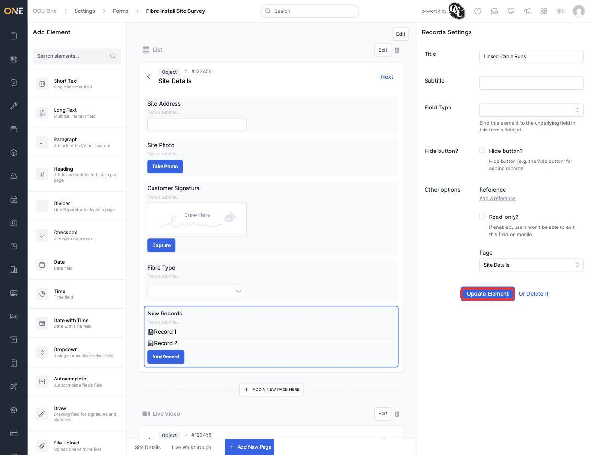
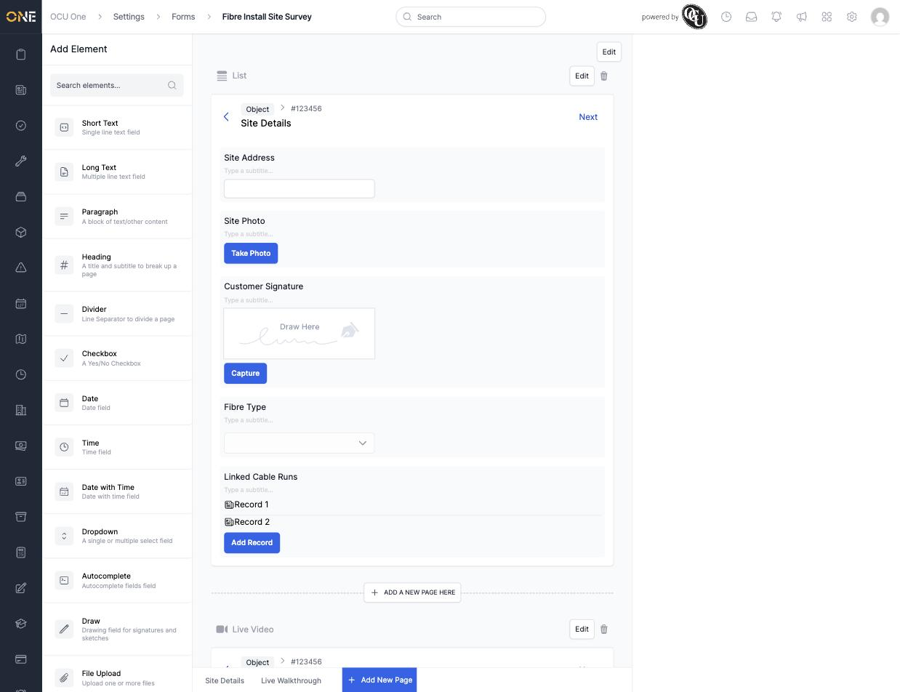

# Adding elements to a form page

Every page in a form is built from **elements** — the individual questions, media captures, and content blocks someone fills in. The element palette on the left of the form builder (**Settings > Forms**) offers a wide range of types beyond simple text, from photo and signature capture to linked records.

## Adding elements

Drag an element from the palette onto a page to add it. A page can hold any mix of element types — for example a Short Text field, a **Take Photo** capture, a **Draw** (signature) pad, and a **Dropdown**, plus a **Records** element for attaching related records:

Click any element to open its settings on the right and give it a proper **Title** — every element type has its own extra settings alongside Title:

- **Take Photo** — Quality, Height/Width, a capture Limit, and whether existing media from the device can be added instead of only new captures.

  

- **Draw** — a signature/sketch pad, with the same Height/Width sizing options.
- **Dropdown**, like most simple field-backed elements, can be bound to a **Field Type** from one of the form's attached field sets — picking one here means answers actually save into that field, not just display on the page.

  

- **Records** — embeds a mini list of related records directly on the page, with its own **Add Record** button and an option to bind it to a Records-type field, or hide the Add button entirely if records should only ever be linked another way.

  

Once configured, the page reflects every element's real title:

## Things to know

- Binding an element to a **Field Type** only works for field types already present in one of the field sets attached to the form (see [Building a custom form](Building%20a%20custom%20form.md)) — an unbound element still displays and can be filled in, but its answer isn't saved anywhere structured.
- Elements can be dragged to reorder them within a page, or deleted from their own settings panel with **Or Delete It**.
- Beyond the types shown here, the palette also includes Heading, Paragraph, Divider, Checkbox, Date/Time, Autocomplete, File Upload, Star Rating, Image, Take Video, Web page, Address, Rich Text, Single/Multiple User, and several Record-specific elements (Title, Description, Reference, Assigned User, Next Action Due, Associated Permit) for building out a record's own detail page.
