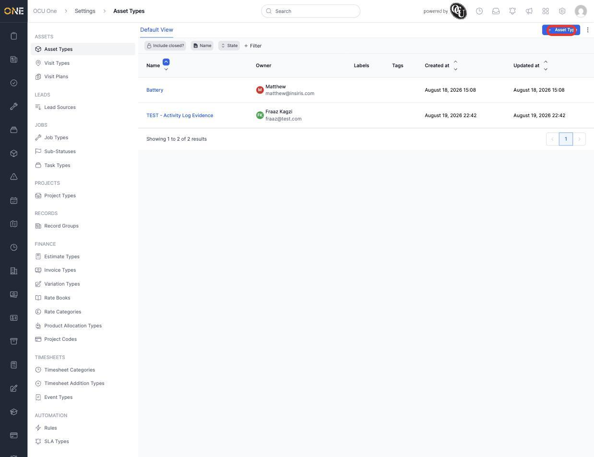
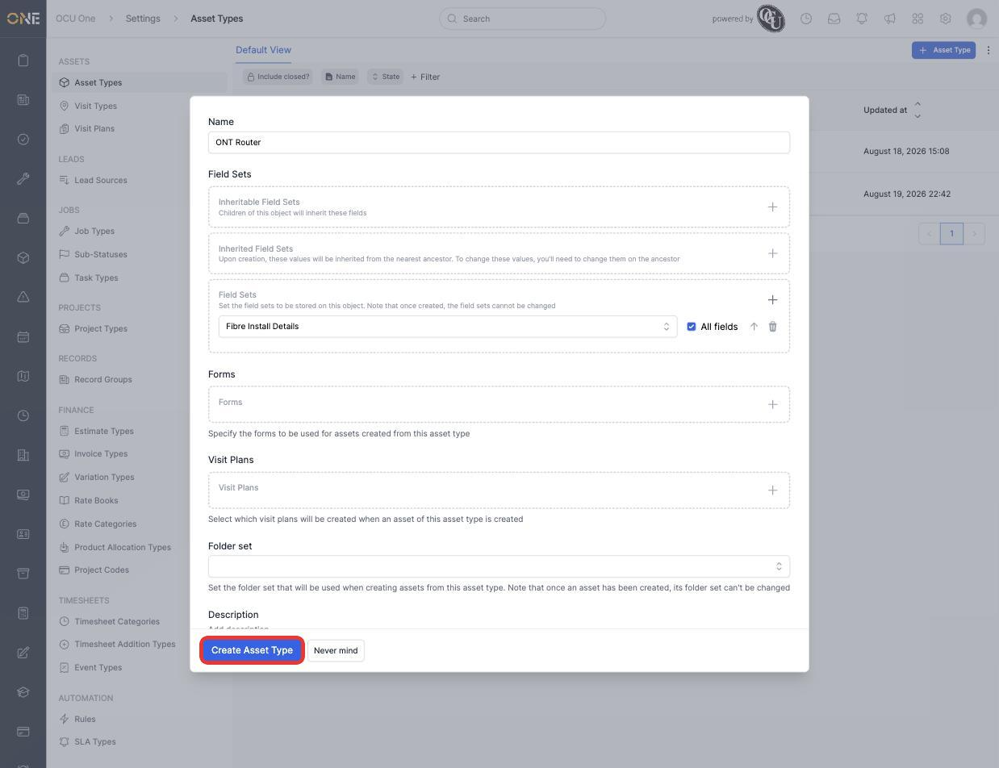
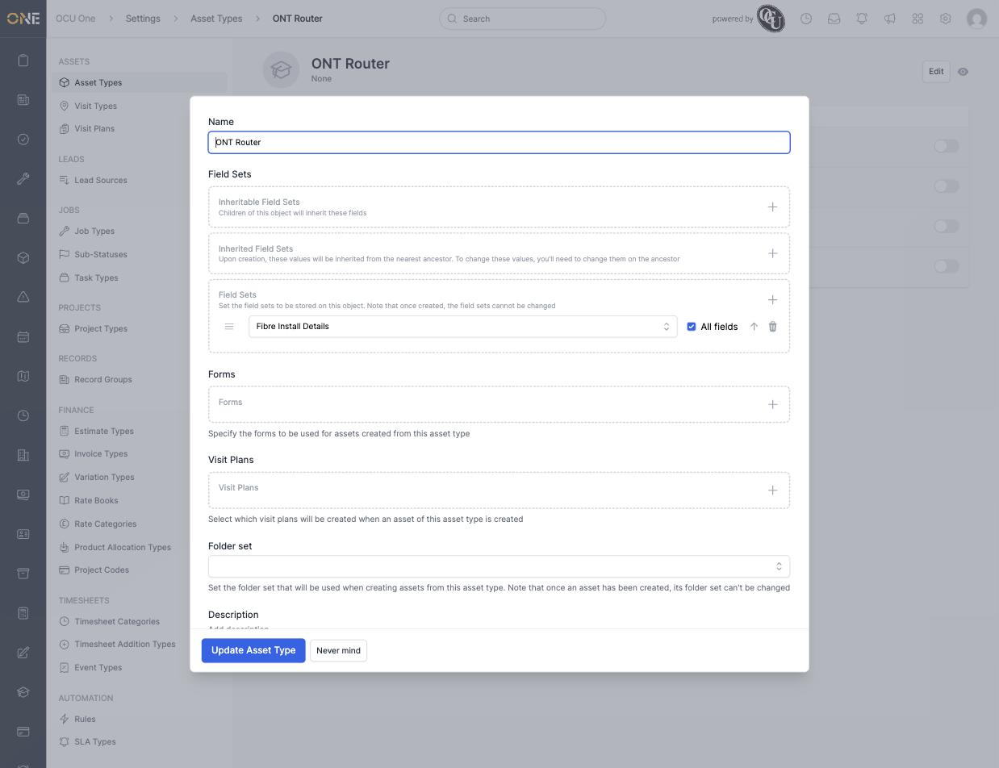

# Attaching a field set to a type

A field set only starts showing up on real records once it's attached to a type — a Job Type, Asset Type, Project Type, and so on. This is done directly from the type's own settings screen, not from the field set itself.

## Attaching a field set

1. Open the type's settings screen (for example **Settings > Asset Types**) and create or edit the type.

   

2. Under **Field Sets**, there are three boxes:
   - **Inheritable Field Sets** — fields that children of this object (for example sub-assets) will inherit.
   - **Inherited Field Sets** — read-only here; these come from a parent and can only be changed on the ancestor itself.
   - **Field Sets** — the field sets actually stored on this type.

   Click the **+** on **Field Sets**, then pick a field set from the dropdown — for example **Fibre Install Details**. The **All fields** checkbox (ticked by default) includes every field group in that set; untick it to attach only specific groups.

   

3. Click **Create Asset Type** (or **Update Asset Type** when editing). The attachment is saved immediately — reopening the type confirms it, now with a drag handle for reordering against any other attached field sets.

   

## Things to know

- **Once a field set is attached to a type, it can't be swapped for a different one** — the warning shown when creating the field set itself ("you cannot change the assigned field set once it's been assigned to an OCU One object") applies here too. Removing the row is possible, but changing which field set is chosen isn't.
- The same field set can be attached to more than one type — for example the same "Fibre Install Details" set could also be attached to a Job Type, so the same fields show up consistently wherever it's used.
- This same **Field Sets** section (Inheritable / Inherited / Field Sets) appears on every type that supports custom fields, not just Asset Types — the pattern is the same everywhere.
