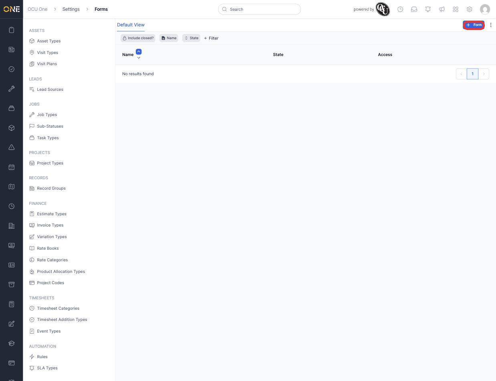
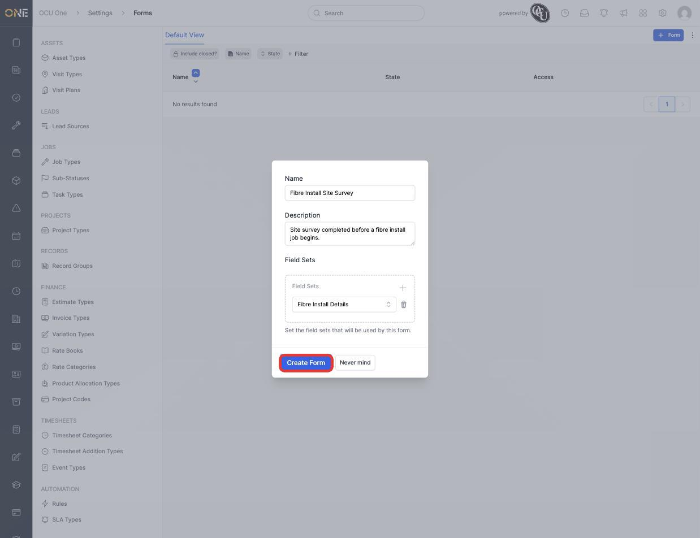
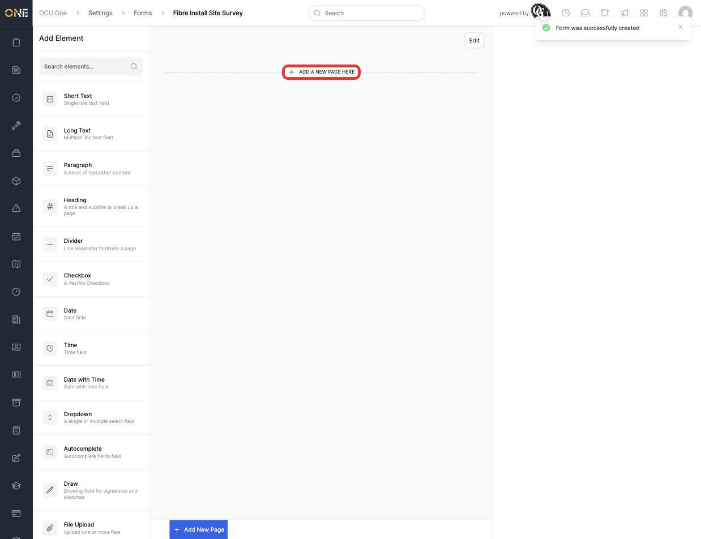
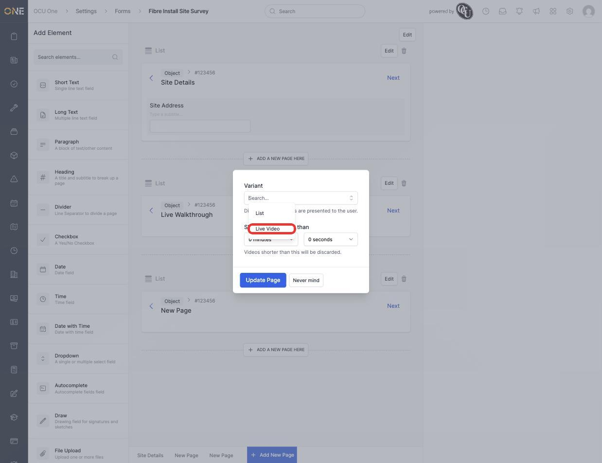
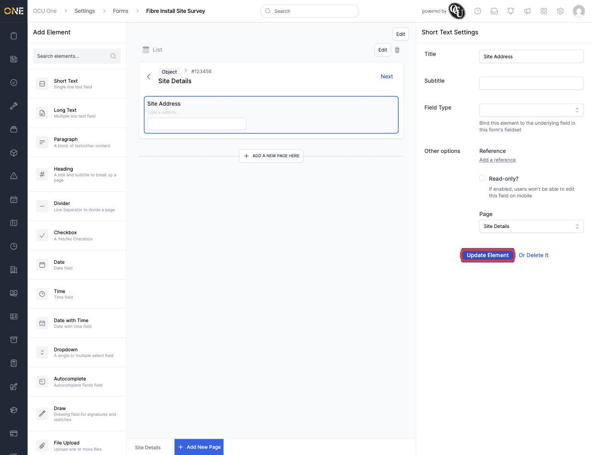
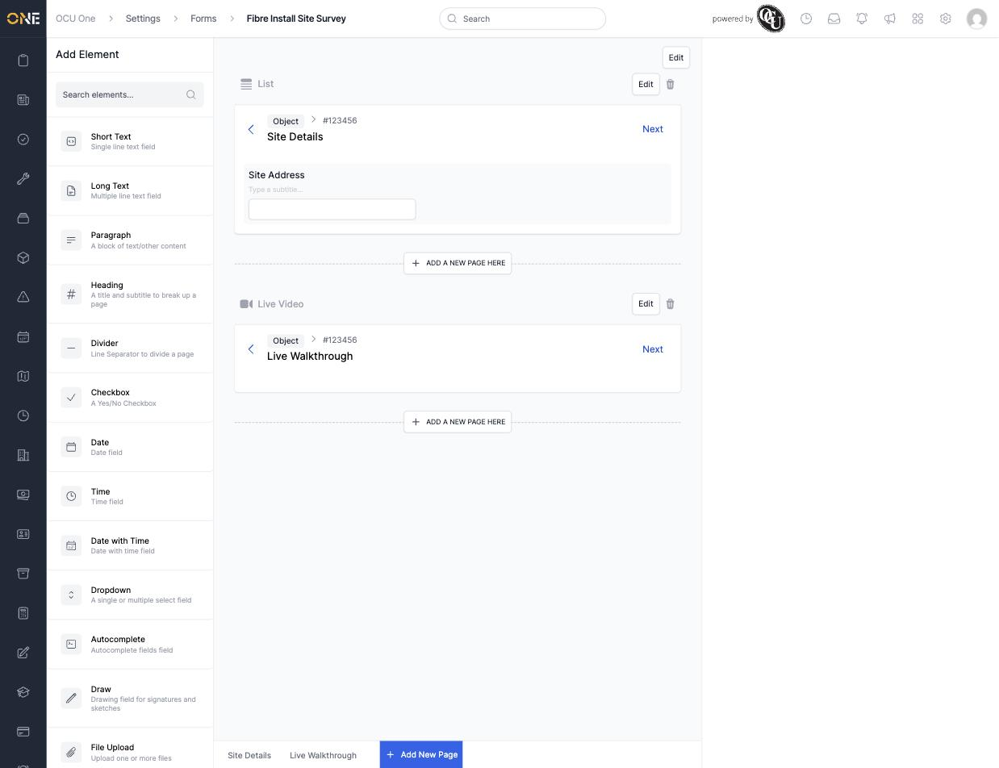

# Building a custom form

A form is a structured, multi-page questionnaire used out in the field — for example a site survey walked through step by step on a mobile device. Forms are built under **Settings > Forms**, made up of one or more pages, each holding the elements (questions, headings, media captures) shown to whoever fills it in.

## Creating a form

1. From the Forms list, click **+ Form**.

   

2. Give it a **Name** (for example **Fibre Install Site Survey**), an optional **Description**, and attach any **Field Sets** whose fields this form should be able to bind its elements to — for example **Fibre Install Details**.

   

3. Click **Create Form**. This opens the form builder — an element palette on the left and the form's pages on the right, starting with a prompt to add the first page.

   

## Adding and naming pages

Click **Add New Page** (or **+ Add a new page here** between existing pages, to insert one at a specific point) to create a page. Click directly on a page's title text to rename it in place — for example **Site Details**.

Each page also has its own **Edit** button, opening two settings:

- **Variant** — **List** (the default, showing elements one after another) or **Live Video** (the page becomes a continuous video capture instead of a list of questions).
- **Skip videos shorter than** — for Live Video pages, a minimum length below which a recorded video is discarded rather than kept.

## Adding an element to a page

Drag an element from the **Add Element** palette onto a page to add it. Click the new element to open its settings panel on the right — give it a **Title** (for example renaming a Short Text element to **Site Address**) and, for elements that should feed into a field set, choose which **Field Type** it's bound to.

A form with a List page ("Site Details") and a Live Video page ("Live Walkthrough") looks like this once built:

## Things to know

- A form isn't visible to anyone on mobile until it's attached somewhere that uses it (for example a Records or Visit Plan configuration) — building the form here only creates the template.
- Reordering pages or elements is done by dragging them; deleting either asks for confirmation first, since it removes anything nested inside.
- See [Adding elements to a form page](Adding%20elements%20to%20a%20form%20page.md) for the full range of element types available, beyond simple text fields.
