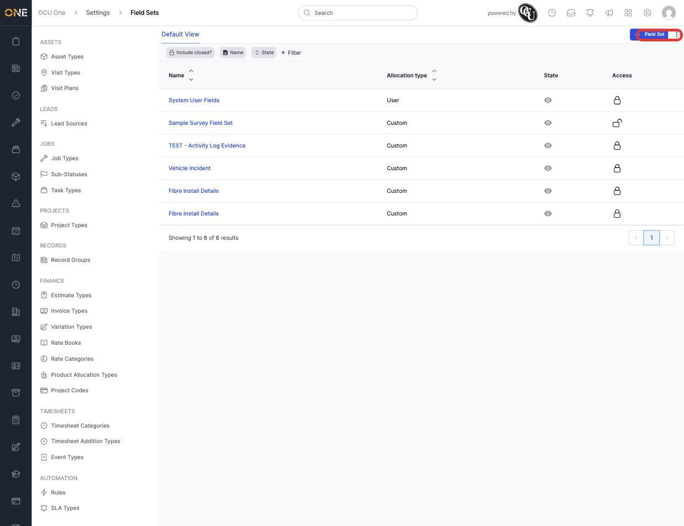
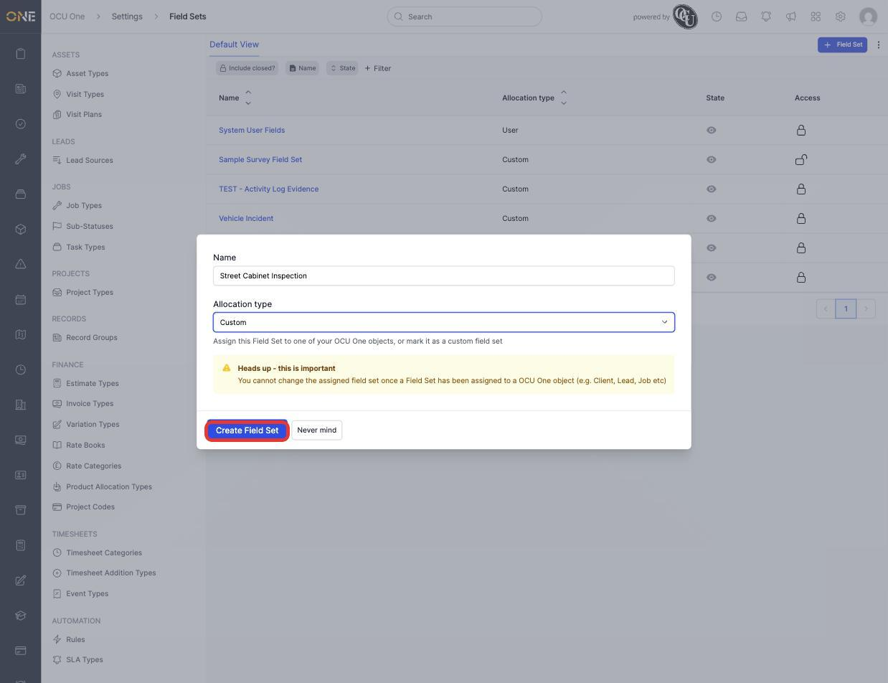
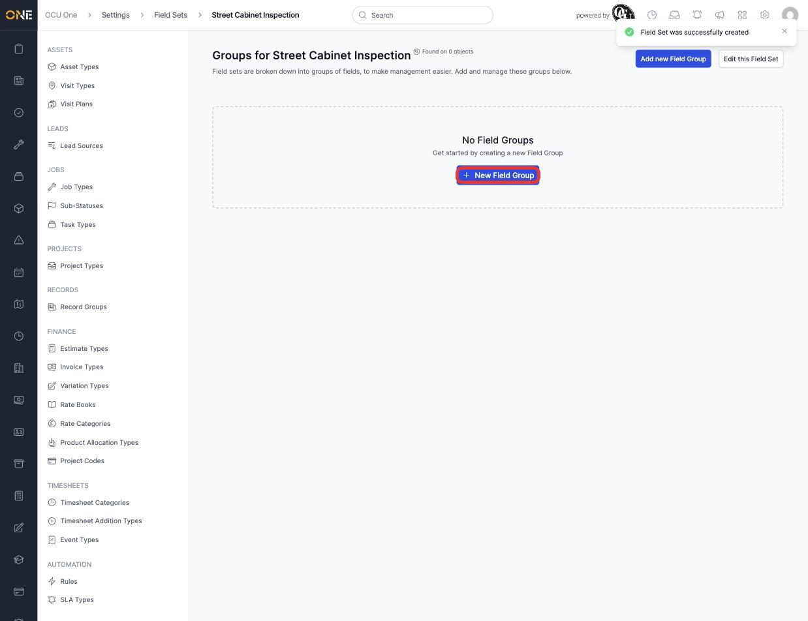
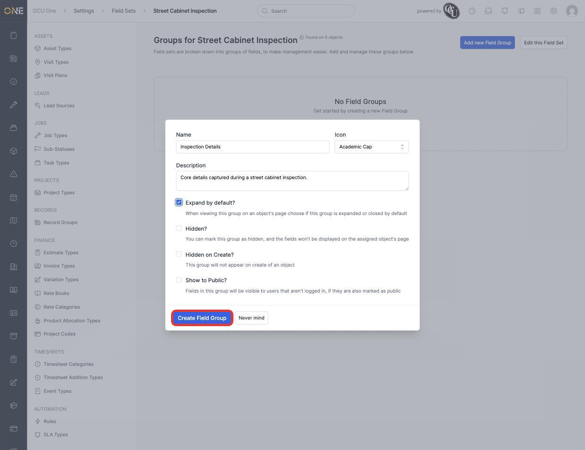
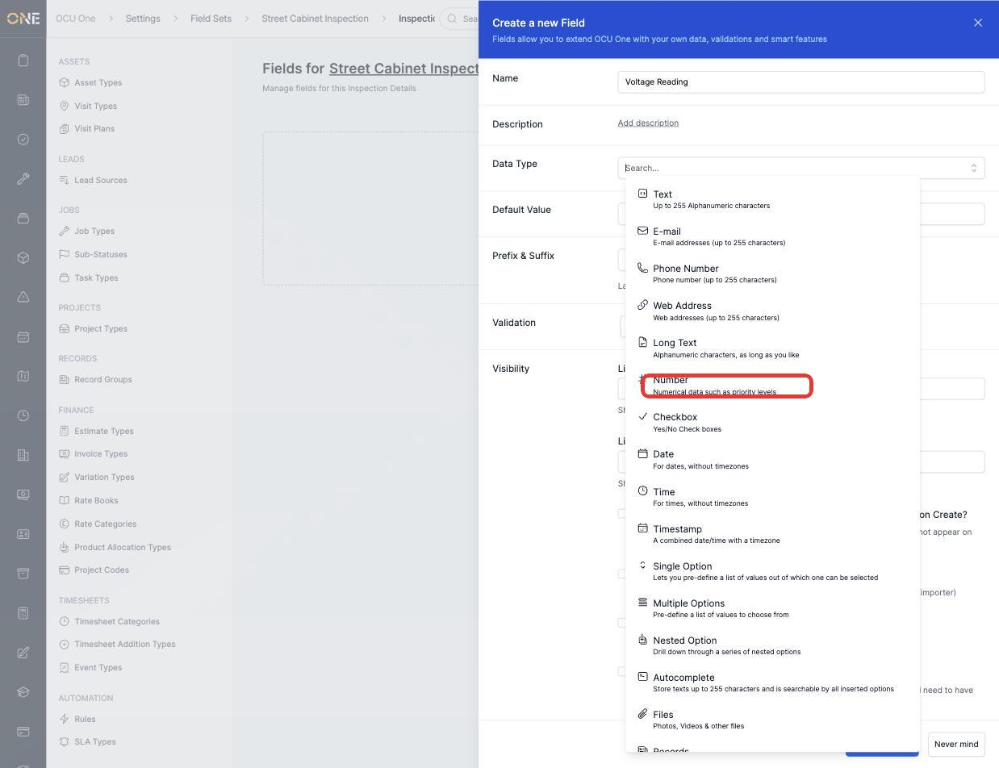
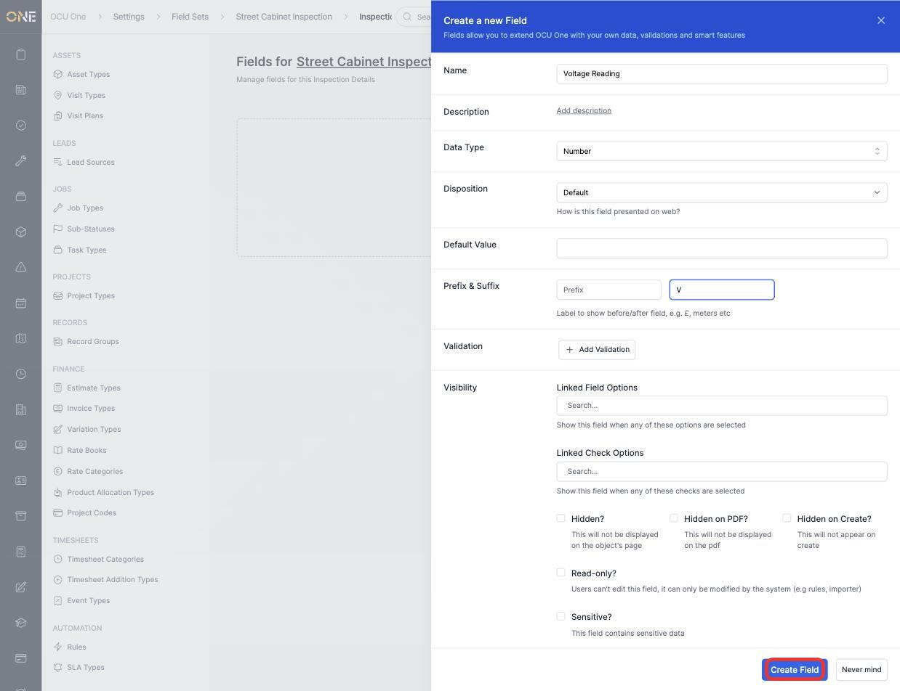
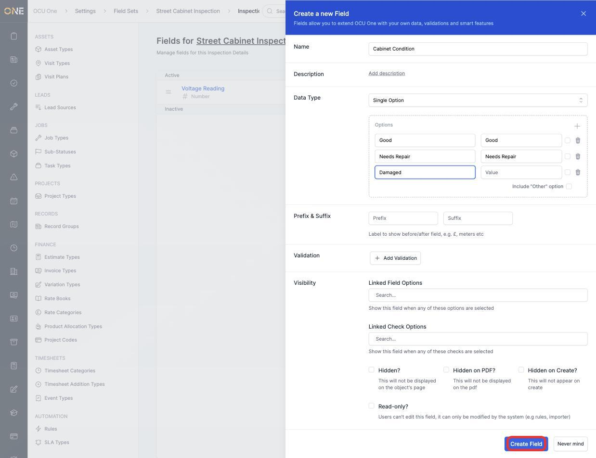
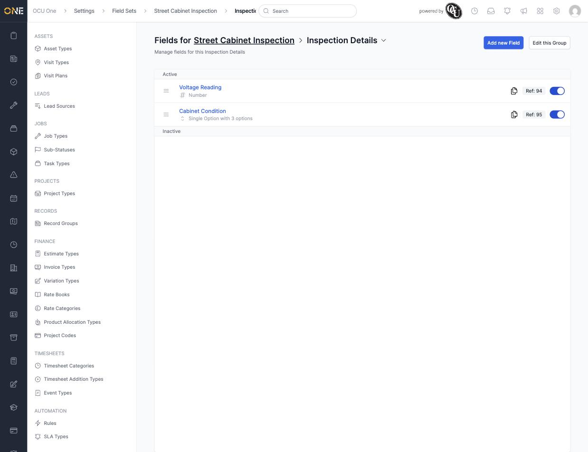

# Building a field set with field groups and field types

A field set is a reusable collection of custom fields that can be attached to jobs, assets, records, or other objects in OCU One. Field sets are broken into **field groups** (sections), and each group holds **field types** (the individual questions or data points). This screen, under **Settings > Field Sets**, is where an admin builds all three.

## Creating a field set

1. From the Field Sets list, click **+ Field Set**.

   

2. Give it a **Name** — for example **Street Cabinet Inspection** — and choose an **Allocation type**. Leave it as **Custom** unless this field set is meant for one specific OCU One object (Job, Client, Lead, etc.) — once a field set has been assigned to an object, its allocation type can't be changed.

   

3. Click **Create Field Set**. You land on the field set's page, ready to add its first group.

   

## Adding a field group

1. Click **New Field Group**.
2. Give the group a **Name** (for example **Inspection Details**), an **Icon**, and an optional **Description**. The checkboxes below control how the group behaves on the object it's attached to — **Expand by default**, **Hidden**, **Hidden on Create**, and **Show to Public**.

   

3. Click **Create Field Group**. You're taken to the group's (empty) list of fields.

## Adding field types to a group

1. Click **New Field**, then give it a **Name**. The **Data Type** dropdown is the main decision — each option shows what kind of data it stores:

   

2. For a numeric field (for example **Voltage Reading**), choosing **Number** adds a **Disposition** option and a **Prefix & Suffix** pair — useful for units like "V" or "m".

   

3. Click **Create Field** to save it, then repeat for a **Single Option** field (for example **Cabinet Condition**). Choosing Single Option reveals an **Options** box — click the **+** to add each choice (Name and Value default to match, and Value can be edited separately if needed).

   

4. Click **Create Field**. Both fields now appear in the group, each showing its data type and an active toggle:

   

## Things to know

- Every field type has its own **Copy** icon (next to its Ref number) and drag handle, so a field can be duplicated into another group or reordered within its own group.
- A field's **Ref** number is a stable reference you can use elsewhere in the system (for example in automation rules) — it doesn't change even if the field is renamed.
- Switching a field's toggle off deactivates it without deleting it — it disappears from anywhere it can be filled in, but any data already recorded against it is kept.
- A field set isn't useful on its own — see [Attaching a field set to a type](Attaching%20a%20field%20set%20to%20a%20type.md) for how to make it appear on real records.
