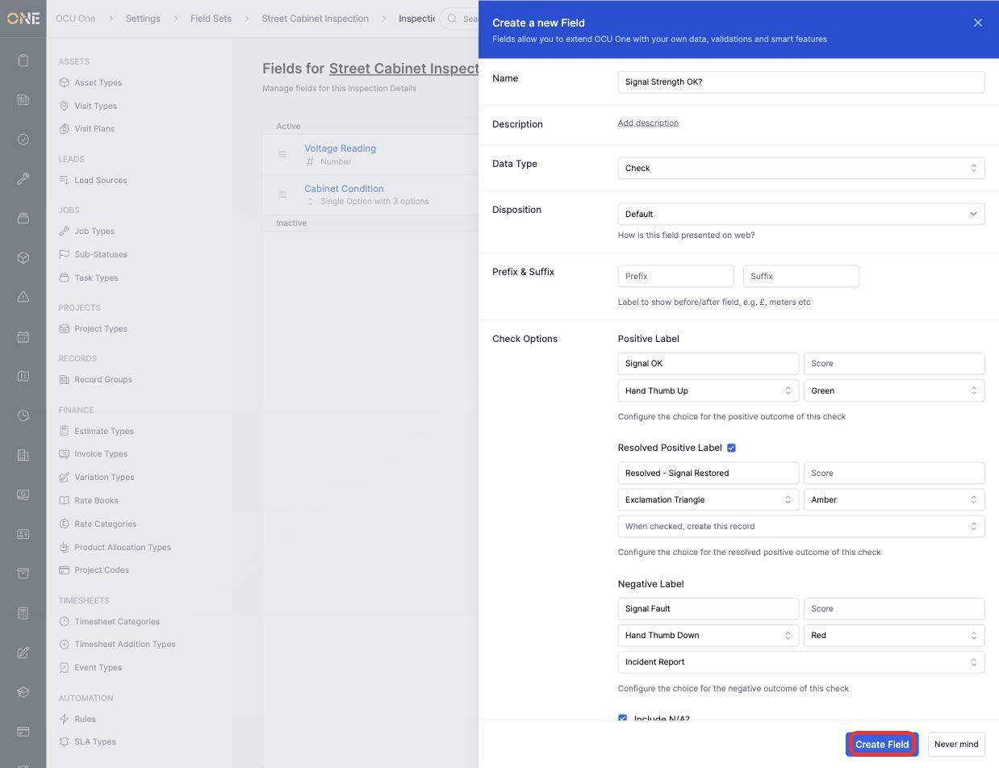
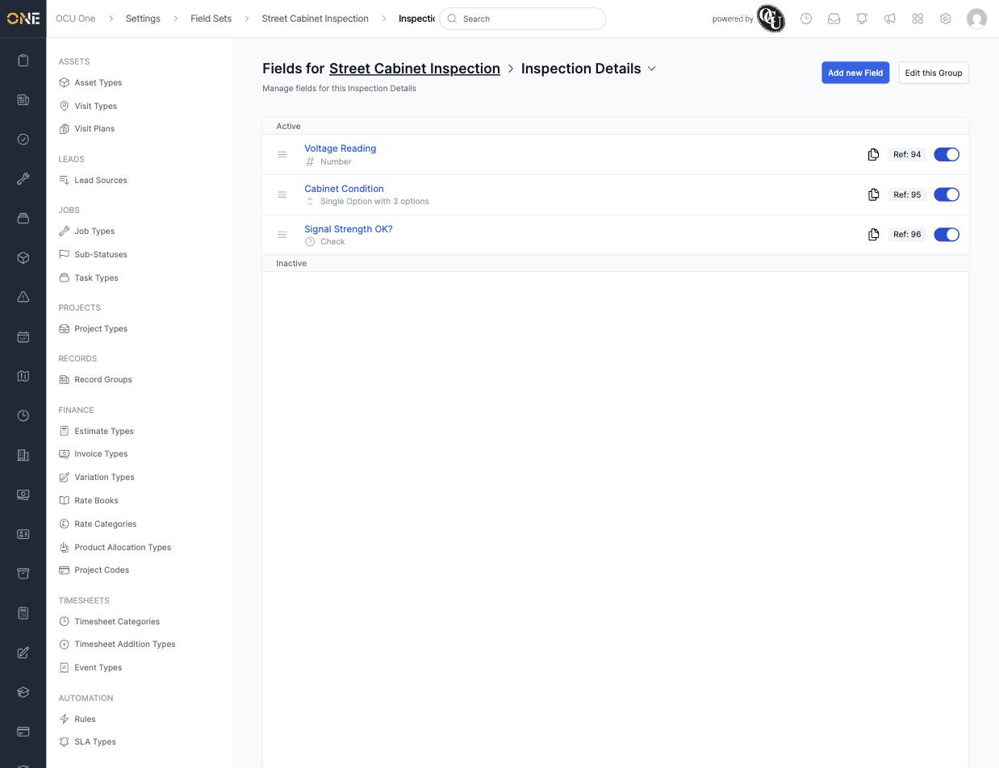

# Configuring a check-type field's pass/fail (RAG) scoring

A **Check** field is a special field type for pass/fail questions — instead of free text, it presents a positive, negative (and optionally a "resolved") outcome, each with its own icon, colour, and RAG score. This is set up from a field type's own configuration under **Settings > Field Sets**.

## Setting up a Check field

1. When creating or editing a field, choose **Check** as the **Data Type**. This adds a **Check Options** section with three outcomes to configure.

   

2. Fill in each outcome:
   - **Positive Label** — the pass wording (for example **Signal OK**), its icon, and RAG colour (defaults to green).
   - **Resolved Positive Label** — tick its checkbox to enable it, then set wording (for example **Resolved - Signal Restored**) for when an initial failure has since been fixed (defaults to amber).
   - **Negative Label** — the fail wording (for example **Signal Fault**), icon, and colour (defaults to red).

   Both the Resolved Positive and Negative outcomes have a **"When checked, create this record"** dropdown — picking a record type here means checking that outcome automatically creates a record of that type (for example an existing **Incident Report** record type), so a failed check can kick off a real follow-up action without any extra clicks.

   

3. Click **Create Field** (or **Update Field** if editing). The field now shows as a Check type in its group's field list.

   

## Things to know

- **Include N/A?** is ticked by default, giving the person filling in the field a "not applicable" option alongside pass/fail.
- The record auto-created on a negative or resolved-positive answer is a genuine record of the type you pick — not a separate "issue" concept. Anyone reviewing that record can see it was generated from this check.
- Each outcome's Score sets how it feeds into the parent object's overall RAG status — a red-scored negative outcome will typically turn the whole record red, for example.
