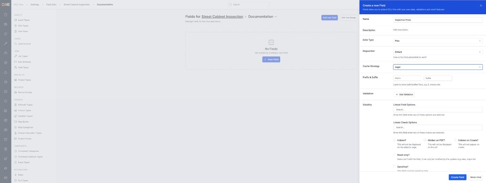
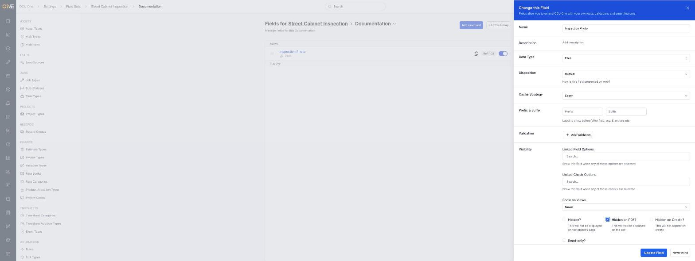
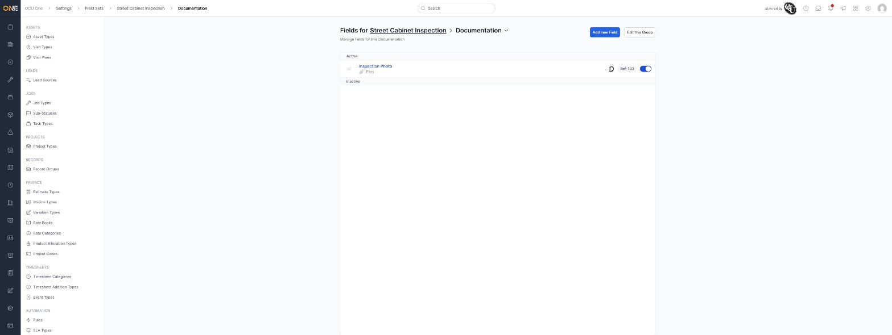

# Configuring an attachment-type field's display options (eager load, show on PDF)

A **Files** field is the data type used for attachments (photos, videos, documents) attached directly to a custom field. Like any other field type, it's set up from a field's own configuration under **Settings > Field Sets**, but choosing **Files** unlocks two extra options that control how those attachments are loaded and whether they appear on PDF exports.

## Setting up a Files field

1. When creating or editing a field, choose **Files** as the **Data Type**. This adds a **Disposition** option (how the field is presented — for example **Default**, **Take Photo**, **Take Video**, or **Draw**) and a **Cache Strategy** option.

   

2. Set **Cache Strategy** to control how eagerly the file is loaded — the options are **Default**, **Never**, **On demand**, and **Eager**. Choosing **Eager** loads the attachment up front whenever the record is opened, instead of waiting for someone to click on it.

   

3. Scroll down to the **Hidden on PDF?** checkbox. Leaving it unchecked (the default) means the attachment will show up on the object's PDF export; ticking it hides it from PDF exports while still leaving it visible on the object's page.

   

   

4. Click **Create Field** (or **Update Field** if editing). The field now shows as a Files type in its group's field list.

   

## Things to know

- There's no separate toggle labelled "show on PDF" — it's the **Hidden on PDF?** checkbox working in reverse: unchecked shows the attachment on PDF exports, checked hides it.
- **Cache Strategy** only matters for performance and loading behaviour — it doesn't change whether the attachment is visible anywhere; **Hidden on PDF?**, **Hidden?**, and **Hidden on Create?** are what control visibility.
- **Hidden?** hides the field from the object's page entirely, while **Hidden on PDF?** only affects PDF exports — a field can be visible on the page but hidden from PDFs, or vice versa.
