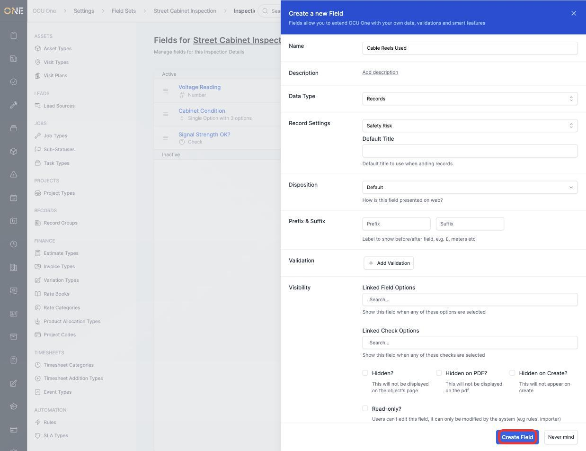
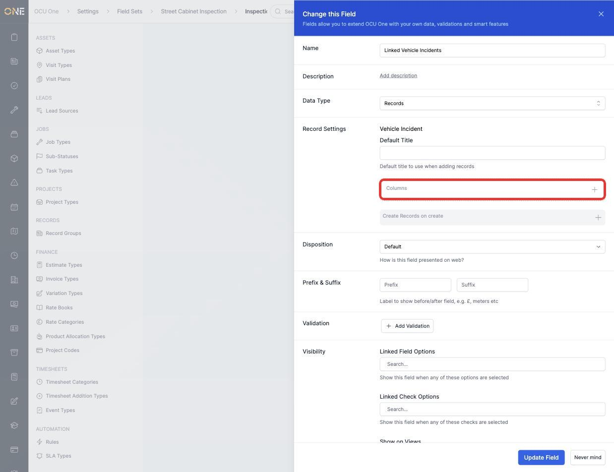
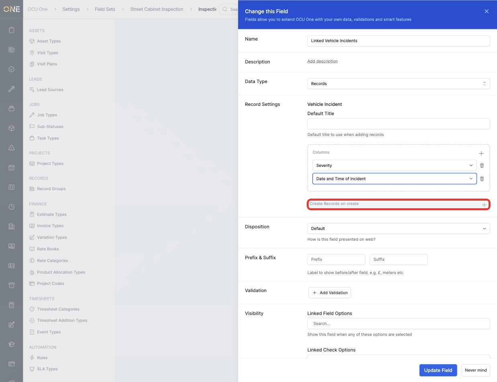
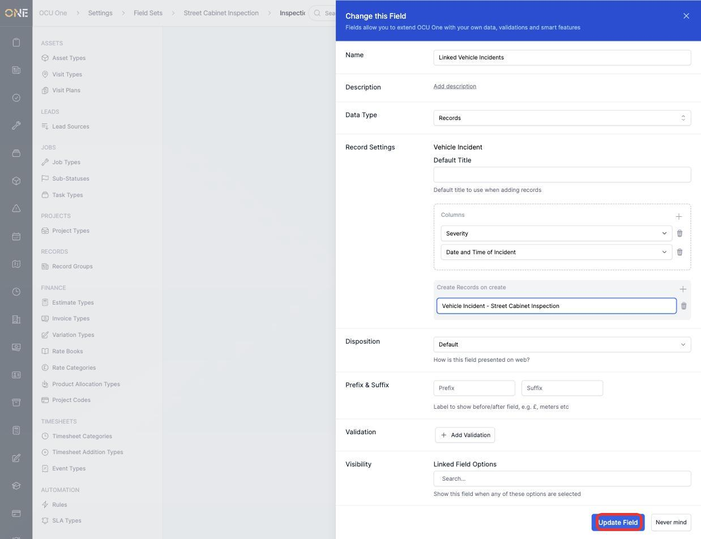

# Configuring records-type field columns and auto-titles

A **Records** field embeds other records directly inside a field, rather than just linking to them. Once a field is set to this data type and pointed at a record type, two extra settings become available — which **columns** show in the embedded list, and what **auto-title** newly created records get. Both live on the field's own configuration under **Settings > Field Sets**.

## Setting up a Records field

1. Create or edit a field and choose **Records** as the **Data Type**, then pick the target **Record Settings** (the record type this field will hold — for example **Vehicle Incident**) and an optional **Default Title**.

   

2. Once created, reopen the field. If the chosen record type already has its own field set(s) configured, a **Columns** box and a **Create Records on create** box appear underneath the record type.

   

## Configuring columns

Click the **+** next to **Columns** to add one, then pick which of the target record type's own fields should show as a column in the embedded list — for example **Severity** and **Date and Time of Incident**. Add as many as needed; each gets its own dropdown and can be removed with the trash icon.

## Configuring an auto-title

Click the **+** next to **Create Records on create** to add a title template. Whatever's typed here becomes the default title given to a new record created through this field — useful for keeping embedded records consistently named without anyone having to type a title by hand.

Click **Update Field** to save.

## Things to know

- Columns and auto-titles are only available once the target record type has at least one field set of its own attached — until then, these boxes don't appear at all.
- Multiple title templates can be added — useful if different naming patterns are needed for different situations — and they can be reordered by dragging.
- These settings only affect the field's own embedded list view; they don't change anything about the target record type itself.
