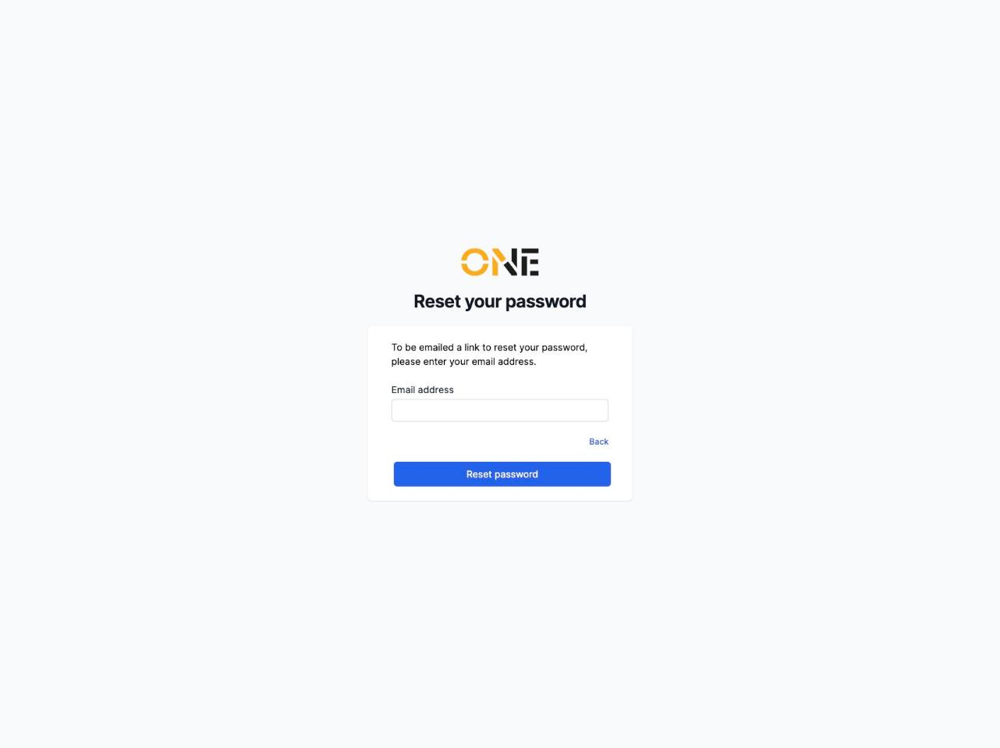
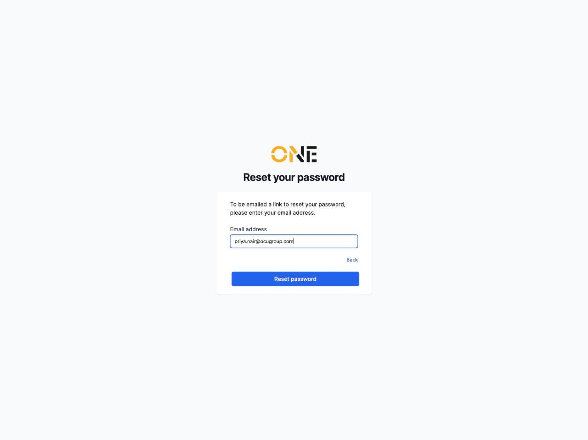
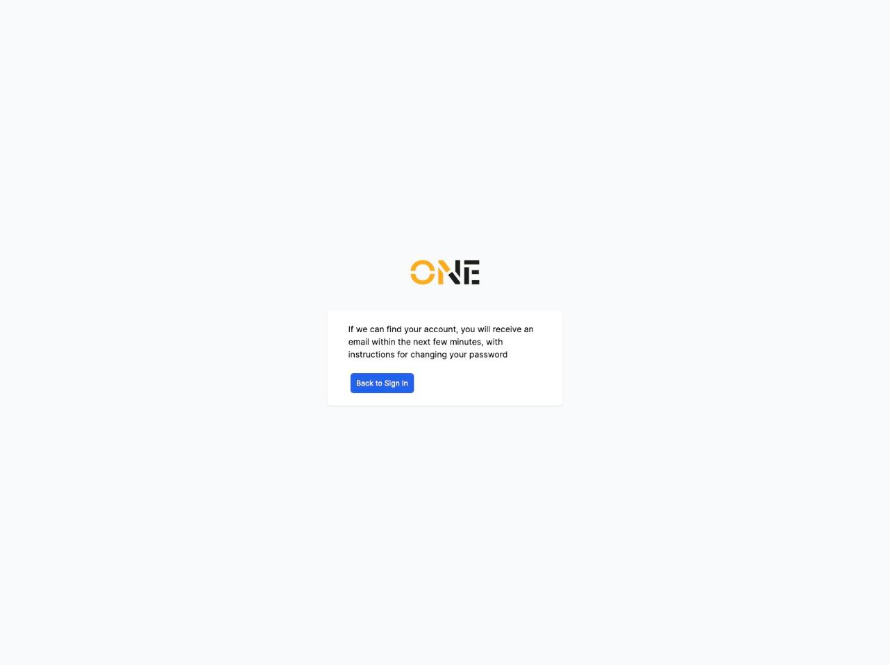

# Requesting a password reset

If you've forgotten your password, you can have OCU One email you a link to choose a new one. This only applies if you sign in with email and password — if your account is set up for Microsoft sign-in, resetting your password happens through your organisation's Microsoft account instead, not here.

1. On the sign-in page, click **Forgot password?**.

2. Enter the email address for your account.

   

3. Fill in your email address and click **Reset password**.

   

4. You'll see a confirmation message either way, whether or not that email matches an account — this is intentional, so the form doesn't reveal which email addresses have accounts.

   

If an account was found, a reset email arrives within a few minutes. Click the link in that email to continue — see the separate guide on setting a new password from a reset link.

If the email doesn't arrive, check your spam folder, or double-check you used the email address your account was set up with.