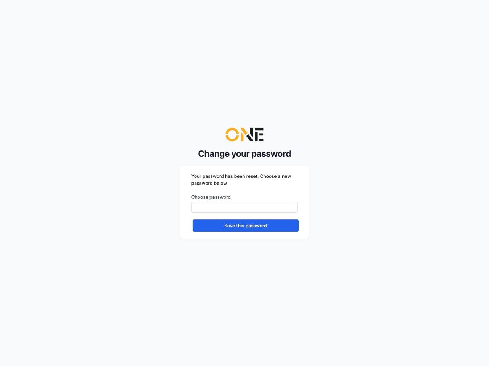
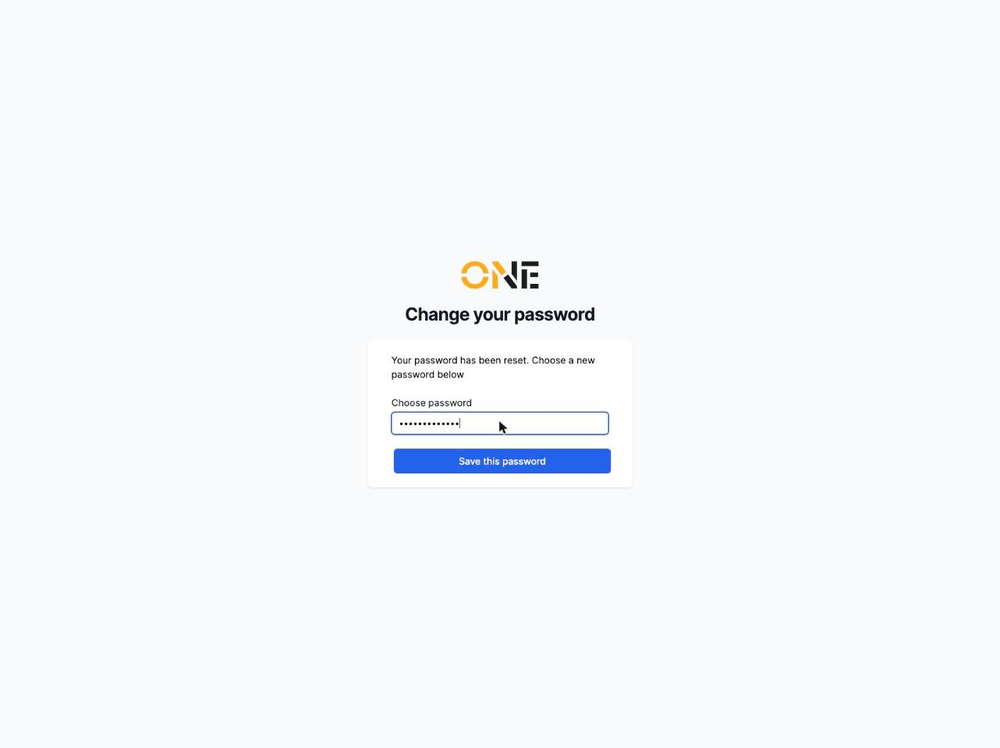

# Setting a new password from a reset link

Once you've requested a password reset (see the separate guide on requesting a password reset), you'll get an email with a link to choose a new password.

1. Click the link in the email. It opens a **Change your password** page with a single field.

   

2. Enter your new password and click **Save this password**.

   

3. You're signed in straight away with your new password and taken to your home page.

   

The reset link only works once — if you need to change your password again later, request a fresh reset link.