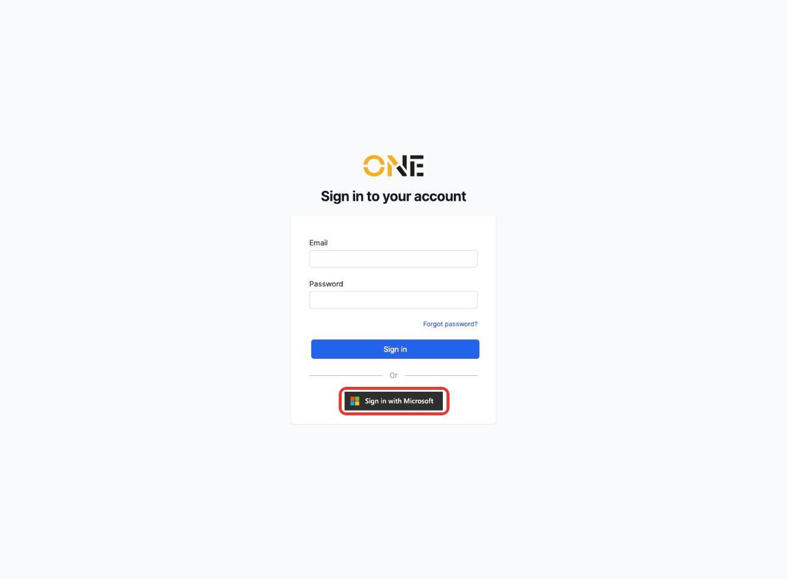
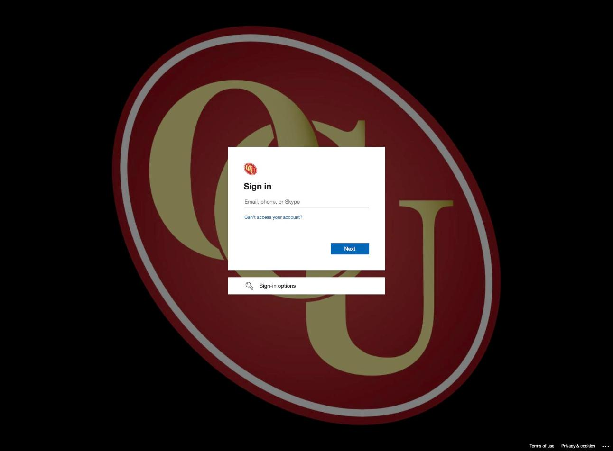
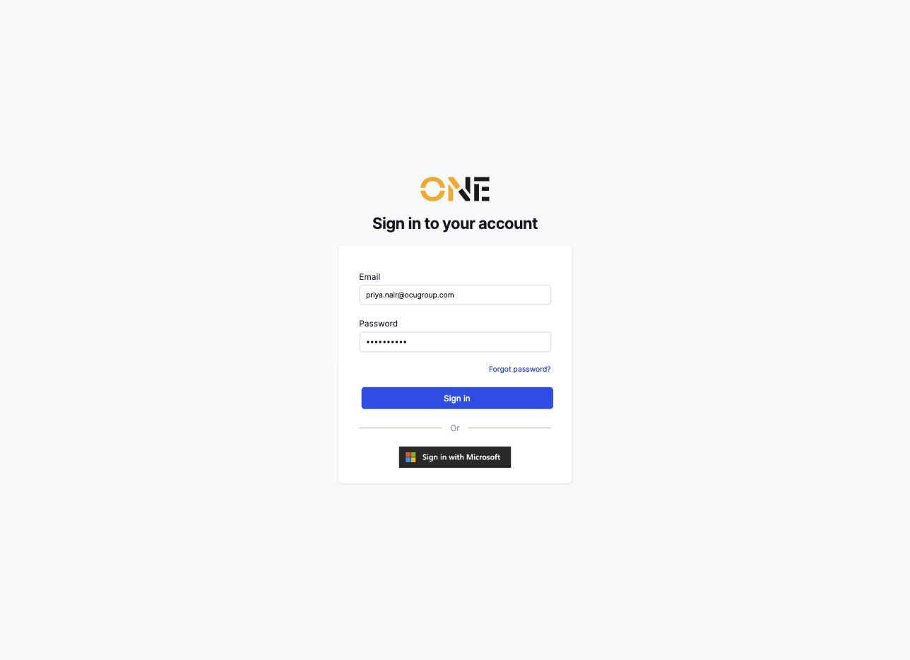
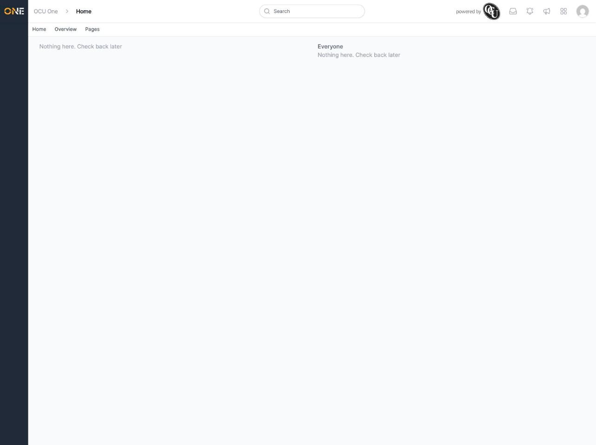
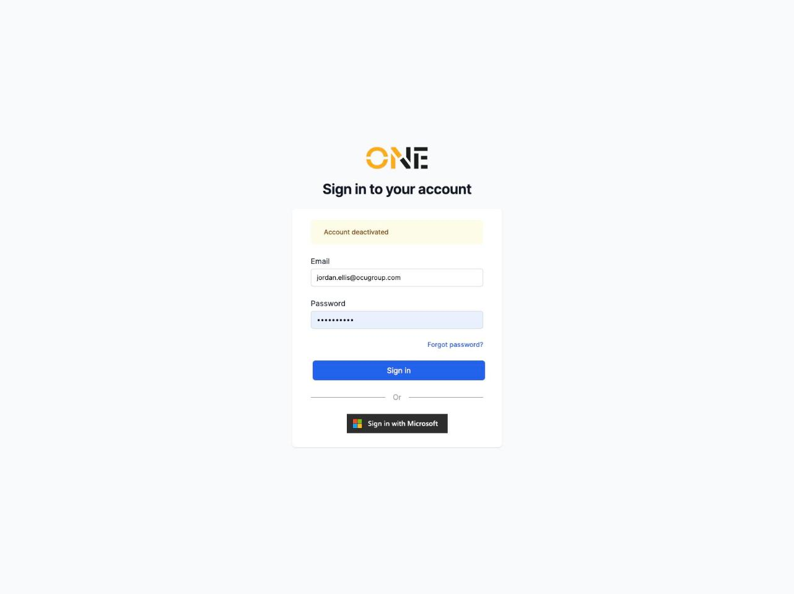
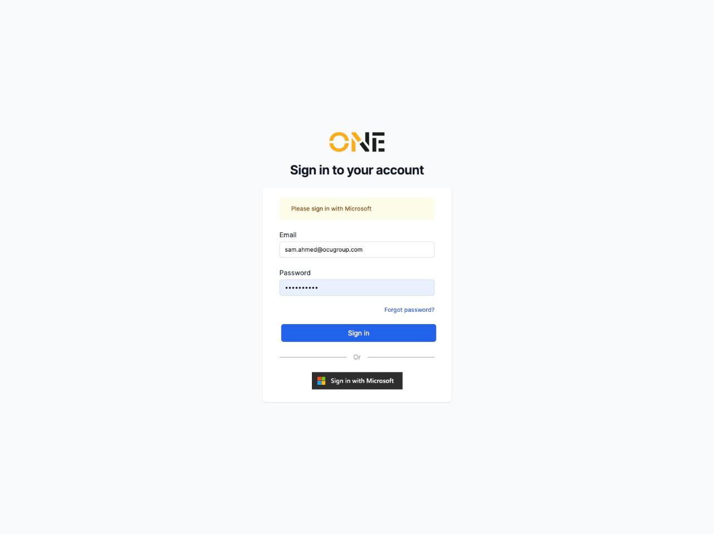
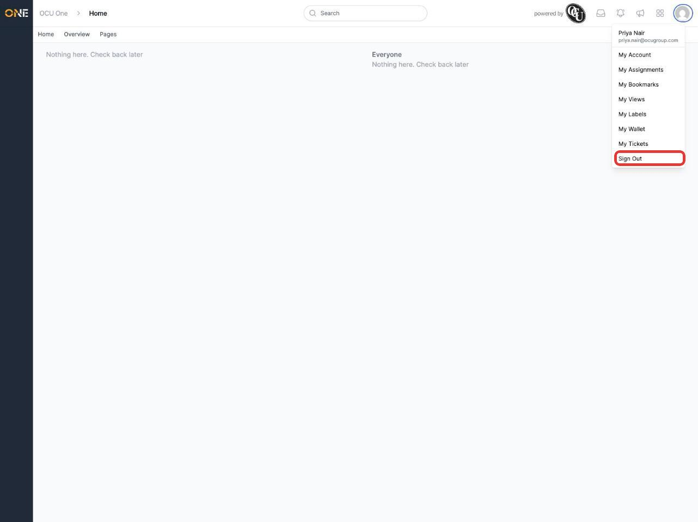

# Signing in to your account

OCU One supports two ways to sign in: with your Microsoft work account (single sign-on) or with an email and password set up directly in OCU One. Most organisations use Microsoft sign-in as their primary method, so it's presented first on the sign-in page — but which one applies to you depends on how your account was set up.

## Signing in with Microsoft

1. On the sign-in page, click **Sign in with Microsoft**.

   

2. You're taken to Microsoft's own sign-in page. Enter your work email and password there (and complete multi-factor authentication if your organisation requires it).

   

3. Once Microsoft confirms who you are, you're redirected straight back into OCU One, signed in.

## Signing in with email and password

If your account isn't set up for Microsoft sign-in, use the **Email** and **Password** fields on the same page instead.

1. Enter your email and password, then click **Sign in**.

   

2. You're taken to your home page.

   

## If sign-in doesn't work

A few messages can appear above the form instead of signing you in:

- **Incorrect email or password** — the email or password you entered doesn't match. Double-check for typos, or use **Forgot password?** to reset it (see the separate guide on requesting a password reset).

  

- **Account deactivated** — your account has been deactivated by an administrator. Contact your administrator if you think this is wrong.

  

- **Please sign in with Microsoft** — your account is set up for Microsoft sign-in only, so the email/password form won't work for it. Use the **Sign in with Microsoft** button instead.

  

## Signing out

Click your account avatar in the top right, then **Sign Out**.

This works the same way whichever method you originally signed in with.