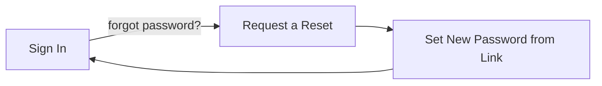

# Signing In — Overview

Getting into OCU One, and getting back in when something goes wrong, comes down to a small number of pieces. This guide explains how they fit together, before you dive into the detailed guides for each part.

## The core pieces

**Signing in** works one of two ways, depending on how your account was set up: with your **Microsoft work account** (single sign-on, the default for most organisations), or with an **email and password** set up directly in OCU One. You don't choose which — your account is already configured for one or the other.

If you use email and password and forget it, **requesting a password reset** sends a reset link to your email. **Setting a new password from a reset link** is the second half of that — following the link and choosing a new password, which also signs you straight back in.

## Why this matters

- **Getting in at all** — knowing which sign-in method applies to your account avoids the confusion of a "Please sign in with Microsoft" or "Incorrect email or password" error.
- **Getting back in** — a forgotten password doesn't need an administrator's help if your account uses email/password sign-in; the reset flow handles it end to end.
- **Security** — the reset request form never confirms whether an email address has an account, and each reset link only works once.

## The end-to-end flow

Start with [Signing in to your account](Signing%20in%20to%20your%20account.md), which covers both the Microsoft and email/password routes, what each error message on the sign-in page means, and how to sign out again.

If email/password sign-in fails because you've forgotten your password, [Requesting a password reset](Requesting%20a%20password%20reset.md) covers asking OCU One to email you a reset link. From there, [Setting a new password from a reset link](Setting%20a%20new%20password%20from%20a%20reset%20link.md) covers following that link, choosing a new password, and being signed straight in with it.

Microsoft sign-in doesn't go through any of this — a forgotten Microsoft password is reset through your organisation's own Microsoft account, not through OCU One.

## The flow at a glance

- **Sign In** — Microsoft SSO or email/password, whichever your account is set up for.
- **Request a Reset** — email/password accounts only; sends a one-time reset link.
- **Set New Password from Link** — choose a new password and land signed in.

Most sign-ins never touch the reset flow at all — it's only there for the moment you need it.
