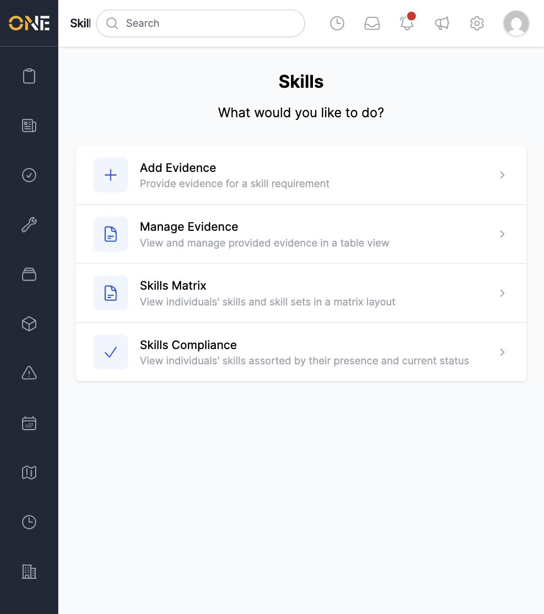

# Finding your way around Skills & Compliance

**Skills** is where certifications, training, and other qualifications are
tracked for the people in your organisation — things like a First Aid
Certificate or a safety training course, each with an expiry date and a
review process.

## The Skills landing page

Click **Skills** in the left sidebar to open the landing page. It lists
everything you can do here as four options:

- **Add Evidence** — upload evidence for a skill requirement, such as a
  scanned certificate. See
  [Uploading skill evidence](Uploading%20skill%20evidence.md).
- **Manage Evidence** — a table view of every evidence record, filterable
  by description or status. See
  [Reviewing, editing, or approving/rejecting skill evidence](Reviewing%2C%20editing%2C%20or%20approving%20rejecting%20skill%20evidence.md).
- **Skills Matrix** — see everyone's skills and skill sets side by side in
  a grid. See [Viewing the Skills Matrix](Viewing%20the%20Skills%20Matrix.md).
- **Skills Compliance** — see who is missing, pending, or up to date on
  their required skills. See
  [Viewing the compliance dashboard and drilling into missing evidence](Viewing%20the%20compliance%20dashboard%20and%20drilling%20into%20missing%20evidence.md).

Your own certificates and training — the evidence you've personally
submitted — live in your **Wallet** instead, opened from your profile menu
in the top-right corner. See
[Viewing your personal skills wallet](Viewing%20your%20personal%20skills%20wallet.md).
