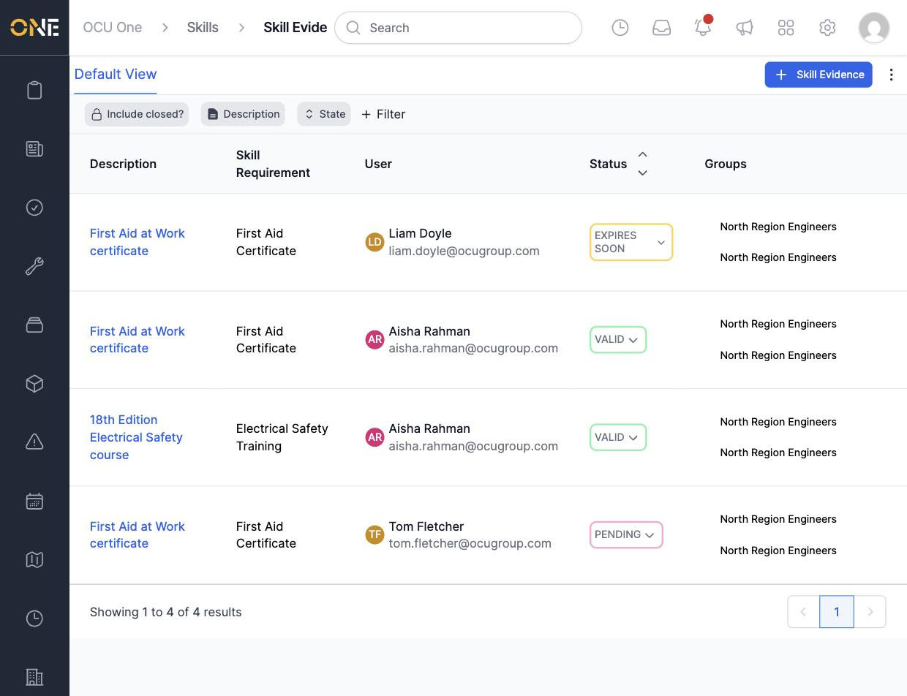
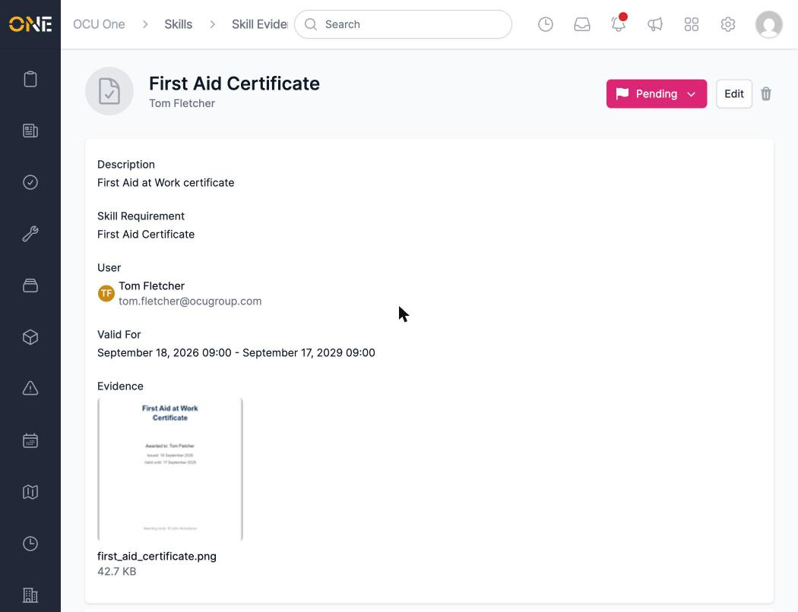
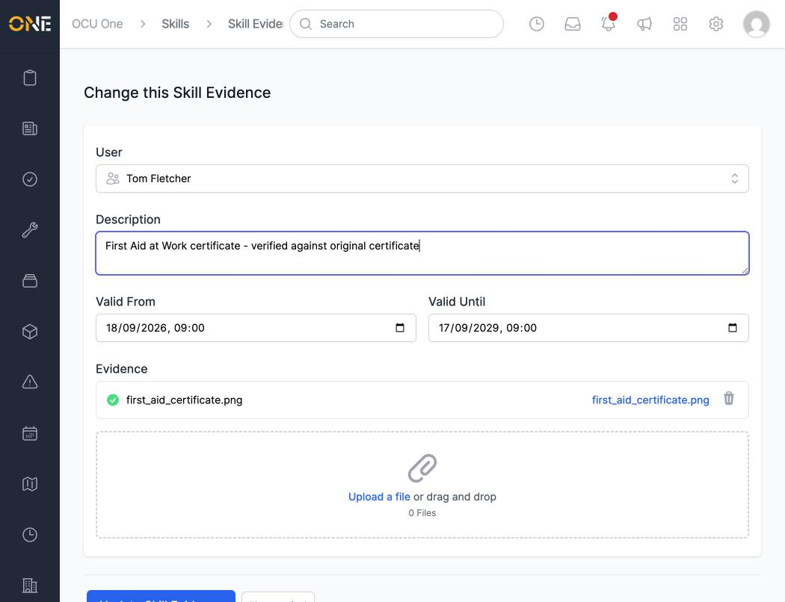
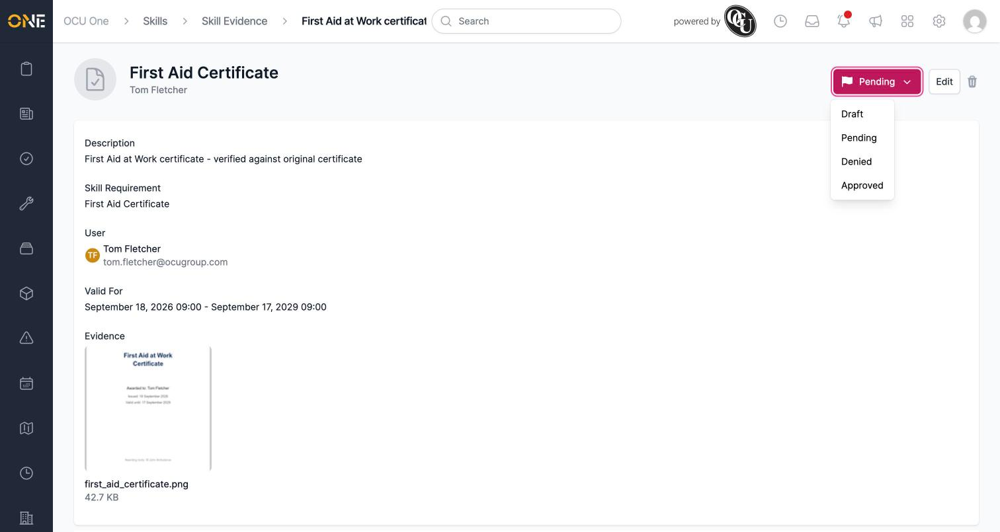
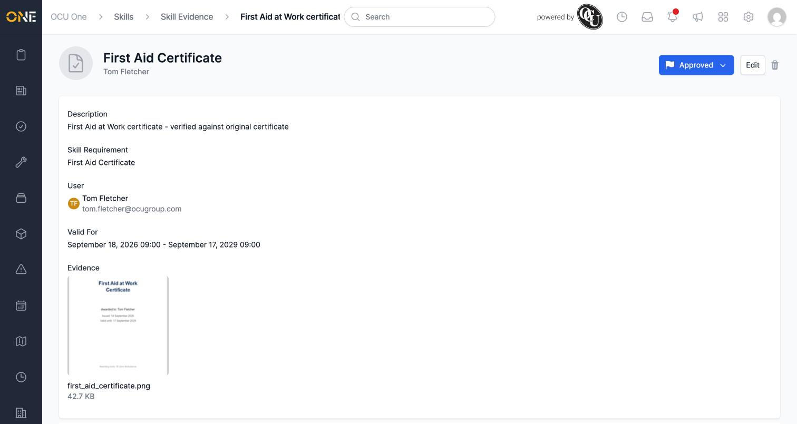

# Reviewing, editing, or approving/rejecting skill evidence

Once someone submits a certificate or training record as skill evidence, a
manager can review it, correct any details, and move it to **Approved** or
**Denied**.

## Finding evidence to review

From the Skills landing page, click **Manage Evidence** to see every
evidence record in one table — its Description, Skill Requirement, User,
Status, and the Groups the user belongs to.

Click a description to open that evidence record.

## Reviewing an evidence record

The record's page shows its description, the skill requirement it's for,
who it belongs to, its valid dates, and the uploaded file itself.

## Editing evidence

Click **Edit** to correct or add to any of the details — for example,
adding a note confirming you've checked the certificate against the
original.

Click **Update Skill Evidence** to save your changes.

## Approving or rejecting

Click the status badge (showing **Pending**) to open the status menu —
**Draft**, **Pending**, **Denied**, or **Approved**.

Choose **Approved** to accept it, or **Denied** to reject it. The badge
updates immediately.

Once approved, the requirement shows as up to date on the
[Skills Matrix](Viewing%20the%20Skills%20Matrix.md), the
[compliance dashboard](Viewing%20the%20compliance%20dashboard%20and%20drilling%20into%20missing%20evidence.md),
and the user's own
[Wallet](Viewing%20your%20personal%20skills%20wallet.md).
