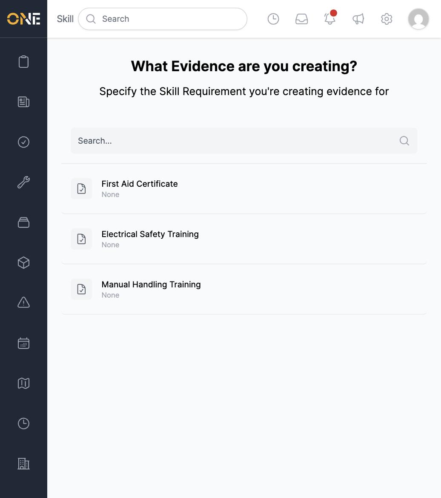
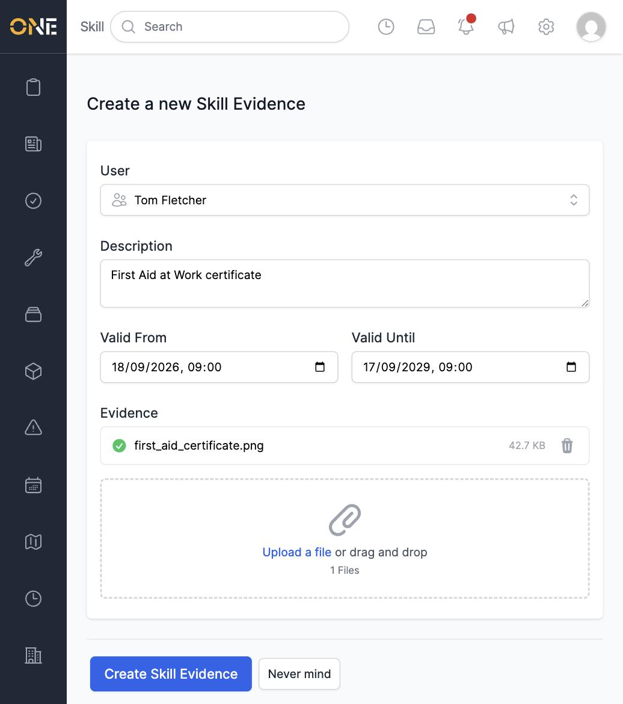
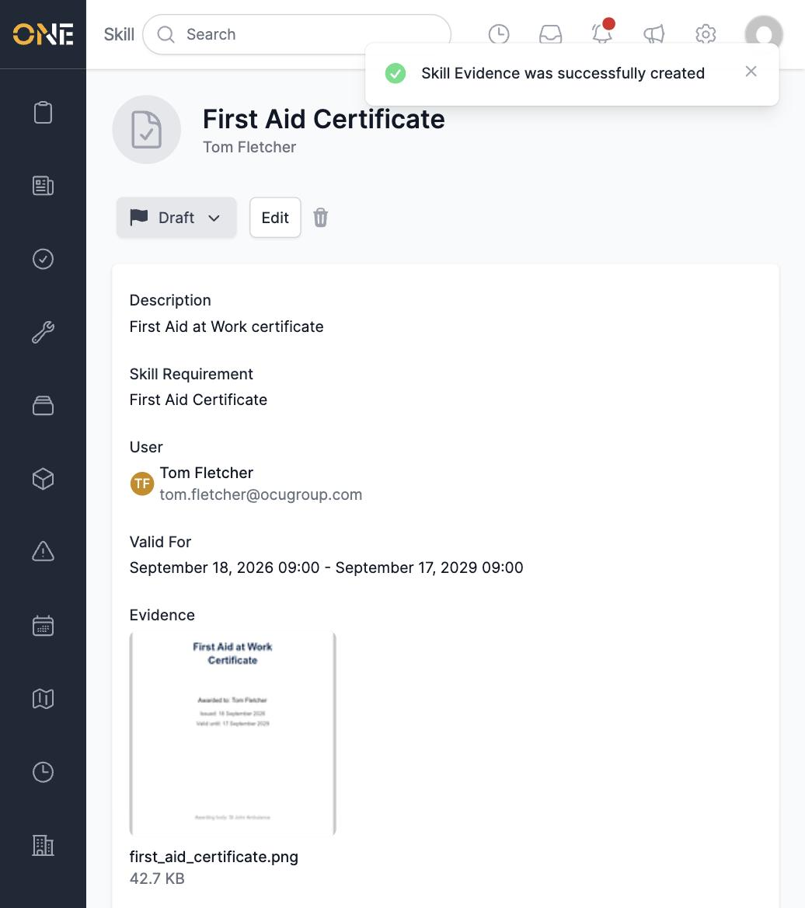
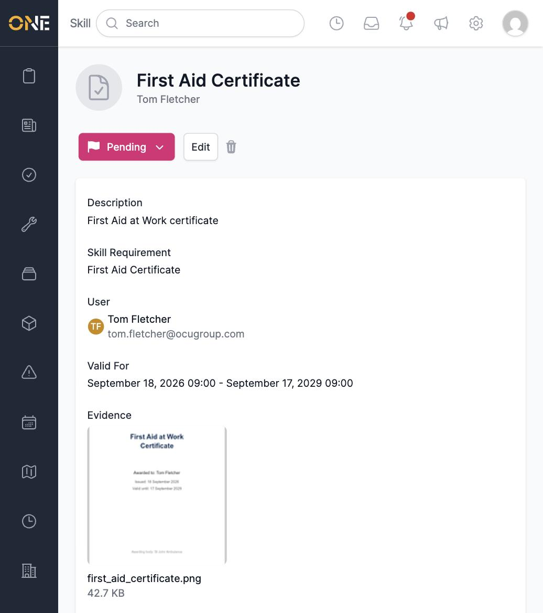

# Uploading skill evidence

When you need to submit proof of a certificate or completed training —
like a First Aid Certificate — you do it by creating a piece of **skill
evidence** for that requirement.

## Starting a new evidence record

From the Skills landing page, click **Add Evidence**. You'll see every
skill requirement in the tenant — pick the one you're submitting evidence
for.

## Filling in the evidence

On the form, set:

- **User** — the person the evidence belongs to. If you're submitting your
  own evidence, only your own name appears in this field.
- **Description** — a short note describing the evidence.
- **Valid From** / **Valid Until** — the dates the certificate or training
  covers.
- **Evidence** — click **Upload a file** or drag and drop a file (such as
  a scanned certificate) into the box.

Click **Create Skill Evidence** to save it. The new record starts in
**Draft** status, with your uploaded file shown as a thumbnail.

## Submitting it for review

A **Draft** evidence record hasn't been sent anywhere yet — click the
status badge and choose **Pending** to submit it for review.

Once it's Pending, a manager can approve or deny it — see
[Reviewing, editing, or approving/rejecting skill evidence](Reviewing%2C%20editing%2C%20or%20approving%20rejecting%20skill%20evidence.md).
You can track its status at any time from your
[Wallet](Viewing%20your%20personal%20skills%20wallet.md).
