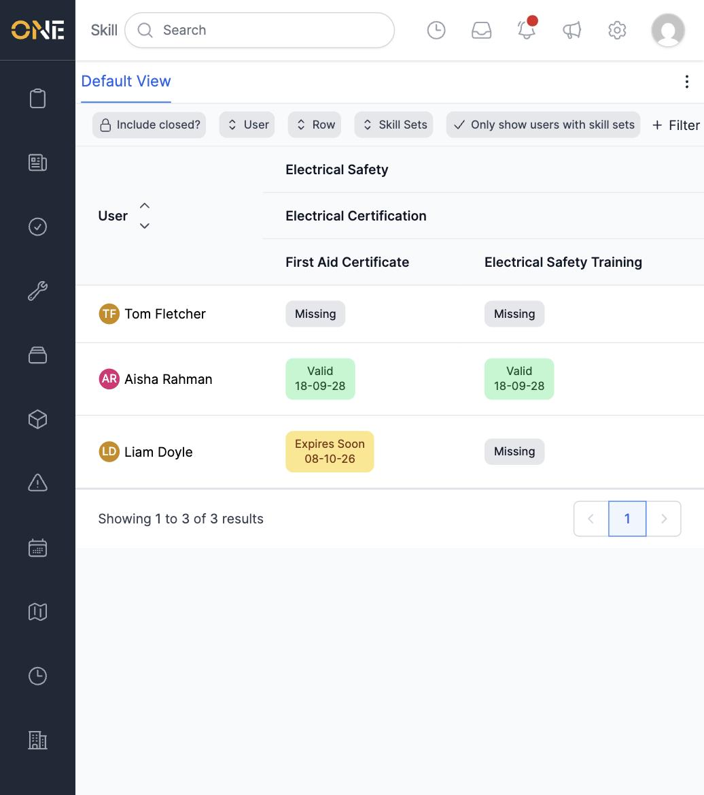
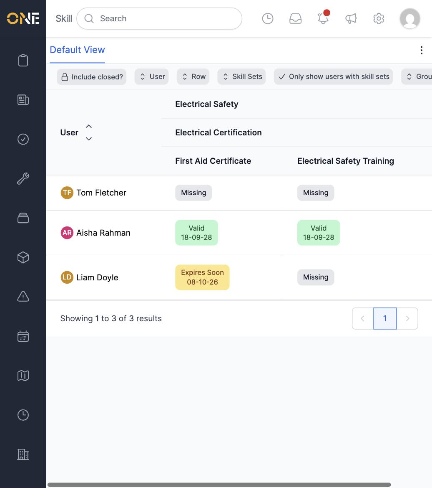

# Viewing the Skills Matrix

The Skills Matrix shows everyone's skills and skill sets side by side in
one table, so you can see at a glance who holds which certifications and
where the gaps are.

## Opening the matrix

From the Skills landing page, click **Skills Matrix**. Each person is a
row; each column is a skill set, which expands into its individual skills
and then their skill requirements. Every cell shows that person's current
status for that requirement — **Missing**, **Valid**, **Expires Soon**,
**Expired**, **Pending**, or **Approved** — colour-coded and, where one
exists, showing the evidence's expiry date.

By default the matrix only lists **Skill Sets** you've selected — pick one
(or more) from the **Skill Sets** column filter to see its columns and the
people assigned to it.

In this example, Tom Fletcher is missing both requirements, Aisha Rahman
is valid on both, and Liam Doyle's First Aid Certificate is about to
expire while his Electrical Safety Training is still missing.

## Filtering further

Click **+ Filter** to add more ways to narrow the matrix, including
**Group** (show only people in a specific group), **User**, **Labels**,
**Tags**, and toggles like **Only show users with skill sets** and **Only
show expiring soon**.

## Changing what each row shows

The **Row** filter controls which level of detail is shown as columns —
**Skill Sets**, **Skills**, or **Skill Requirements** — so you can
collapse the matrix down to just skill sets for a high-level view, or
expand it to see every individual requirement.
