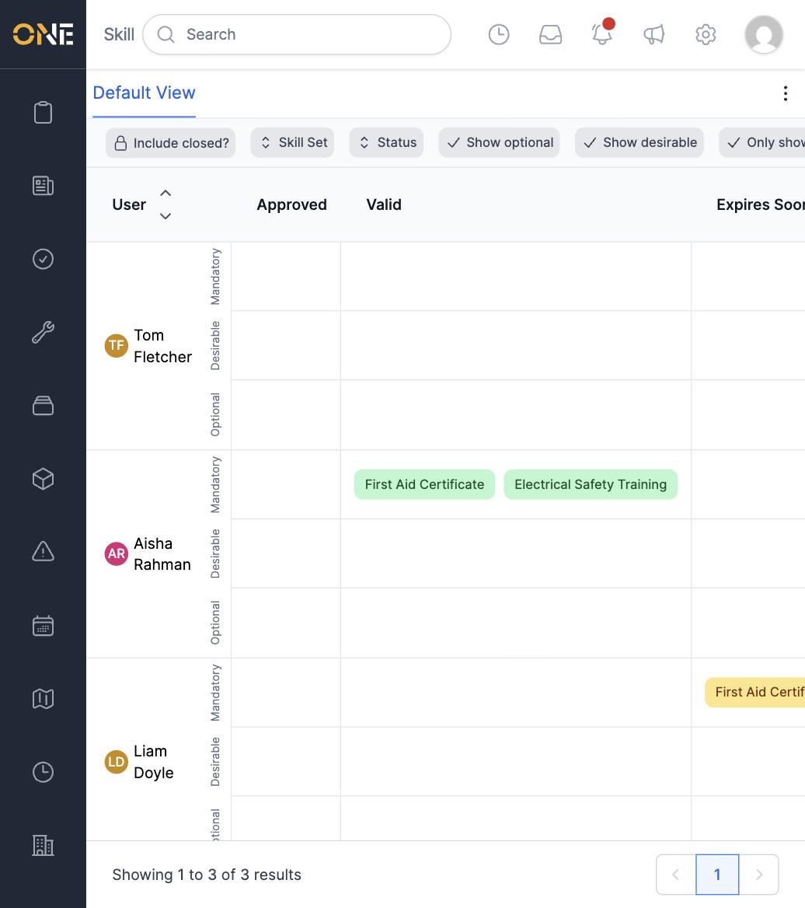
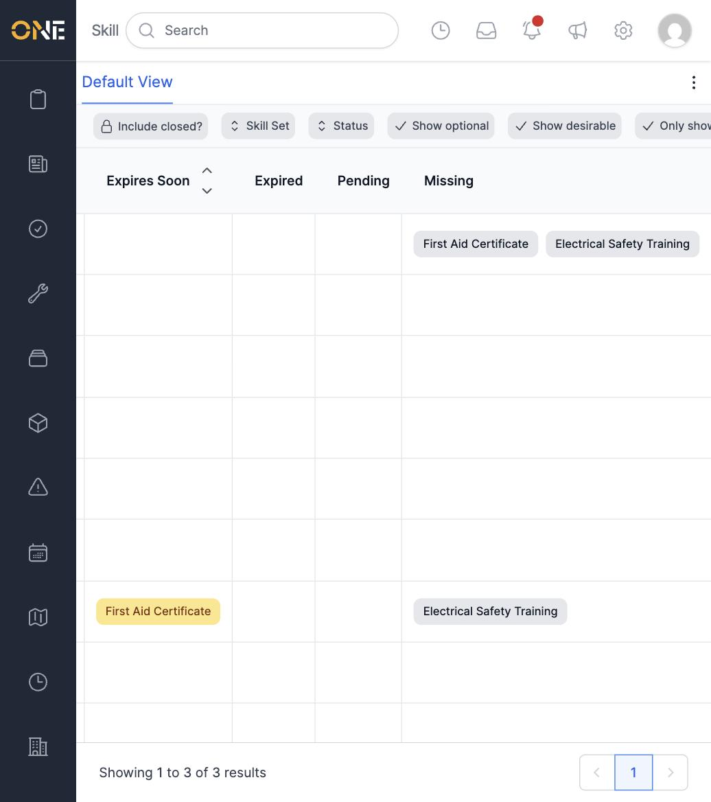
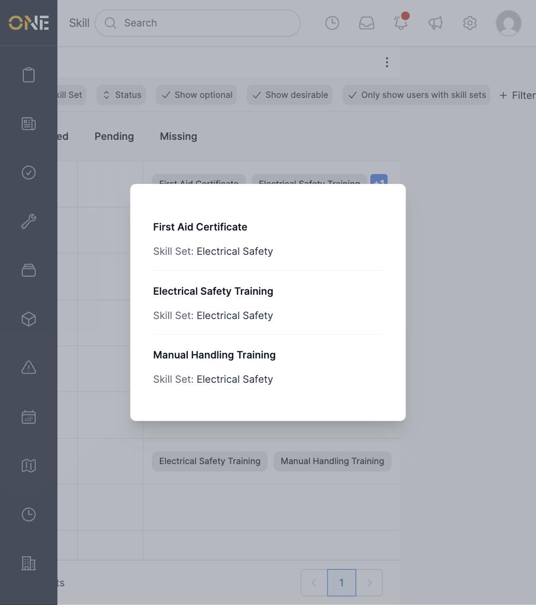

# Viewing the compliance dashboard and drilling into missing evidence

The Skills Compliance dashboard shows, for every person, how many of their
required skills fall into each status — **Approved**, **Valid**, **Expires
Soon**, **Expired**, **Pending**, and **Missing** — broken down by whether
the requirement is Mandatory, Desirable, or Optional for them.

## Opening the dashboard

From the Skills landing page, click **Skills Compliance**. Use the
**Skill Set** filter together with **Only show users with skill sets** (in
**+ Filter**) to narrow the list down to people who actually hold a given
skill set, rather than every user in the tenant.

Each requirement that has evidence appears as a coloured badge — click it
to open that evidence record directly. Scroll the table right to see every
status column, including **Missing**.

## Drilling into missing evidence

A **Missing** cell lists up to two requirement names directly. When there
are more than two, a blue **+N** button appears — click it to see every
missing requirement for that person in a pop-up, along with which skill
set each one belongs to.

This is a quick way to see exactly what someone still needs to submit
evidence for, without having to open their Wallet or check the Skills
Matrix requirement by requirement.
