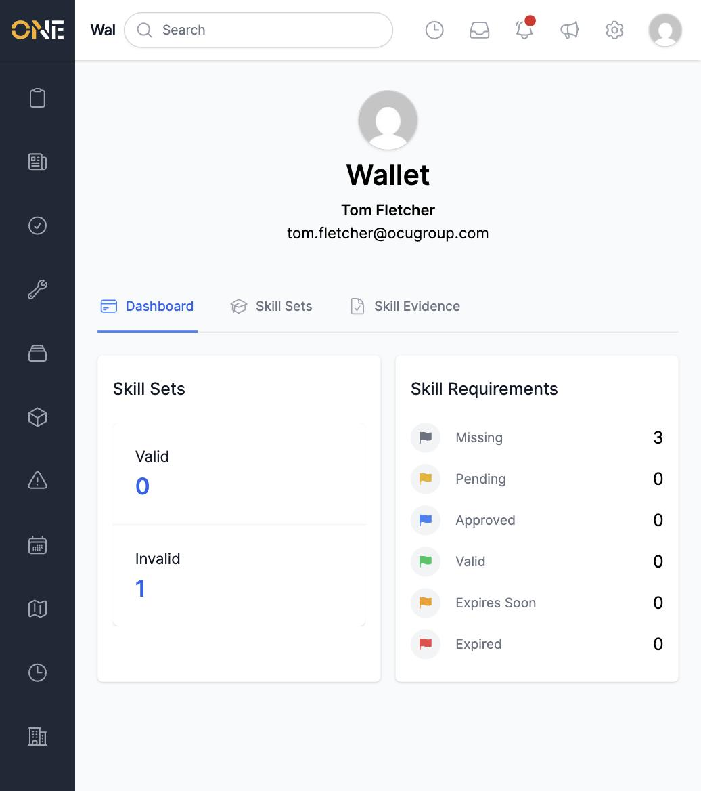
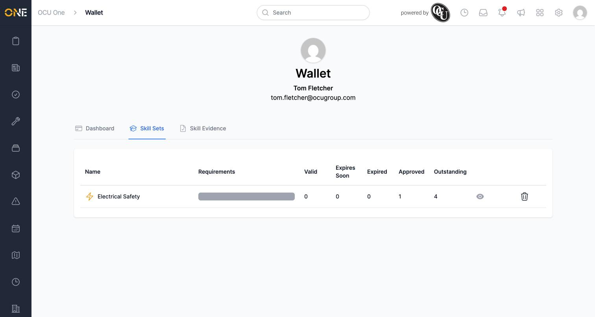
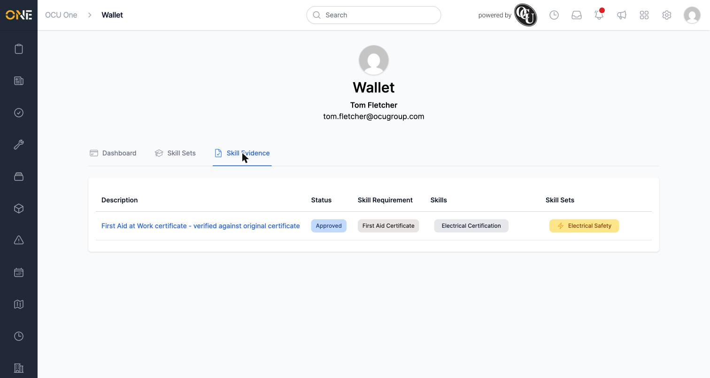

# Viewing your personal skills wallet

Your **Wallet** is where you see your own skill sets and skill evidence —
what you're required to hold, what you've submitted, and where things
stand.

## Opening your Wallet

Click your profile picture in the top-right corner and choose **My
Wallet**. The **Dashboard** tab shows two summaries: how many of your
skill sets are **Valid** vs **Invalid**, and a breakdown of your skill
requirements by status — **Missing**, **Pending**, **Approved**, **Valid**,
**Expires Soon**, and **Expired**.

After submitting and getting a certificate approved, the dashboard
reflects it under **Approved**:

## The Skill Sets tab

Click **Skill Sets** to see each skill set you've been assigned, with
columns for **Valid**, **Expires Soon**, **Expired**, **Approved**, and
**Outstanding** requirements. Click the eye icon on a row to see that
skill set's detail.

## The Skill Evidence tab

Click **Skill Evidence** to see every piece of evidence you've submitted,
with its Status, Skill Requirement, Skills, and Skill Sets. Click a
description to open that evidence record — see
[Reviewing, editing, or approving/rejecting skill evidence](Reviewing%2C%20editing%2C%20or%20approving%20rejecting%20skill%20evidence.md)
for what happens next.

To submit new evidence yourself, see
[Uploading skill evidence](Uploading%20skill%20evidence.md).
