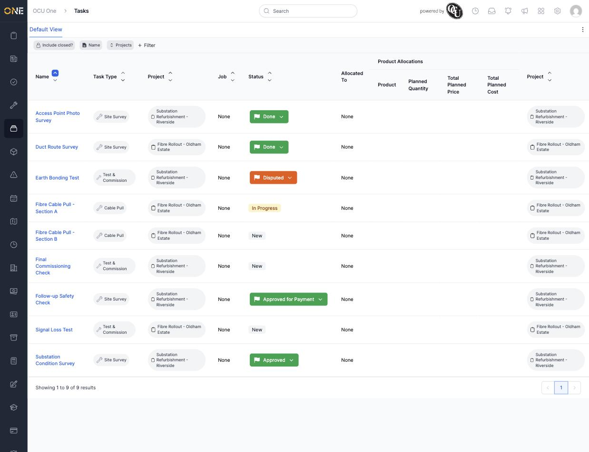

# Browsing the tasks landing page

Most of the time you work with a task from inside the job or project it belongs to. The Tasks landing page is different — it's a single table showing every task across all of your projects at once, so you can see what's outstanding without opening each project individually.

## Getting there

Click the tasks icon in the left-hand sidebar.

## What's on this page

The page opens on a table listing every task, with a column for the task's **Name**, **Task Type**, the **Project** it belongs to, its **Job** (if it's linked to one directly rather than a project), its current **Status**, who it's **Allocated To**, and any **Product Allocations** logged against it:

Each task's status is shown as a coloured pill — for example **New**, **In Progress**, **Done**, **Disputed**, or **Approved for Payment** — matching the same statuses used elsewhere in the app.

## Things to know

- This table only shows tasks that belong to a project — a task created directly on a job (rather than a project) won't appear here, since it's meant to be worked from that job's own Tasks tab instead.
- Like other list screens, you can add filters (for example by Task Type or Status), customise which columns are shown, and save the result as your own view — see the guide on filtering a list view by a field for how that works.
- Clicking a task's name takes you straight to that task's own page.
