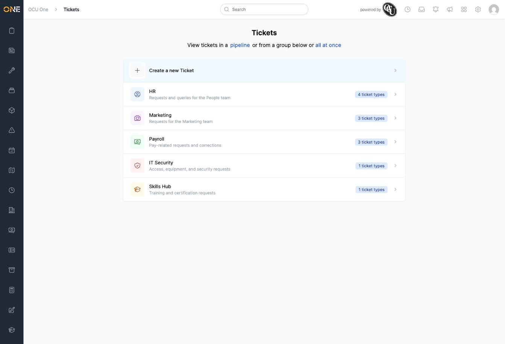
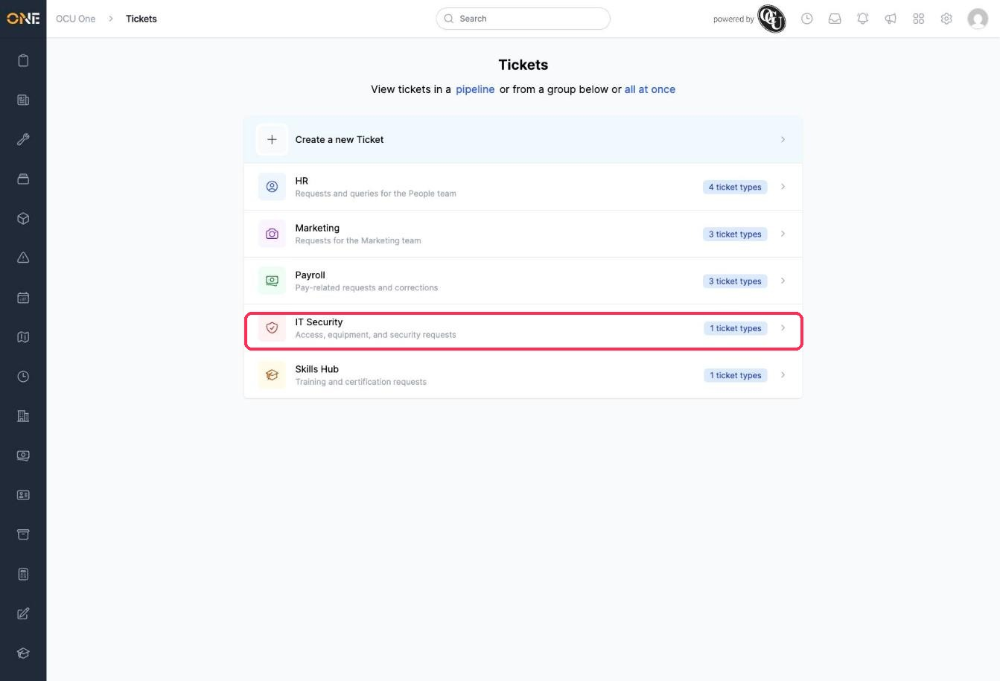

# Browsing the ticket type catalog

The Tickets landing page is where you start whenever you want to raise or browse tickets. Every ticket type your organisation uses is organised into groups here — for example **HR**, **Marketing**, **Payroll**, **IT Security**, and **Skills Hub** — so you can quickly find the right place to go without needing to remember exact names.

## What you'll see

Open **Tickets** from the main menu to reach this page.

- **Create a new Ticket** at the top takes you straight into raising a new ticket, without needing to pick a group first. See the guide on creating a new ticket for that flow.
- Below it, each row is a **ticket group** — a category your organisation has set up, such as HR or Payroll. The badge on the right (for example **4 ticket types**) tells you how many different ticket types live inside that group.
- Click any group to see the individual ticket types inside it — for example, clicking **IT Security** shows you what kinds of IT Security tickets you can raise or browse.

## Other ways to view tickets from here

At the top of the page, next to the group list, there are two shortcuts for viewing tickets a different way:

- **pipeline** — opens a kanban-style board view of tickets, grouped by their stage rather than by type.
- **all at once** — shows every ticket you have access to in a single list, instead of browsing group by group.

## Things to know

- Groups and their ticket types are set up by an administrator — if you can't find a category you expect, it may not have been created yet, or you may not have permission to see it.
- A group with no ticket types you have access to won't show any types when you click into it, even if the group itself is visible.
