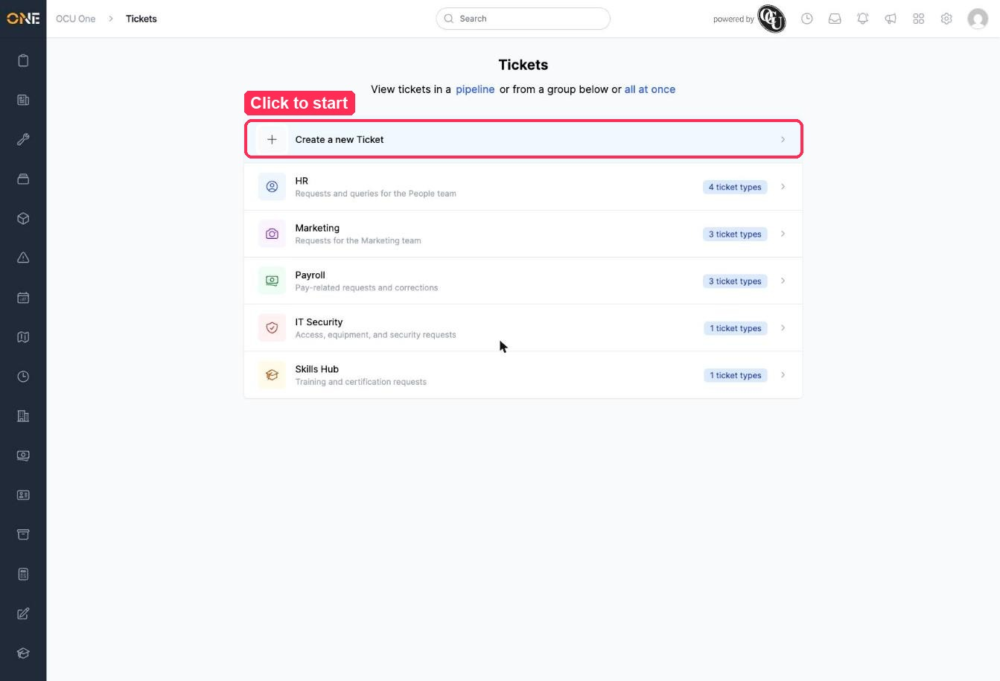
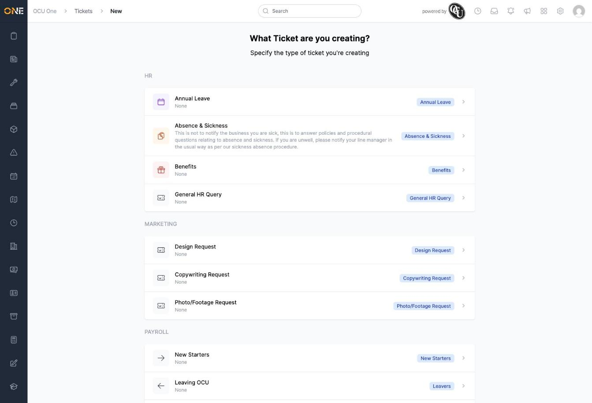
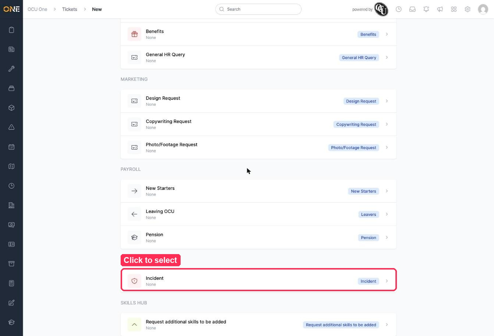
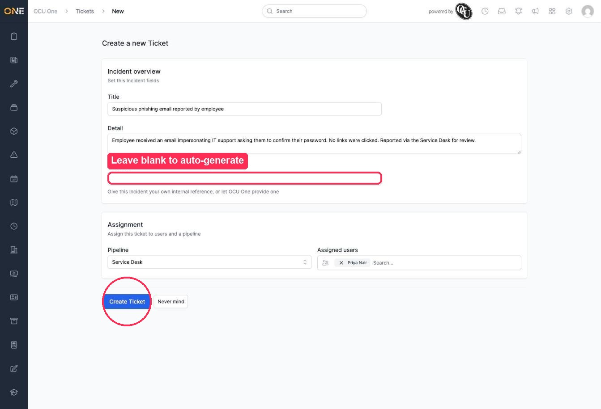
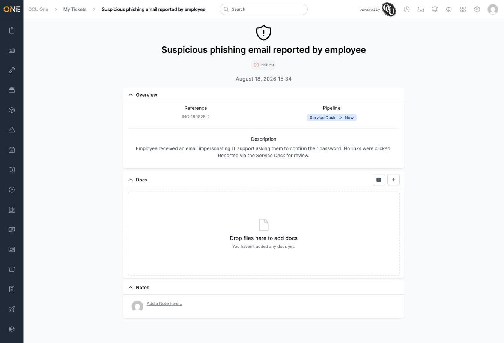

# Creating a new ticket

Tickets are how OCU One handles internal service requests — things like an HR query, a marketing request, or an IT incident. Every ticket belongs to a **ticket type** (for example "Incident" or "Annual Leave"), and every ticket type sits under a **group** (for example "IT Security" or "HR"). This guide walks through raising a new ticket from scratch.

In this example, Priya reports a suspicious phishing email to IT Security.

## Starting a new ticket

1. From the Tickets landing page, click **Create a new Ticket** at the top of the list.

   

2. You'll see every ticket type you can raise, organised under its group (HR, Marketing, Payroll, IT Security, Skills Hub, and so on).

   

   Scroll to find the one you need and click it — here, **Incident** under **IT Security**.

   

## Filling in the ticket

Once you've picked a type, a form opens with two sections:

- **Overview** — the details of the ticket itself:
  - **Title** — a short summary shown wherever the ticket is listed.
  - **Detail** — a longer description of what's going on.
  - **Reference** — an internal reference number. You can type your own, or leave it blank and OCU One will generate one automatically based on the ticket type (for an Incident, this comes out as something like `INC-180826-2`).
- **Assignment** — who's handling it:
  - **Pipeline** — which pipeline the ticket moves through (for example "Service Desk"). This determines what stages the ticket can progress through later.
  - **Assigned users** — search and select whoever should be responsible for the ticket.

Not every ticket type shows all of these fields — it depends on how that type has been set up. Some may skip the reference or assignment section entirely.

3. Fill in the fields, then click **Create Ticket**. Since the Reference field was left blank here, OCU One will assign one automatically.

   

4. You're taken straight to the new ticket's page, showing the auto-generated reference, the pipeline and stage it starts in, and the description you entered.

   

## Things to know

- If you decide not to go ahead partway through, click **Never mind** to back out without creating the ticket.
- A ticket always starts in the first stage of whichever pipeline you assigned it to (shown here as **Service Desk » New**). See the guide on moving a ticket's pipeline stage for how to progress it from there.
- From the ticket's page you can also attach documents and add notes — both are available immediately, even before anyone else has picked up the ticket.
