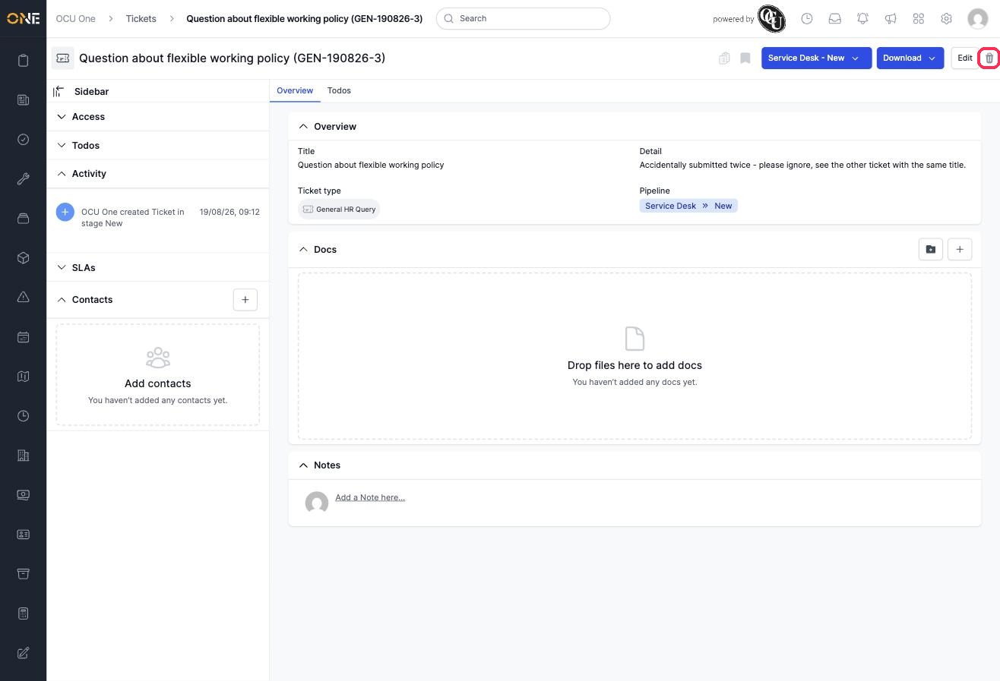
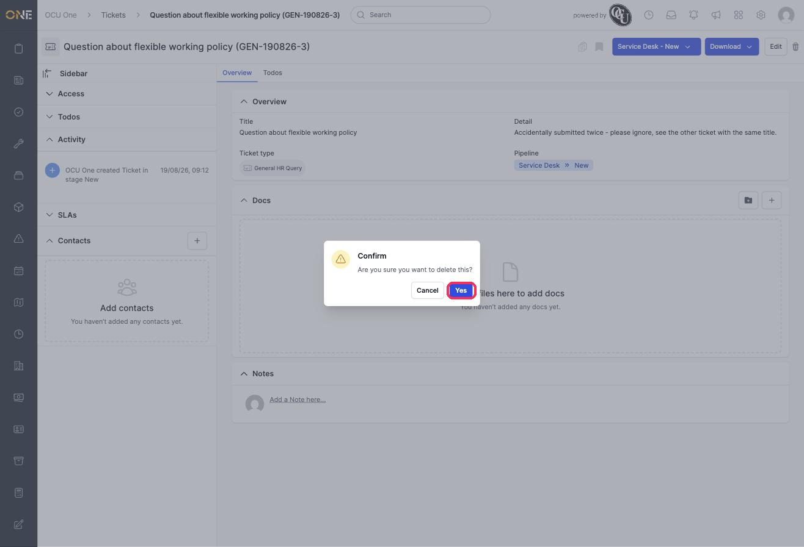
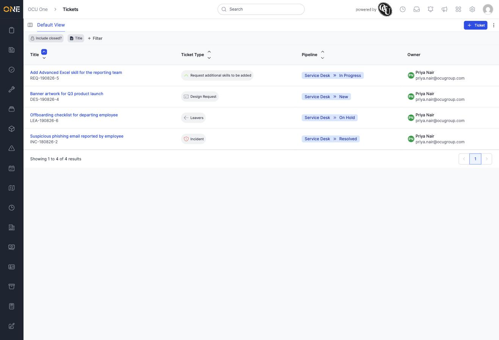

# Deleting a ticket

If a ticket was raised by mistake — for example, the same request submitted twice — you can delete it from its detail page.

## Deleting the ticket

1. On a ticket's detail page, click the trash icon at the top right.

   

2. A confirmation box appears asking "Are you sure you want to delete this?". Click **Yes** to continue, or **Cancel** to back out without deleting anything.

   

3. The ticket disappears from the tickets list straight away.

   

## Things to know

- Deleting is immediate and can't be undone from here — there's no separate "are you really sure" step beyond the one confirmation box, so only click **Yes** once you're sure.
- A deleted ticket no longer appears in the tickets list, any pipeline board, or "My Tickets" — as if it never existed.
- You'll only see the trash icon if you have permission to delete tickets. If it's missing, ask an administrator.
