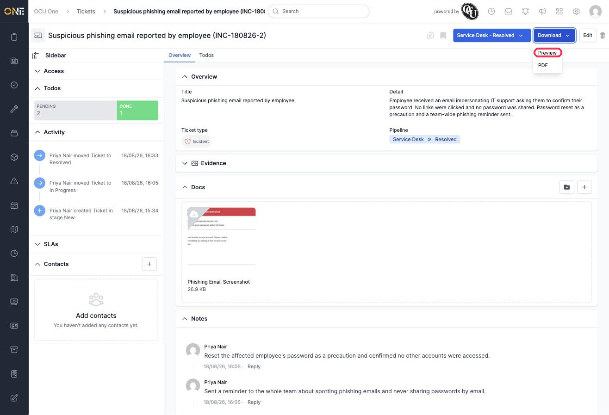
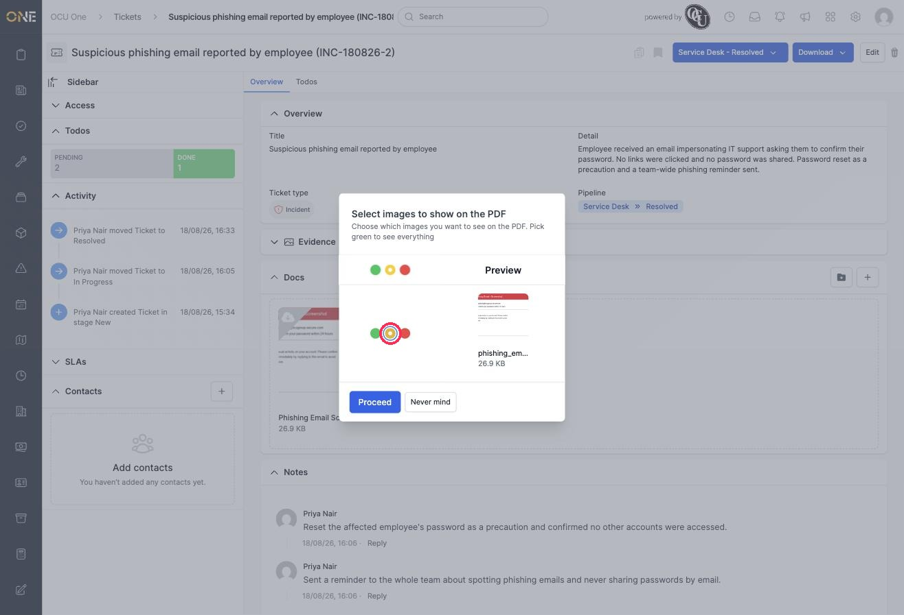
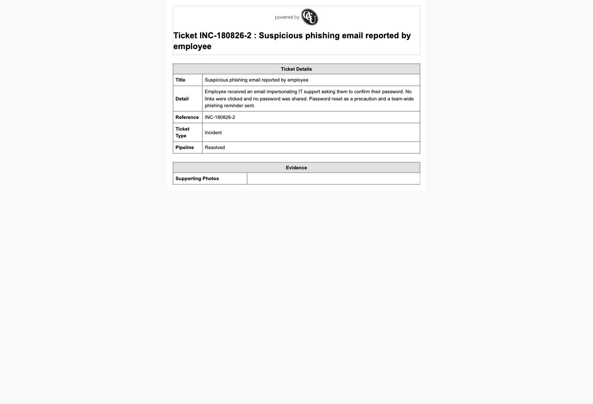

# Downloading or previewing a ticket as a PDF

Every ticket can be exported as a PDF — useful for sharing a summary outside of OCU One, or keeping a record of a resolved ticket.

## Choosing Preview or PDF

1. On a ticket's detail page, click the **Download** button at the top right.

   

2. Choose **Preview** to view the PDF straight away in your browser, or **PDF** to download it as a file. Both start with the same step below.

## Choosing which images to include

If the ticket has any photos attached, you're asked which ones to include before the PDF is generated.

3. For each photo, choose green to show it, yellow to leave it out **this time only**, or red to leave it out permanently. Click **Proceed** when you're happy with your choices.

   

4. The PDF is generated with your choices applied. Here, the photo was left out just for this once, so the Evidence section on the PDF shows an empty row instead of the image.

   

## Things to know

- If the ticket has no photos attached, you'll skip straight past the image selection screen.
- Choosing red ("don't show") hides a photo from every future PDF for this ticket, not just this one — choose amber if you only want to leave it out this time.
- The PDF always includes the ticket's title, detail, reference, ticket type, and pipeline stage, along with any other custom fields the ticket type has been set up with.
