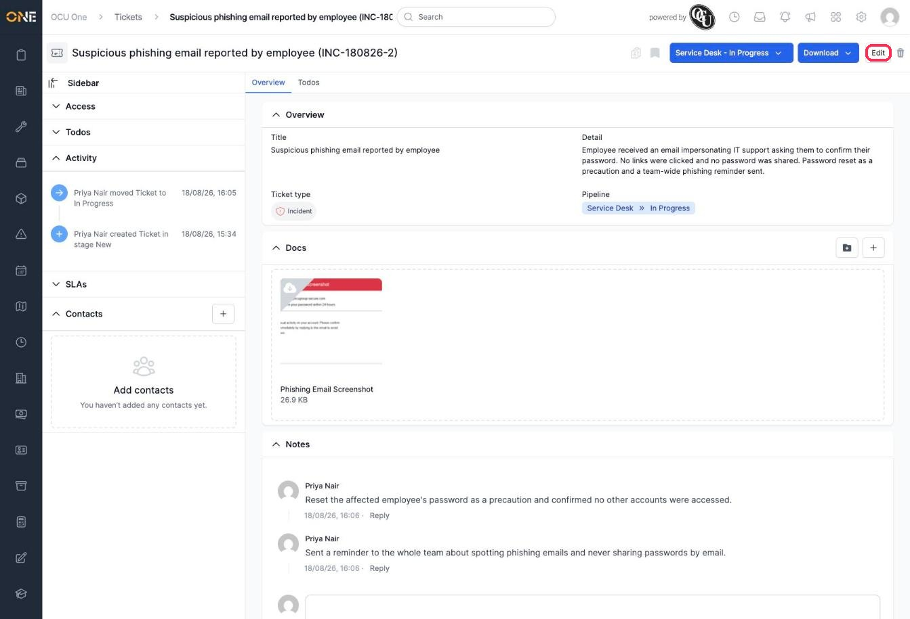
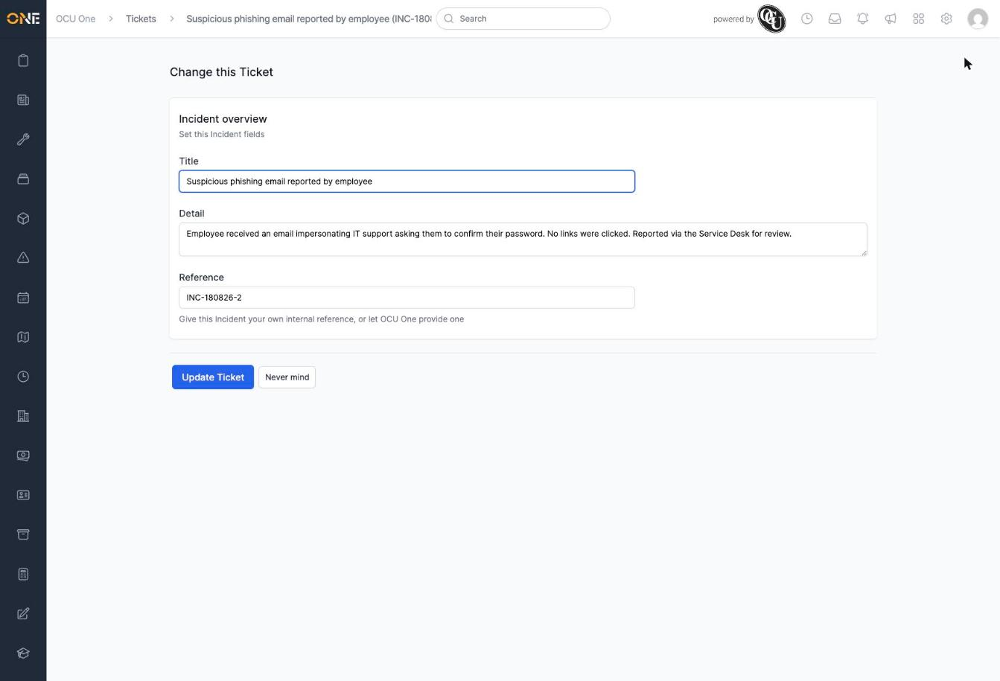
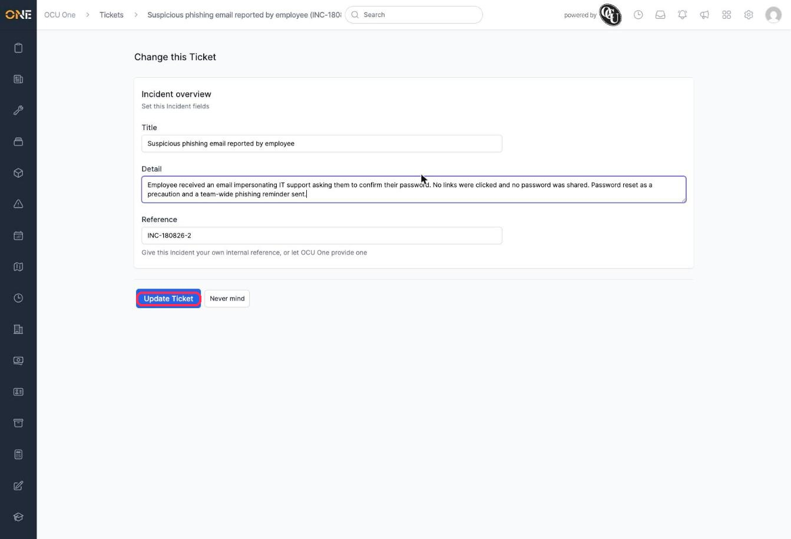
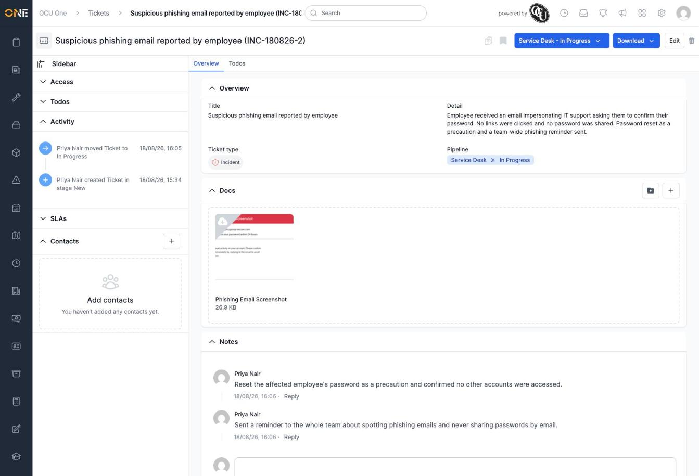

# Editing a ticket

You can change a ticket's title, detail, or reference at any time from its detail page.

## Opening the edit form

1. On a ticket's detail page, click **Edit** at the top right.

   

2. This opens the same fields you saw when creating the ticket — **Title**, **Detail**, and **Reference**.

   

## Making changes

3. Update whichever field needs changing. Here, the **Detail** is updated to record what happened after the ticket was raised.

4. Click **Update Ticket** to save your changes.

   

You'll see a confirmation that the ticket was updated, and land back on its detail page showing the new information.

## Things to know

- If you decide not to make the change after all, click **Never mind** to go back without saving anything.
- Editing a ticket only changes the fields on this form — it doesn't move its pipeline stage, add notes, or attach docs. Those are done from the ticket's detail page instead.
- Which fields appear on the edit form depends on how the ticket's type was set up — not every ticket type shows a Reference field, for example.
