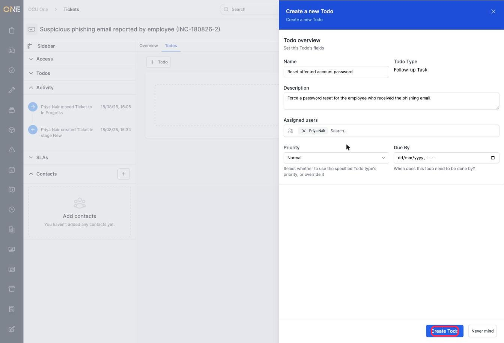
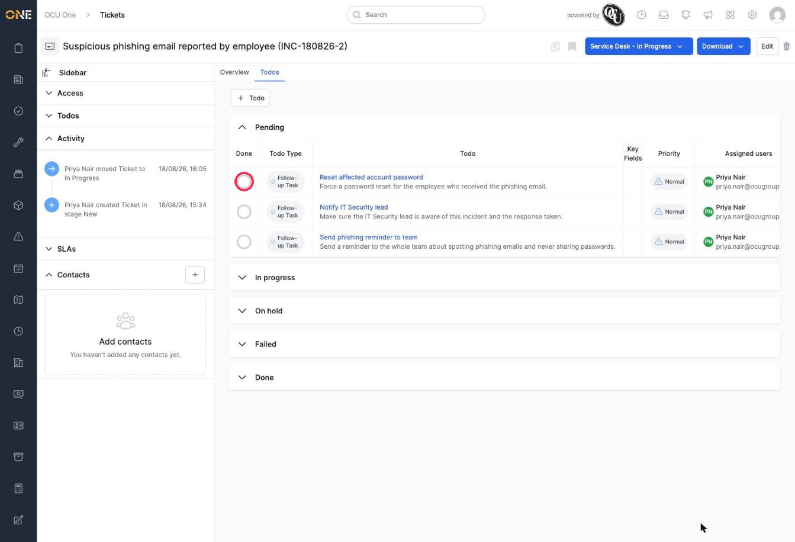
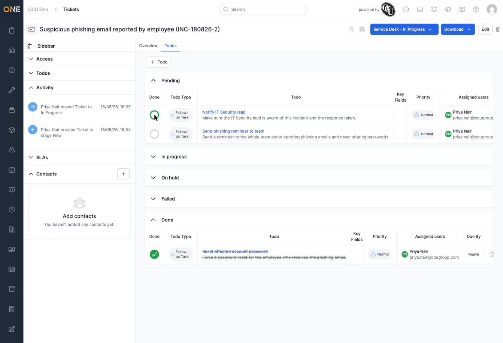

# Managing ticket todos

The **Todos** tab on a ticket lets you break the work into individual tasks, assign them to people, and track their progress separately from the ticket itself.

## Adding a todo

1. On a ticket, click the **Todos** tab, then click **+ Todo**.
2. Pick a todo type if you're asked for one.
3. Fill in the todo's details — its **Name**, an optional **Description**, who it's **Assigned** to, its **Priority**, and an optional **Due By** date — then click **Create Todo**.

   

Repeat this for each task the ticket needs. Here, three todos have been added: resetting the affected account's password, notifying the IT Security lead, and sending a phishing reminder to the team.

## Tracking progress

Todos are grouped into **Pending**, **In progress**, **On hold**, **Failed**, and **Done** — each shown as its own collapsible section.

Click the circle next to a todo to mark it **Done**. It moves out of Pending and into the Done section immediately, with its name shown struck through.

## Things to know

- Click a todo's name to open it and see or change more detail, such as moving it to **In progress** or **On hold** instead of straight to Done.
- Todos can be assigned to anyone with access — assigning one to someone else is a good way to hand off part of the work without splitting the ticket itself.
- What todo types you can create depends on your permissions — if **+ Todo** doesn't offer the type you expect, you may not have access to it.
