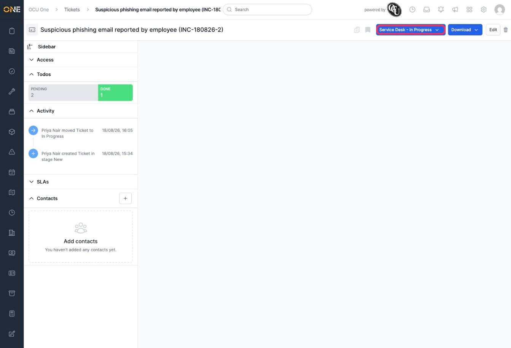
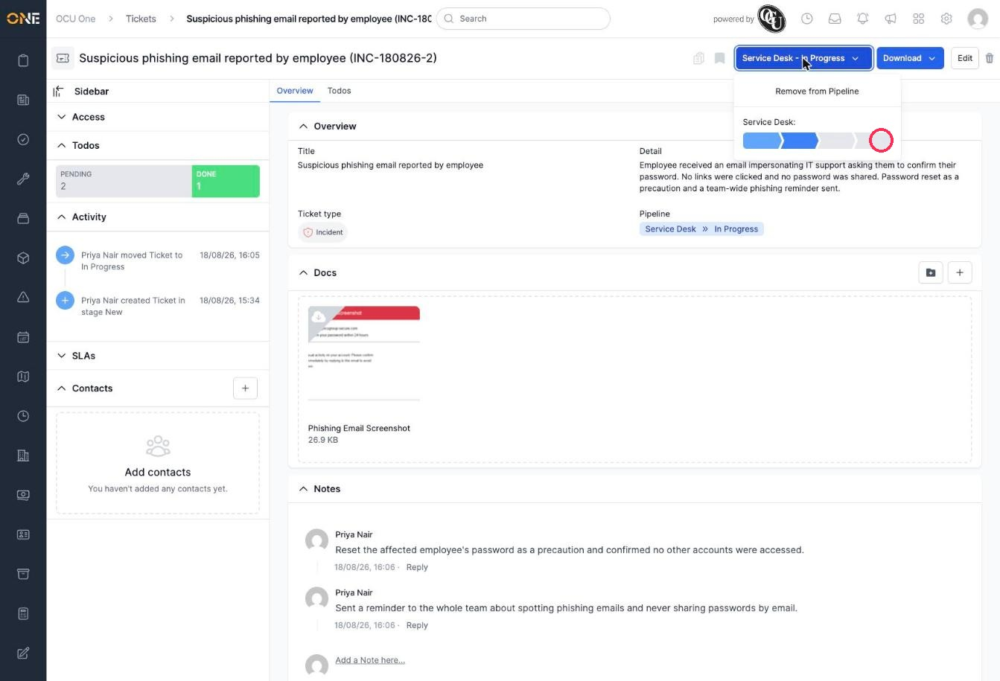
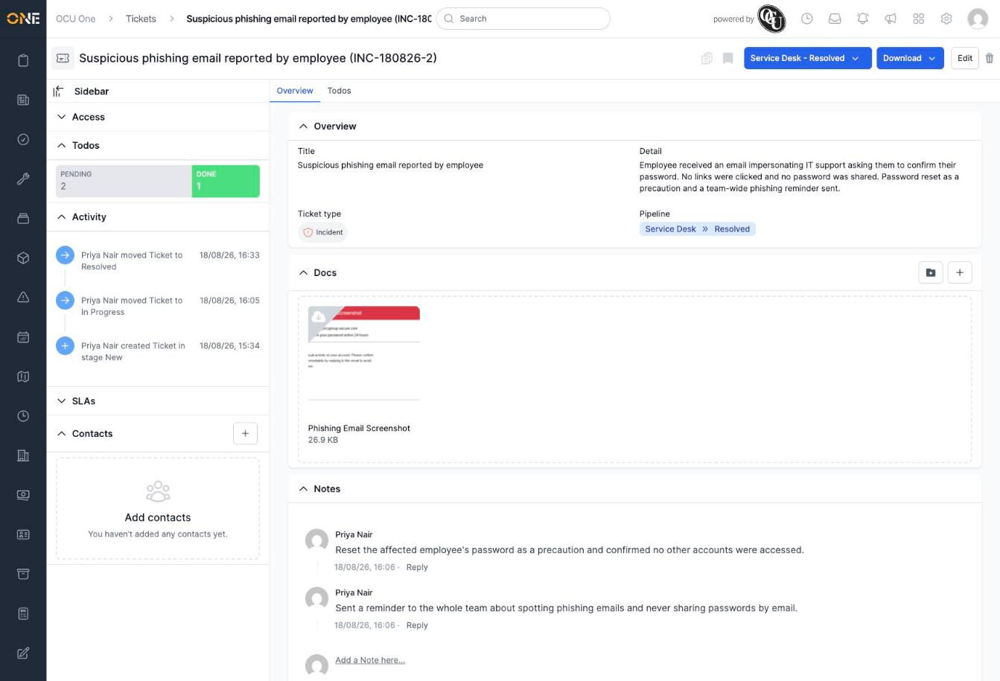

# Moving a ticket's pipeline stage

A ticket's progress is tracked by moving it through the stages of its pipeline — for example from **New** to **In Progress** to **Resolved**. You can move a ticket forward (or backward) at any time from its detail page.

## Moving the stage

1. On a ticket's detail page, click the blue button showing its pipeline and current stage, near the top right.

   

2. A dropdown opens showing the pipeline's stages as a row of segments, with the current stage highlighted. Click any segment to move the ticket straight to that stage.

   

3. The ticket updates immediately — no confirmation step needed. The button now shows the new stage, and the change is recorded in the ticket's Activity log.

   

## Things to know

- You can jump to any stage in the pipeline, not just the next one in order — moving straight from **New** to **Resolved** is allowed if that's what's needed.
- **Remove from Pipeline**, at the top of the same dropdown, takes the ticket out of its pipeline entirely rather than moving it to a different stage.
- Every stage change is logged in the ticket's Activity feed, along with who made the change and when — this can't be edited or removed afterwards.
