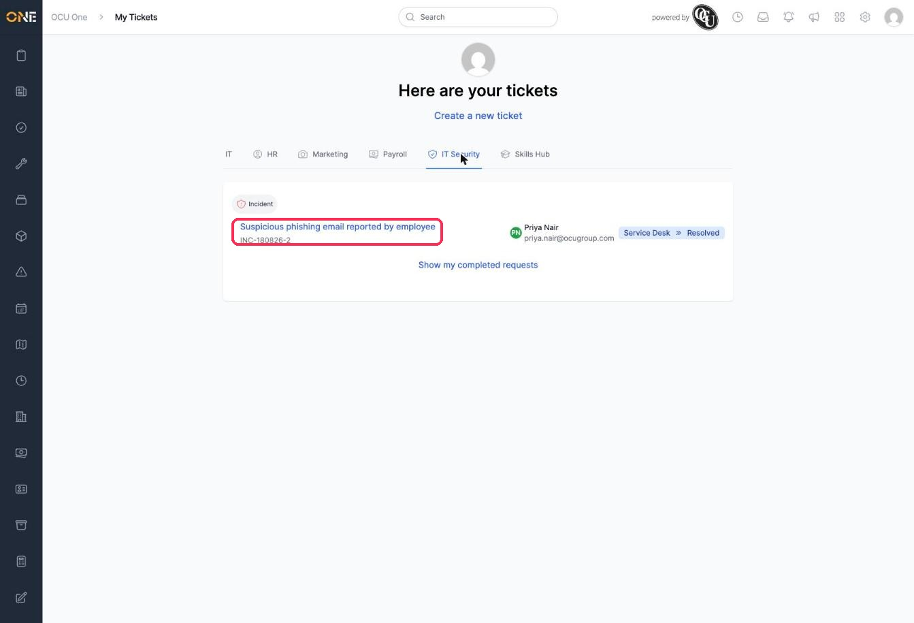
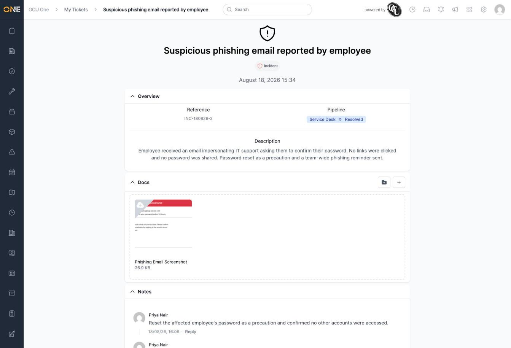
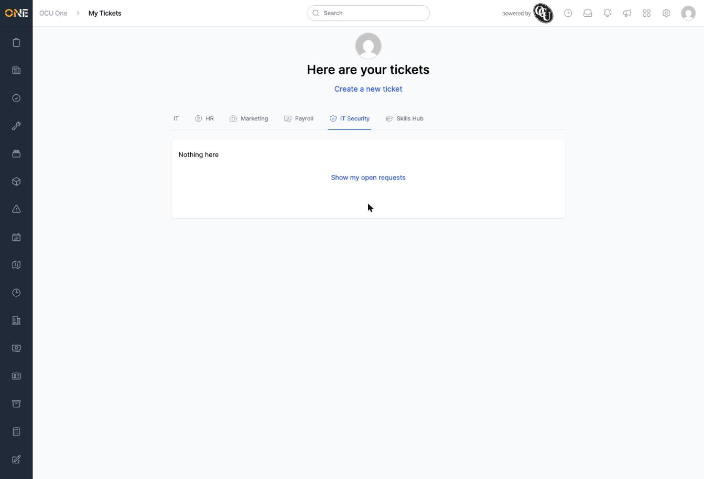

# Viewing "My Tickets"

**My Tickets** is your personal view of the tickets you're involved in, organised by group rather than by everything at once. It's reached from your account area, separately from the main Tickets section.

In this example, Priya checks the phishing incident she raised and is assigned to.

## Browsing your tickets

Along the top, each tab is a ticket group — **HR**, **Marketing**, **Payroll**, **IT Security**, **Skills Hub**, and so on. Click a tab to see your tickets in that group.

Each ticket shows its type, title and reference, who it's assigned to, and its current pipeline stage. Click a ticket's title to open it.

## Open vs. completed requests

By default, each tab shows your **open** requests. Click **Show my completed requests** to switch to tickets that have finished.

## Things to know

- Moving a ticket to its pipeline's last stage (like **Resolved**) doesn't automatically count it as "completed" here — whether a ticket shows as completed depends on how its stage has been configured, not just its name. A ticket can sit in a stage called Resolved and still show up under open requests.
- **Create a new ticket** at the top works the same as the main Tickets area — see the guide on creating a new ticket for the full flow.
- You'll only see tabs for groups that have ticket types you have access to, and only tickets you're the owner of or assigned to.
