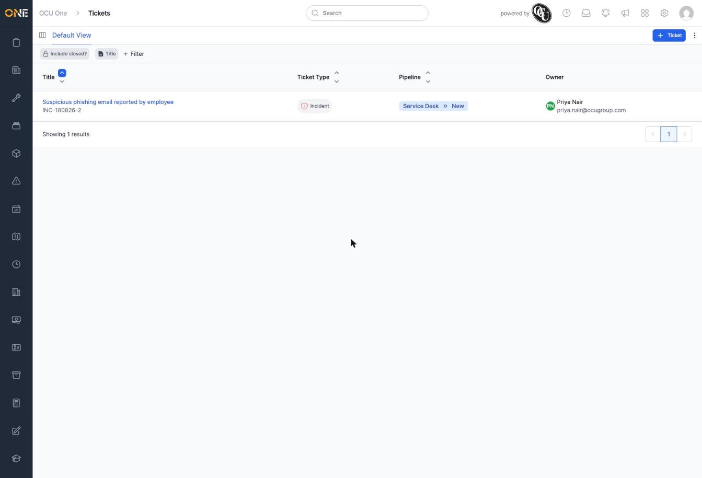
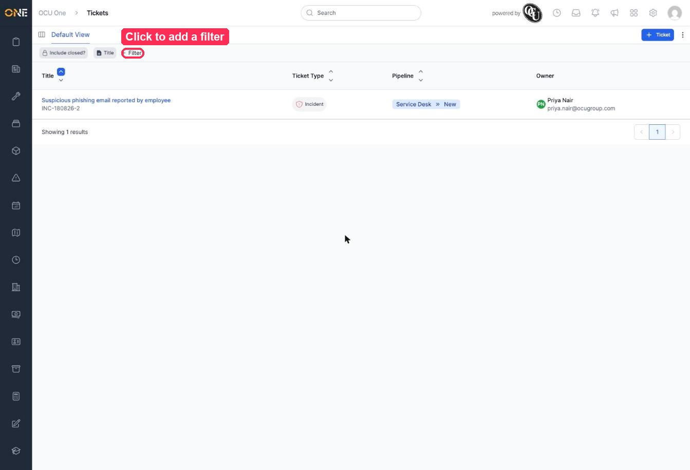
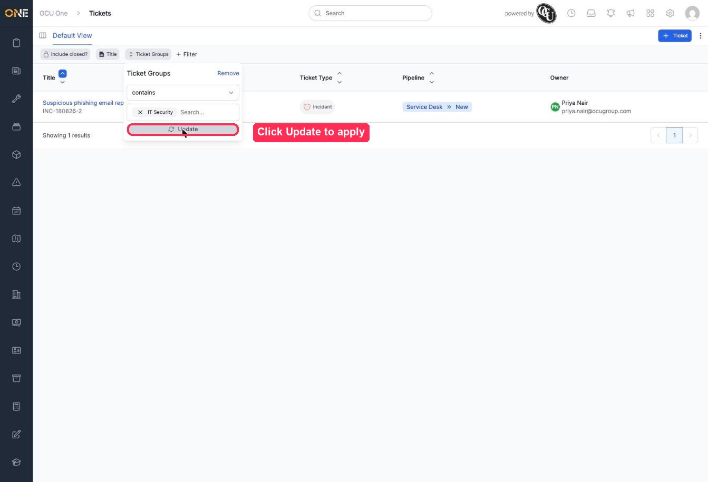
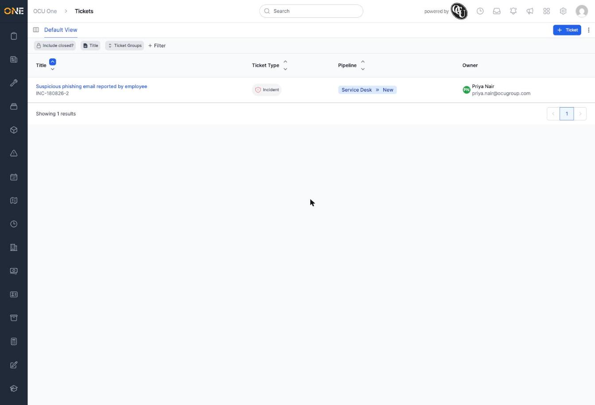

# Viewing the tickets list

The tickets list gives you a single table of every ticket you have access to, across every group and type, rather than browsing one group at a time.

## What you'll see

Open **Tickets**, then click **all at once** on the landing page (or go directly to the tickets list from a link elsewhere in OCU One).

Each row shows:
- The ticket's **title** and **reference** underneath it.
- Its **ticket type**, shown as a coloured badge with the type's icon.
- Its **pipeline and current stage** (for example **Service Desk » New**).
- Its **owner** — the person who raised it.

Along the top, **Include closed?** toggles whether archived tickets are included, and clicking a column header (like **Title**) lets you sort or group by that field.

## Filtering the list

1. Click **+ Filter** to add a filter.

   

2. Pick the field you want to filter by from the list — for example **Ticket Groups** — then choose a value, such as **IT Security**.

3. Click **Update** to apply it.

   

4. The list refreshes to only show tickets matching your filter.

   

You can add more than one filter at once — each appears as its own chip in the toolbar, and a ticket has to match all of them to show up.

## Things to know

- Click **+ Ticket** at the top right to raise a new ticket without leaving the list. See the guide on creating a new ticket for that flow in detail.
- To change a filter you've already added, click its chip to reopen its settings. To remove one, open its chip and click **Remove**.
- What you see here depends on your permissions — a ticket won't appear if you don't have access to it, even if it matches your filters.
