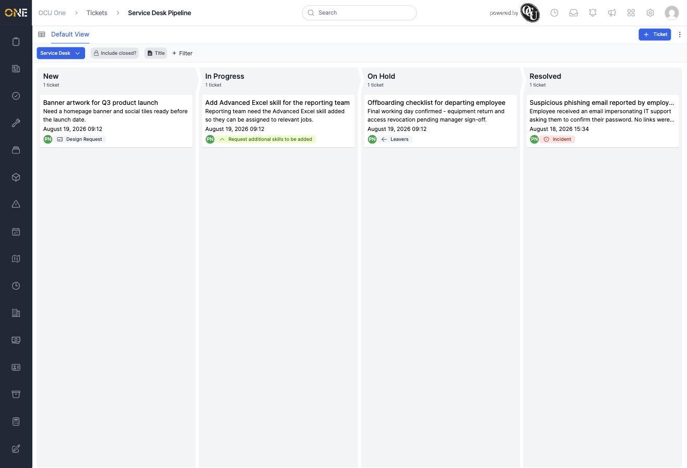
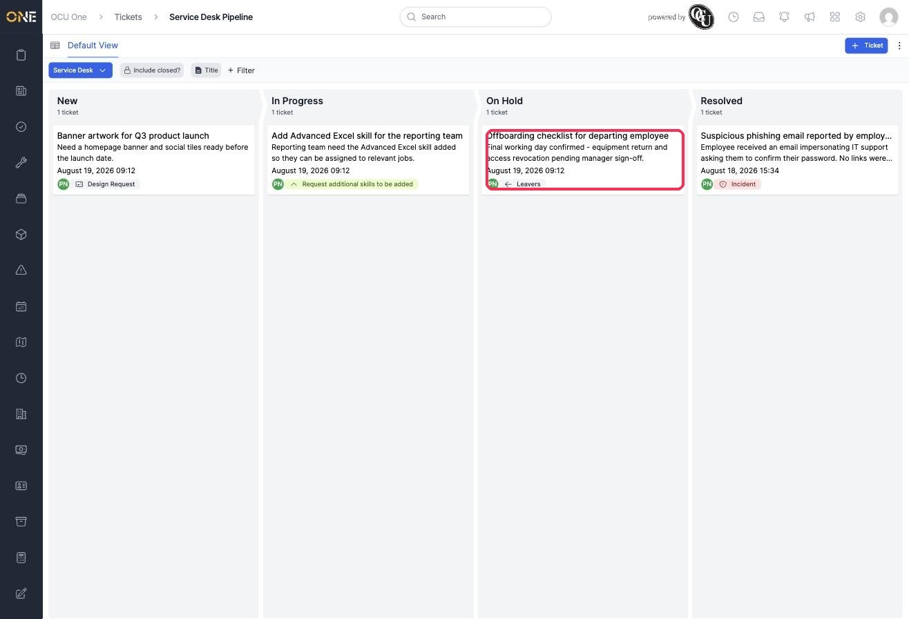
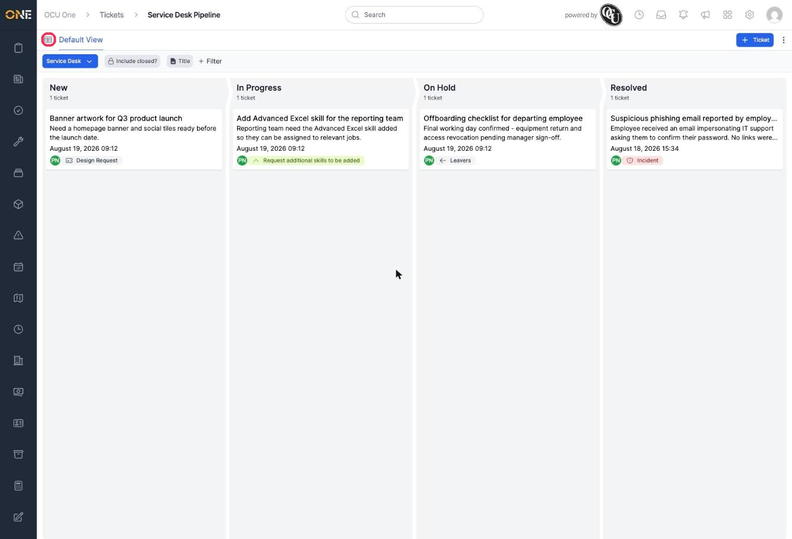
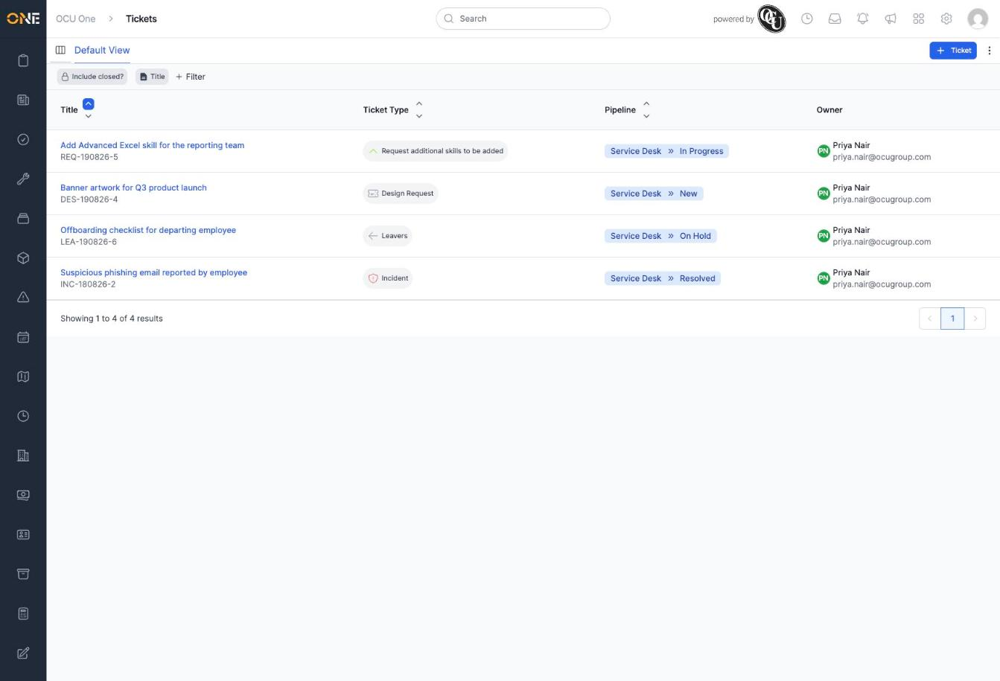

# Viewing the tickets pipeline board

The pipeline board gives you a bird's-eye view of every ticket in a pipeline, grouped into columns by stage. It's a faster way to see what's outstanding across a whole team than scrolling through the tickets list.

## The board

Each column is a stage in the pipeline, showing the tickets currently sitting at that stage. Every ticket card shows its title, a short excerpt of its detail, who's assigned, and its ticket type.

## Opening a ticket from the board

Click anywhere on a ticket's card to open it.

## Switching to a table view

If you'd rather see the same tickets as a sortable table, click the table icon next to the view name.

This takes you to the regular tickets list, with the same tickets you saw on the board.

## Things to know

- If your organisation has more than one ticket pipeline, use the pipeline dropdown at the top left to switch between them.
- **Add filter** and the **Title** search work the same way here as on the tickets list, letting you narrow the board down to specific tickets.
- **Include closed?** shows tickets that have already reached a closed stage, which are hidden from the board by default.
- Click **+ Ticket** at the top right to raise a new ticket without leaving the board.
