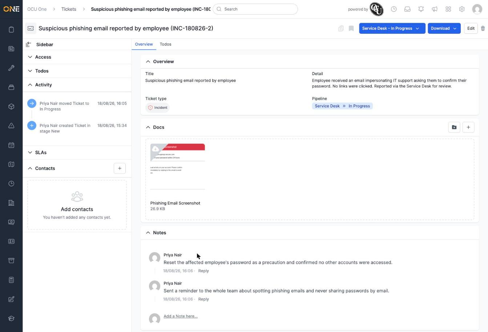
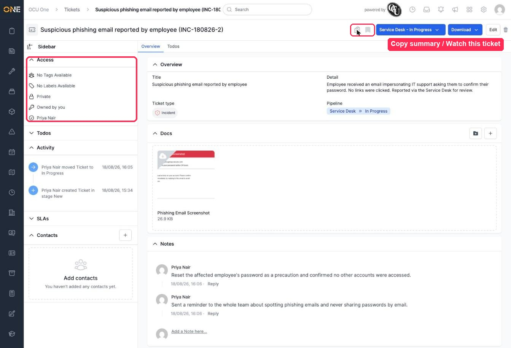

# Viewing ticket details

Opening a ticket takes you to its detail page, where you can see everything about it, update its progress, and collaborate with anyone else involved.

In this example, Priya opens the phishing incident she raised earlier, after it's moved on a little.

## The Overview tab

- **Overview** — the ticket's title, detail, ticket type, and its current pipeline and stage (here, **Service Desk » In Progress**).
- **Docs** — any files attached to the ticket. Drag and drop a file onto this area, or click **+** to add one another way.
- **Notes** — a running conversation on the ticket. Click **Add a Note here...** to post one, and **Reply** under an existing note to respond to it directly.

At the top of the page:
- The blue **Service Desk - In Progress** button shows the ticket's current pipeline and stage — click it to move the ticket forward. See the guide on moving a ticket's pipeline stage for details.
- **Download** lets you download or preview the ticket as a PDF.
- **Edit** takes you to the ticket's edit form, and the trash icon deletes (archives) it.

## The sidebar

Click **Access** in the sidebar to expand it and see:
- Any **tags** or **labels** applied to the ticket.
- Its **visibility** (for example **Private**, meaning only the owner and anyone assigned can see it).
- Who **owns** the ticket, and who it's **assigned** to.

Further down the sidebar, **Todos** shows any to-dos linked to the ticket (see the guide on managing ticket todos), and **Activity** is a running log of everything that's happened — who created the ticket, and every stage change since.

The two small icons next to the title, just above the stage button, let you **copy a short summary of the ticket** to your clipboard, and **watch the ticket** so you get notified about future updates to it.

## Things to know

- What you can see and do on a ticket depends on your permissions — if you can't see an action described here, you likely don't have access to it.
- A ticket's Activity log can't be edited or removed — it's a permanent record of what happened and when.
