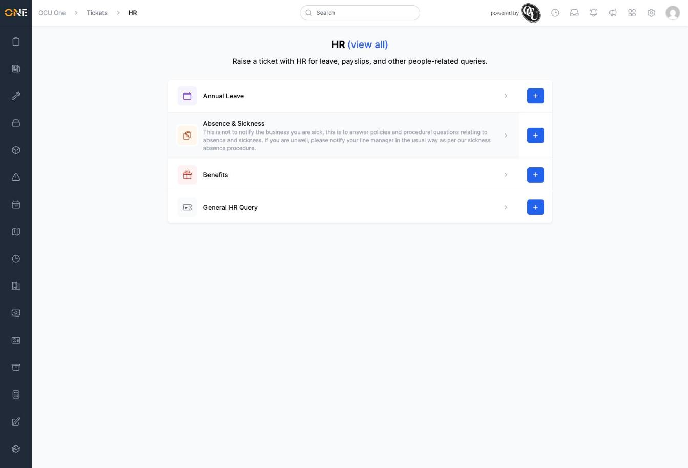
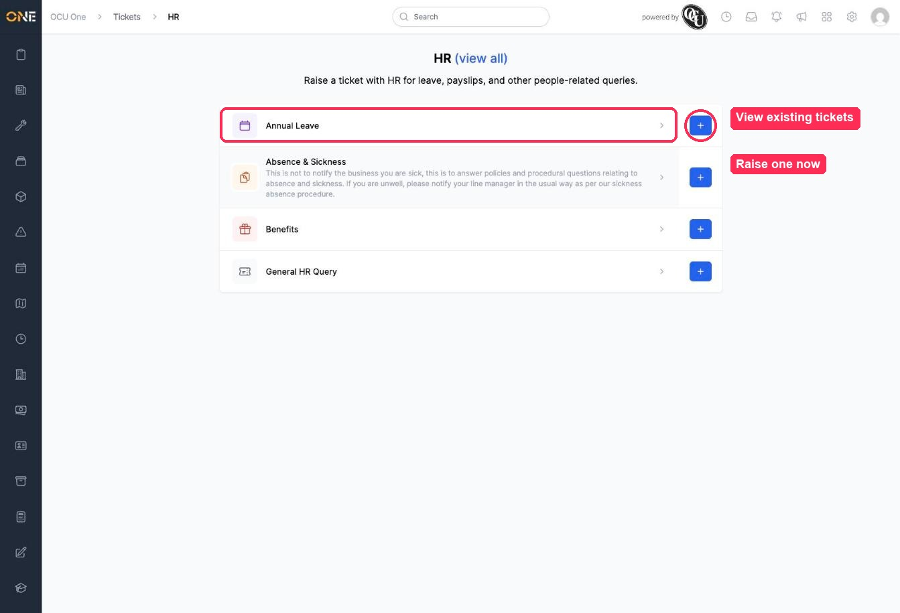

# Viewing ticket types within a ticket group

Clicking into a ticket group from the Tickets landing page shows you every ticket type available in that group, along with a short description of what each one is for.

In this example, Priya opens the **HR** group.

## What you'll see

At the top, the group's name and description explain what the group is for. Below that, each row is a **ticket type** you can raise within this group. Some types (like **Absence & Sickness** here) include extra guidance text explaining exactly when to use them and when not to — worth reading before you raise a ticket, since it can save you from filing it under the wrong type.

## Two ways to use a ticket type

Each row gives you two options:

- **Click the row itself** to see a list of existing tickets of that type — useful for checking whether something's already been raised.
- **Click the blue + button** to jump straight into raising a new ticket of that type, skipping the type-picker step covered in the guide on creating a new ticket.

## Things to know

- Click **(view all)** next to the group name at the top to see every ticket across all types in this group at once, rather than one type at a time.
- Which ticket types appear here depends on your permissions — if a type has been set up but you don't have access to it, it won't show in this list.
