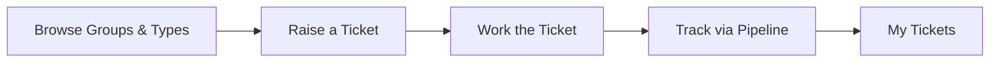

# Tickets — Overview

**Tickets** is how internal requests and issues get raised, tracked, and resolved — the kind of thing an internal service desk handles, like an IT access request, an HR query, or a marketing design request. This guide explains how the pieces fit together, before you dive into the detailed guides for each part.

## The core pieces

**Ticket Groups** are the top-level categories tickets are organised under — things like HR, Marketing, Payroll, IT Security, or Skills Hub. Each group represents a team or area that handles its own kinds of requests.

Within a group, **Ticket Types** define the specific kinds of ticket you can raise — for example, HR's group might offer Annual Leave, Absence & Sickness, Benefits, and General HR Query as separate types, each with their own fields.

A **Ticket** is a single request or issue, created from one of these types. It has a title, a detail, an optional reference, and can be assigned to whoever's handling it.

A **Pipeline** tracks a ticket's progress through a set of **stages** — for example New, In Progress, On Hold, and Resolved. Not every ticket type needs to be on a pipeline, but most service-desk-style tickets are.

## Why this matters

Ticket groups, types, and pipelines are what turn "a request was raised" into something a team can actually manage:

- **Routing** — grouping tickets by team and type means the right people see the requests relevant to them, without digging through everything.
- **Progress tracking** — a pipeline shows at a glance whether a ticket is just raised, actively being worked, or done.
- **Accountability** — assigning a ticket to a person, and logging every change in its activity feed, keeps a clear record of who did what and when.

## The end-to-end flow

It starts with **browsing what's available**. The ticket groups landing page shows every group you have access to — see [Browsing the ticket type catalog (ticket groups landing page)](Browsing%20the%20ticket%20type%20catalog.md) — and opening a group shows the specific ticket types within it, see [Viewing ticket types within a ticket group](Viewing%20ticket%20types%20within%20a%20ticket%20group.md). The full list of tickets already raised, across every group, is covered in [Viewing the tickets list/table](Viewing%20the%20tickets%20list.md).

Raising a request is covered in [Creating a new ticket](Creating%20a%20new%20ticket.md) — pick a type, fill in its fields, and optionally assign it and place it on a pipeline straight away.

Once a ticket exists, **working it** covers most of what you'll do day to day: [Viewing ticket details (main tab)](Viewing%20ticket%20details.md) shows its overview, docs, and notes; [Editing a ticket](Editing%20a%20ticket.md) covers changing its title, detail, or reference; [Managing ticket todos](Managing%20ticket%20todos.md) covers breaking the work into individual tasks; and [Downloading or previewing a ticket PDF](Downloading%20or%20previewing%20a%20ticket%20PDF.md) covers exporting it as a shareable summary. If a ticket was raised by mistake, [Deleting a ticket](Deleting%20a%20ticket.md) covers removing it for good.

**Tracking progress** through a pipeline is its own pair of guides: [Moving a ticket's pipeline stage](Moving%20a%20ticket's%20pipeline%20stage.md) covers updating a single ticket's stage, while [Viewing the tickets pipeline (kanban) board](Viewing%20the%20tickets%20pipeline%20%28kanban%29%20board.md) covers seeing every ticket in a pipeline at once, grouped by stage.

Finally, [Viewing "My Tickets" (personal account tab)](Viewing%20My%20Tickets.md) covers your own personal view — the tickets you own or are assigned to, organised by group, separate from the main Tickets area.

## The flow at a glance

- **Browse Groups & Types** — find the right group and ticket type for the request.
- **Raise a Ticket** — create it with a title, detail, and optional assignment.
- **Work the Ticket** — update it, add todos, attach docs, export it as a PDF, or delete it if it was raised in error.
- **Track via Pipeline** — move it through stages, either one at a time or via the board.
- **My Tickets** — the personal, per-group view of tickets you own or are assigned to.

Not every ticket type needs a pipeline or todos — the simplest tickets are just a title, a detail, and a status. But the full flow above is there for anything that needs closer tracking.
