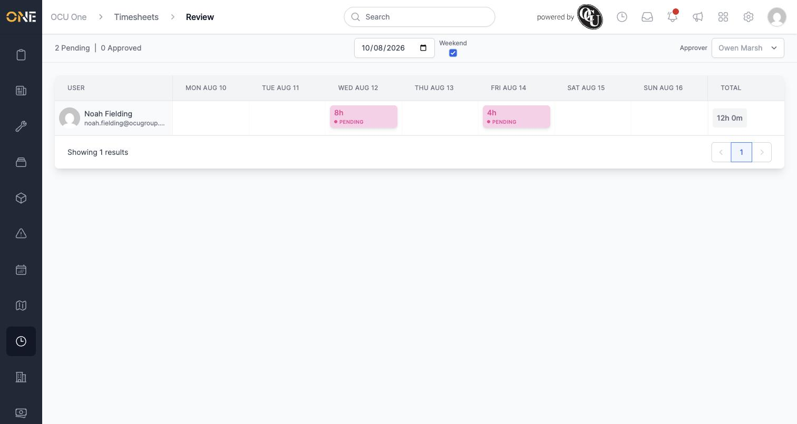
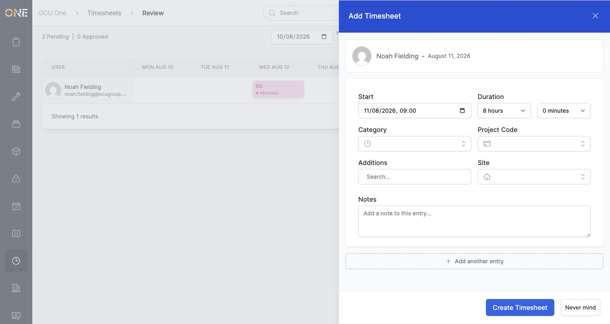
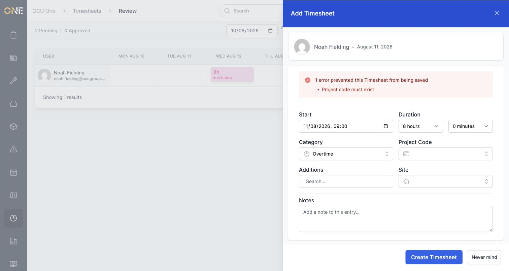
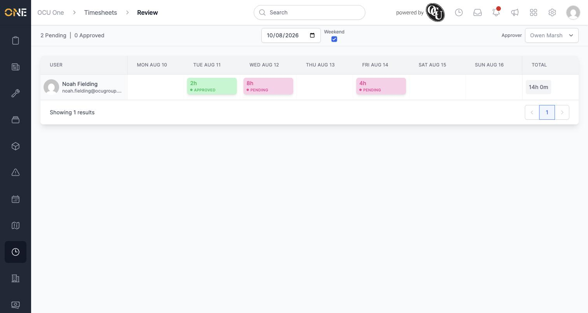
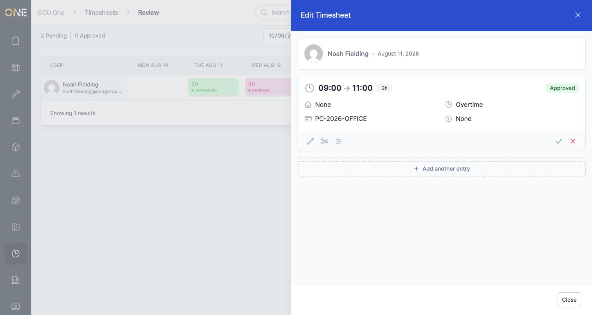
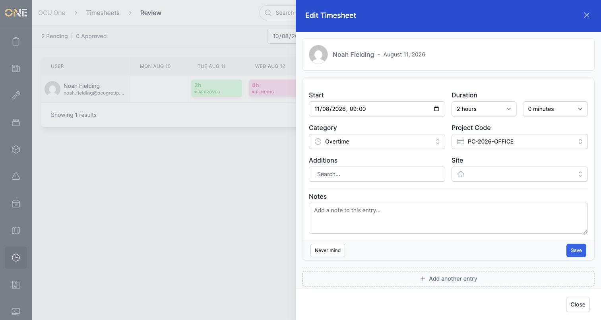

# Adding or editing a timesheet entry from the review grid

Beyond approving or denying what's already there, the weekly review grid also lets you add a missing entry for someone, or correct the details of one that already exists — useful when a shift wasn't logged, or something about it needs fixing before it goes to payroll.

## Adding a missing entry

If a day is blank for someone, hover over that cell and click the **+** that appears:

This opens an **Add Timesheet** panel for that person and date:

Fill in:
- **Start** and **Duration** — when the entry begins and how long it lasted
- **Category** — e.g. Overtime, if your organisation uses timesheet categories
- **Project Code**
- **Additions** and **Site**, if relevant
- **Notes** — any free-text detail worth recording

Here's an Overtime entry for 2 hours:

**Project Code is required** — if you try to save without one, you'll see an error and the entry won't be created:

Once everything's filled in, click **Create Timesheet**. The entry appears in the grid straight away — and because it was added by you during review rather than logged by the person themselves, it's automatically marked **Approved**:

## Editing an existing entry

Click any entry in the grid to open it:

This card shows the entry's details read-only, along with a row of icons underneath — edit (pencil), split (scissors), and round (sliders) — plus approve/deny buttons on the right if you have permission. Click the **pencil** to make changes:

Change whatever needs correcting — here, the duration is being extended from 2 to 3 hours — then click **Save** (or **Never mind** to discard your changes). The card updates immediately, and so does the grid behind it:

## Good to know

- You can add more than one entry for the same person and day by clicking **Add another entry** at the bottom of either panel — useful if someone's day was split across more than one project or category.
- The split and round icons next to the pencil are covered in their own guide, for adjusting exactly where a shift starts, ends, or is divided.
