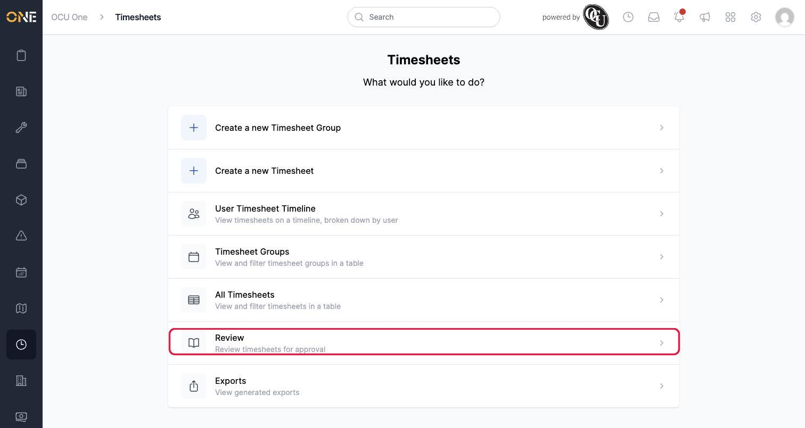
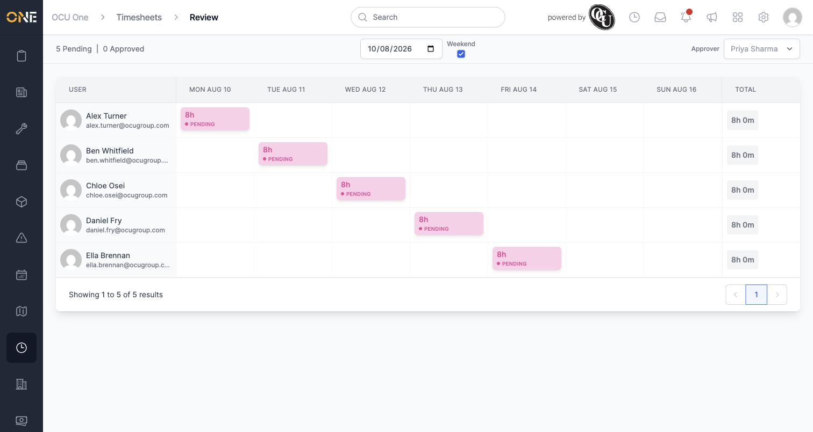
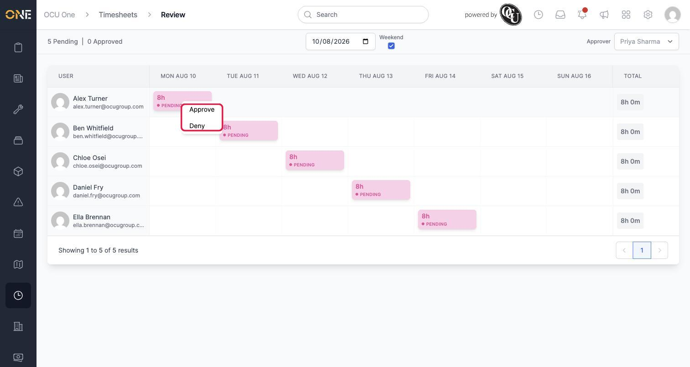
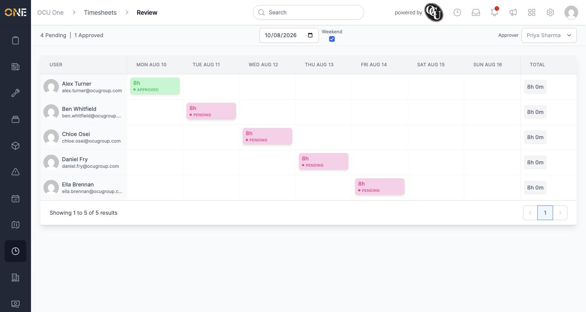
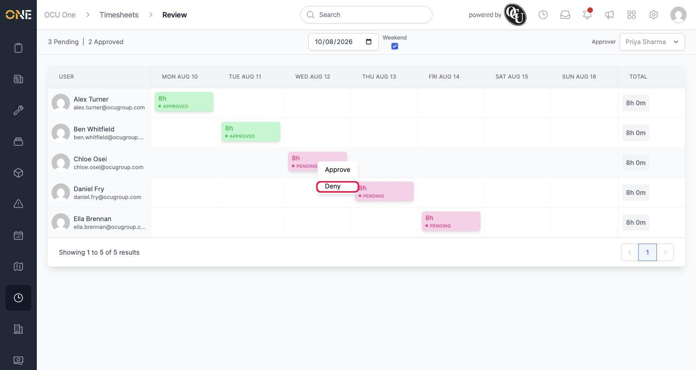
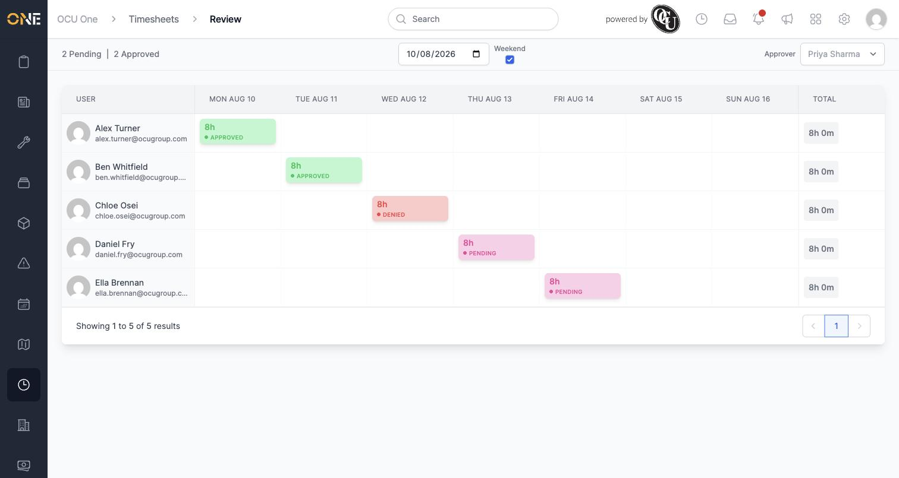
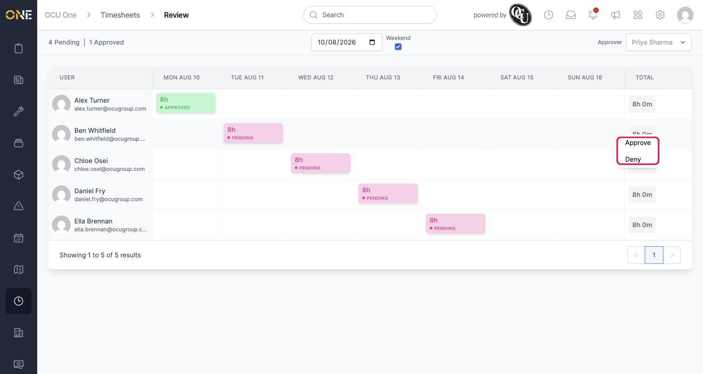
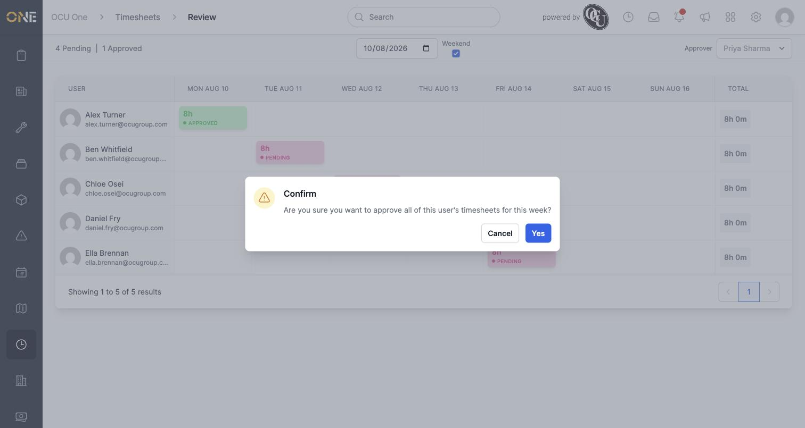
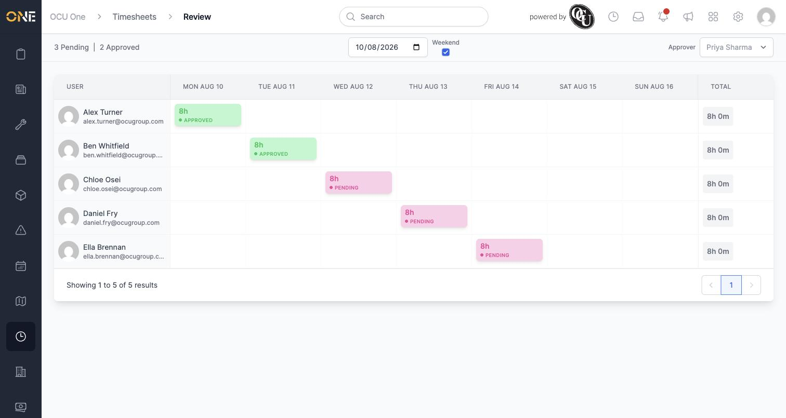

# Approving or denying timesheets for your team (weekly review grid)

The review grid is where a manager works through a whole team's timesheets for a week at once — one row per person, one column per day — approving or denying entries without opening each one individually.

## Getting there

From the Timesheets landing page, choose **Review**:

## Reading the grid

The grid shows one row per team member, one column per day of the selected week, and a running total on the right. Each coloured cell is a timesheet entry — pink for pending, green for approved, red for denied — showing the hours logged and its status:

Across the top:
- **Pending / Approved** counts for the currently selected week and team
- A **date picker** to jump to a different week, and a **Weekend** checkbox to show or hide Saturday/Sunday
- An **Approver** dropdown — if you're set up to approve timesheets on behalf of another manager (as a "cover" approver), this lets you switch between your own team and theirs. It only appears when you have more than one team available to approve for.

## Approving or denying a single entry

Click (or right-click) a cell to bring up its actions:

Choosing **Approve** updates that entry immediately — no confirmation needed — and the pending/approved counts at the top update to match:

**Deny** works the same way, from the same menu:

A denied entry is shown in red:

## Approving or denying a whole week at once

Rather than going cell by cell, you can act on everything a person logged that week in one go. Click (or right-click) their **Total** cell on the right of their row:

Because this affects multiple entries at once, you're asked to confirm first:

Confirming updates every entry that person logged that week in one step:

## Good to know

- Right-clicking a day's column header (rather than an individual cell or a person's total) approves or denies that day for everyone shown in the grid — useful for clearing a single day across the whole team, and it asks for confirmation the same way a whole-week action does.
- If you can't find someone's timesheet, check the **Approver** dropdown in the top right — you may be looking at your own team rather than the one you need to approve for.
