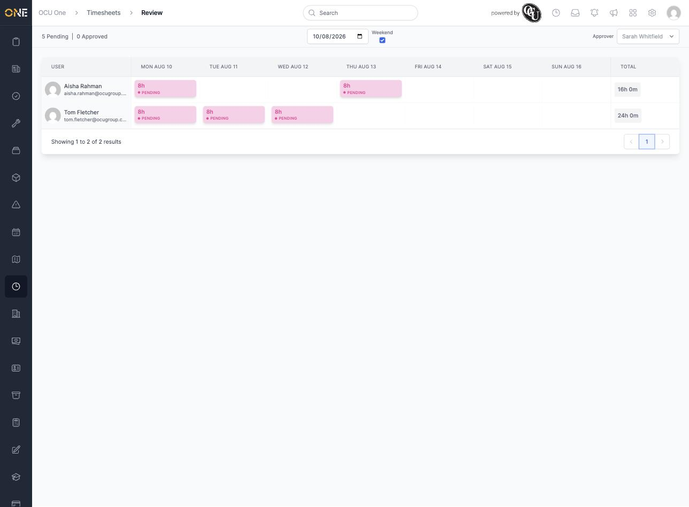
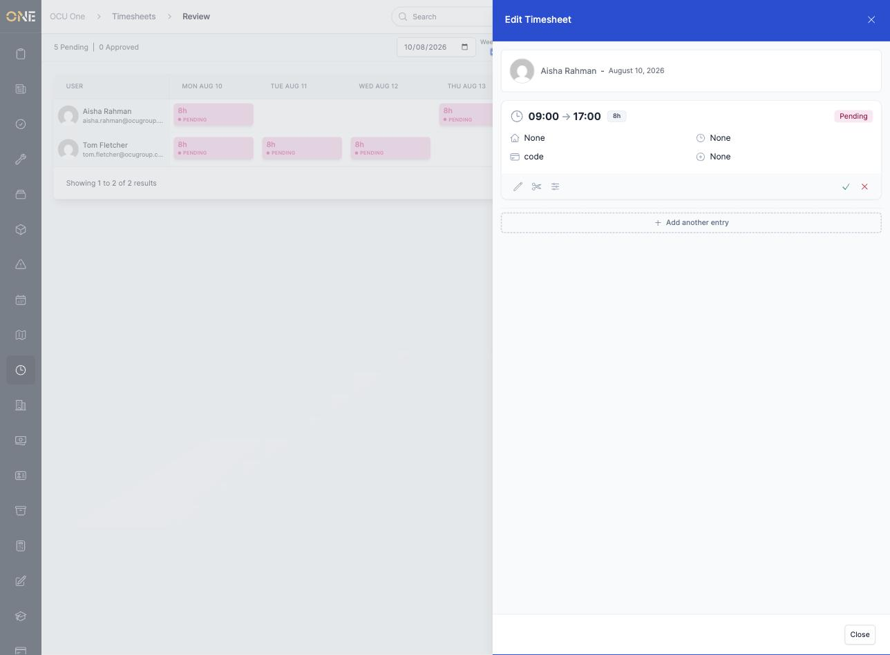
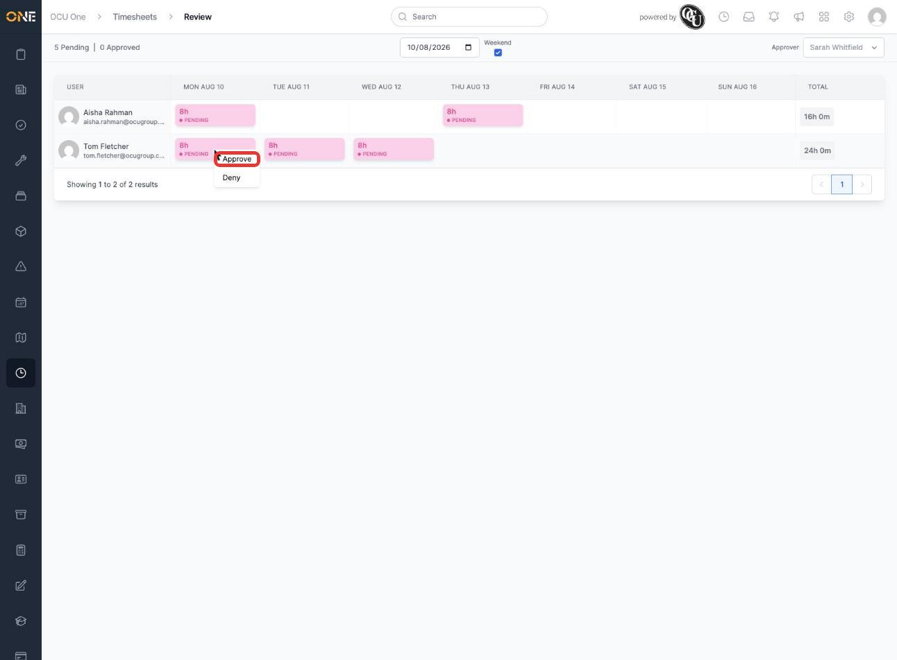
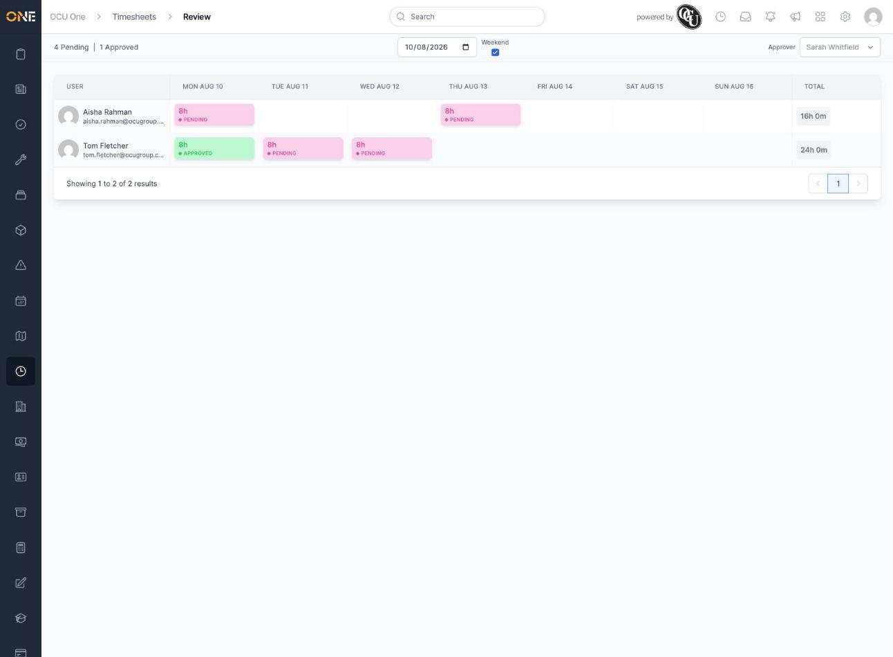
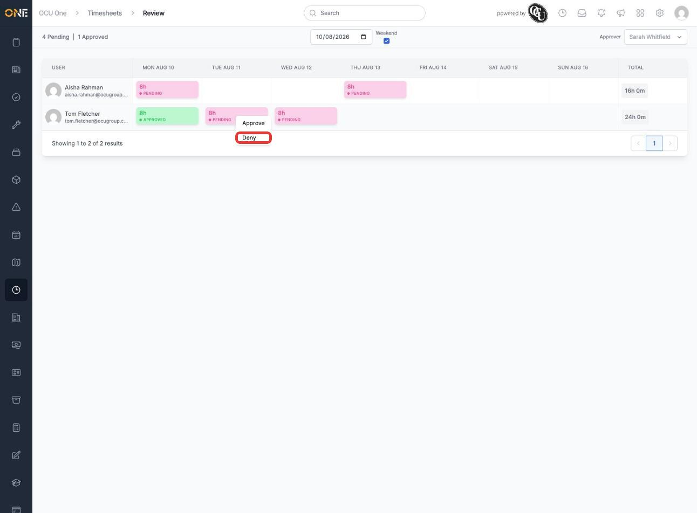
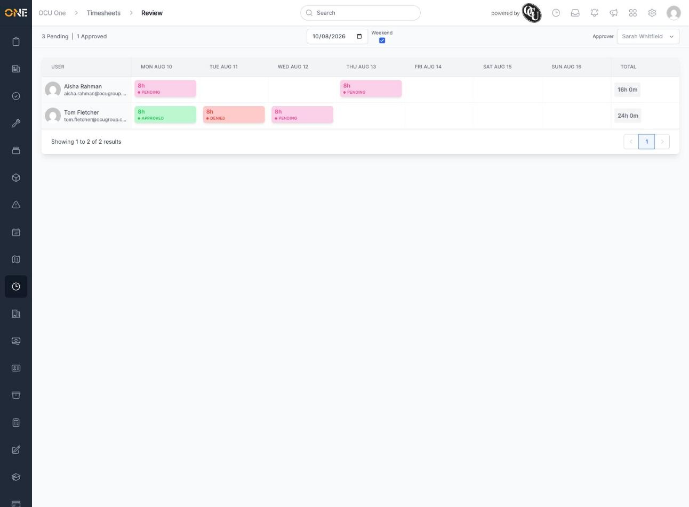
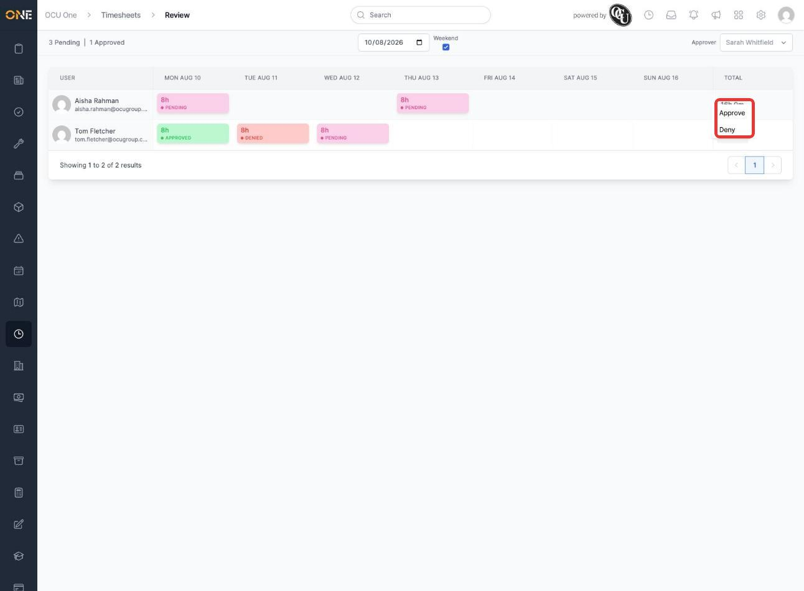
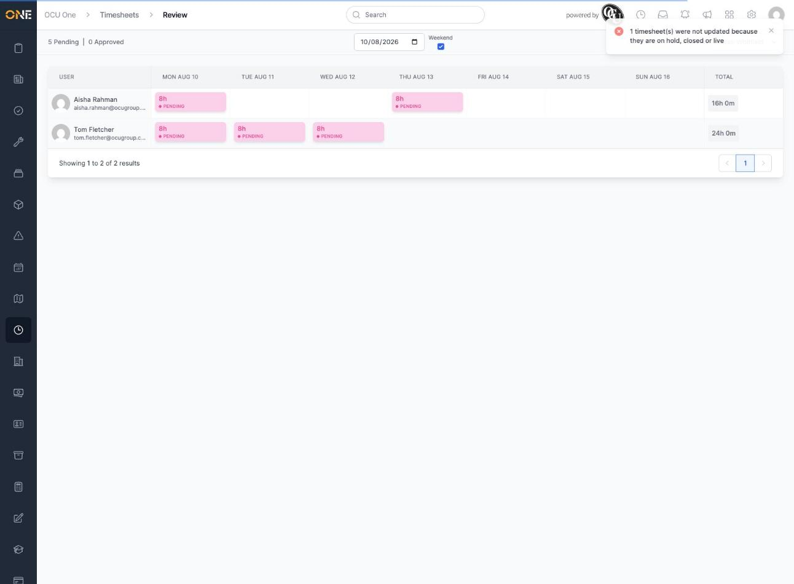

# Approving or denying timesheets for your team (weekly review grid)

The review grid is where a manager works through a whole team's timesheets for a week at once — one row per person, one column per day — approving or denying entries without opening each one individually.

## Reading the grid

The grid shows one row per team member, one column per day of the selected week, and a running total on the right. Each coloured cell is a timesheet entry — pink for pending, green for approved, red for denied — showing the hours logged and its status:

Across the top:
- **Pending / Approved** counts for the currently selected week and team
- A **date picker** to jump to a different week, and a **Weekend** checkbox to show or hide Saturday/Sunday
- An **Approver** dropdown — if you're set up to approve timesheets on behalf of another manager (as a "cover" approver), this lets you switch between your own team and theirs. It only appears when you have more than one team available to approve for.

Clicking a cell (a left click, not right-click) opens that entry's full detail instead of a menu — useful if you want to check what was logged before deciding:

## Approving or denying a single entry

The quick way, without opening the entry, is to **right-click** its cell to bring up its actions:

Choosing **Approve** updates that entry immediately — no confirmation needed — and the pending/approved counts at the top update to match:

**Deny** works the same way, from the same right-click menu:

A denied entry is shown in red, and the Pending count drops to match:

## Approving or denying a whole week at once

Rather than going cell by cell, you can act on everything a person logged that week in one go. Click their **Total** cell on the right of their row:

Because this affects every entry that person logged that week, you're asked to confirm first — "Are you sure you want to approve all of this user's timesheets for this week?" (or the equivalent wording for Deny). Confirming updates every entry in one step and the grid refreshes to show the new totals.

## Things to know

- Right-clicking a day's column header (rather than an individual cell or a person's total) approves or denies that day for everyone shown in the grid — useful for clearing a single day across the whole team. It asks for confirmation the same way a whole-week action does.
- Whole-week and whole-day actions can fail partway through — for example if one of the entries involved has since been put on hold, closed, or is otherwise not in a state that can be changed. When that happens, the grid shows an error explaining how many entries couldn't be updated instead of silently skipping them, so you know to go back and check those ones individually:

  

- If you can't find someone's timesheet, check the **Approver** dropdown in the top right — you may be looking at your own team rather than the one you need to approve for.
